.. module:: hasasia

.. note:: This tutorial was generated from a Jupyter notebook that can be
          downloaded `here <_static/notebooks/calcSNR_tutorial.ipynb>`_.

.. _calcSNR_tutorial:

Using ``gwent`` to Calculate Signal-to-Noise Ratios
===================================================

Here we present a tutorial on how to use ``gwent`` to calculate SNRs for
the instrument models currently implemented (LISA, PTAs, aLIGO, and
Einstein Telescope) with the signal being an array of coalescing Binary
Black Holes.

First, we import important modules.

.. code:: python

    import numpy as np
    import matplotlib.pyplot as plt
    import matplotlib as mpl
    import astropy.constants as const
    import time
    import astropy.units as u
    
    import gwent
    import gwent.binary as binary
    import gwent.detector as detector
    import gwent.snr as snr
    import gwent.snrplot as snrplot

Setting matplotlib preferences

.. code:: python

    mpl.rcParams['figure.dpi'] = 300
    mpl.rcParams['figure.figsize'] = [5,3]
    mpl.rcParams['text.usetex'] = True
    mpl.rc('font',**{'family':'serif','serif':['Times New Roman'],'size':14})

We need to get the file directories to load in the instrument files.

.. code:: python

    load_directory = gwent.__path__[0] + '/LoadFiles/InstrumentFiles/'

Source Selection Function
-------------------------

Takes in a an instrument model that dictates reasonable mass ranges for
the particular detector mass regime and instantiates a source with the
variable ranges limited by the waveform calibration region.

The source parameters must be set (ie. M,q,z,chi1,chi2), but one only
needs to set the minima and maxima of the selected SNR axes variables.

.. code:: python

    def Get_Source(model):
        if model in [0,1]:
            #M = m1+m2 Total Mass
            M = 1e2
            M_min = 1e0
            M_max = 1e5
        elif model in [2,3,4,5,6]:
            #M = m1+m2 Total Mass
            M = 1e9
            M_min = 1e8
            M_max = 1e11
        else:
            #M = m1+m2 Total Mass
            M = 1e6
            M_min = 1e1
            M_max = 1e10
            
        #q = m2/m1 reduced mass
        q = 1.0
        q_min = 1.0
        q_max = 18.0
    
        #Chi = S_i*L/m_i**2, spins of each mass i
        chi1 = 0.0 #spin of m1
        chi2 = 0.0 #spin of m2
        chi_min = -0.85 #Limits of PhenomD for unaligned spins
        chi_max = 0.85
        
        z = 1.0 #Redshift
        z_min = 1e-2
        z_max = 1e3
        
        source = binary.BBHFrequencyDomain(M,q,z,chi1,chi2)
        source.M = [M,M_min,M_max]
        source.q = [q,q_min,q_max]
        source.chi1 = [chi1,chi_min,chi_max]
        source.chi2 = [chi2,chi_min,chi_max]
        source.z = [z,z_min,z_max]
    
        return source

Instrument Selection Function
-----------------------------

Takes in an instrument model then assigns the fiducial noise and
detector values. The model only assigns ranges of calculation for quick
variable calculations, but one only needs to set the minima and maxima
if they wish to use other selected SNR axes variables.

If loading a detector, the file should be frequency in the first column
and either strain, effective strain noise spectral density, or amplitude
spectral density in the second column.

For generating a detector, one must assign a value to each of the
different instrument parameters (see the section on Declaring x and y
variables and Sample Rates).

.. code:: python

    def Get_Instrument(model):
        if model in [0,1]:
            T_obs = 4*u.yr #Observing time in years
            if model == 0: #Einstein Telescope
                #Loaded from http://www.et-gw.eu/index.php/etsensitivities
                load_name = 'ET_D_data.txt'
                load_location = load_directory + 'EinsteinTelescope/' + load_name
                instrument = detector.GroundBased('ET',T_obs,load_location=load_location,I_type='A')
            elif model == 1: #aLIGO
                #Loaded from https://dcc.ligo.org/T1800044/public
                load_name = 'aLIGODesign.txt'
                load_location = load_directory + 'aLIGO/' + load_name
                instrument = detector.GroundBased('aLIGO',T_obs,load_location=load_location,I_type='A')
        elif model in [2,3,4]:
            #NANOGrav calculation using 11.5yr parameters https://arxiv.org/abs/1801.01837
            T_obs = 15*u.yr #Observing time in years
            T_obs_min = 5*u.yr
            T_obs_max = 30*u.yr
            
            sigma = 100*u.ns.to('s')*u.s #rms timing residuals in seconds
            sigma_min = 100*u.ns.to('s')*u.s
            sigma_max = 500*u.ns.to('s')*u.s
            
            N_p = 18 #Number of pulsars
            N_p_min = 18
            N_p_max = 40
            
            cadence = 1/(2*u.wk.to('yr')*u.yr) #Avg observation cadence of 1 every 2 weeks in num/year
            cadence_min = 2/u.yr
            cadence_max = 1/(u.wk.to('yr')*u.yr)
            
            
            if model == 2: #NANOGrav 15 yr WN only
                instrument = detector.PTA('NANOGrav_WN',T_obs,N_p,sigma,cadence)
            elif model == 3: #NANOGrav realistic noise
                instrument = detector.PTA('NANOGrav_realistic_noise',T_obs,N_p,cadence,use_11yr=True)
            elif model == 4: #NANOGrav 11 yr real data
                #NANOGrav calculation using 11.5yr parameters https://arxiv.org/abs/1801.01837
                load_name = 'NANOGrav_11yr_S_eff.txt'
                load_location = load_directory + 'NANOGrav/StrainFiles/' + load_name
                T_obs = 11.42*u.yr #Observing time in years
                instrument = detector.PTA('NANOGrav_11yr',load_location=load_location,I_type='E')
                
            instrument.T_obs = [T_obs,T_obs_min,T_obs_max]
            instrument.sigma = [sigma,sigma_min,sigma_max]
            instrument.N_p = [N_p,N_p_min,N_p_max]
            instrument.cadence = [cadence,cadence_min,cadence_max]
            
        elif model in [5,6]: #SKA (2030s)
            #SKA calculation using parameters and methods from https://arxiv.org/abs/0804.4476 section 7.1
            T_obs = 15*u.yr #Observing time (years)
            T_obs_min = 10*u.yr
            T_obs_max = 30*u.yr
            
            sigma = 10*u.ns.to('s')*u.s #rms timing residuals in nanoseconds
            sigma_min = 10*u.ns.to('s')*u.s
            sigma_max = 100*u.ns.to('s')*u.s
            
            N_p = 20 #Number of pulsars
            N_p_min = 18
            N_p_max = 200
            
            cadence = 1/(u.wk.to('yr')*u.yr) #Avg observation cadence of 1 every week in num/year
            cadence_min = 2/u.yr
            cadence_max = 1/(u.wk.to('yr')*u.yr)
            
            if model == 5: #SKA WN only
                instrument = detector.PTA('SKA_WN',T_obs,N_p,sigma,cadence)
            elif model == 6: #SKA realistic noise
                instrument = detector.PTA('SKA_realistic_noise',T_obs,N_p,cadence,use_11yr=True)
                
            instrument.T_obs = [T_obs,T_obs_min,T_obs_max]
            instrument.sigma = [sigma,sigma_min,sigma_max]
            instrument.N_p = [N_p,N_p_min,N_p_max]
            instrument.cadence = [cadence,cadence_min,cadence_max]
            
        else:
            #L3 proposal
            #Default Params from https://arxiv.org/abs/1702.00786
            
            T_obs = 4*u.yr #Observing time in years
            T_obs_min = 1*u.yr
            T_obs_max = 10*u.yr
    
            L = 2.5e9*u.m #armlength in meters
            L_min = 1.0e7*u.m
            L_max = 1.0e11*u.m
            
            A_acc = 3e-15*u.m/u.s/u.s
            A_acc_min = 1e-16*u.m/u.s/u.s
            A_acc_max = 1e-14*u.m/u.s/u.s
            
            f_acc_break_low = .4*u.mHz.to('Hz')*u.Hz
            f_acc_break_low_min = .1*u.mHz.to('Hz')*u.Hz
            f_acc_break_low_max = 1.0*u.mHz.to('Hz')*u.Hz
            
            f_acc_break_high = 8.*u.mHz.to('Hz')*u.Hz
            f_acc_break_high_min = 1.*u.mHz.to('Hz')*u.Hz
            f_acc_break_high_max = 10.*u.mHz.to('Hz')*u.Hz
            
            f_IFO_break = 2.*u.mHz.to('Hz')*u.Hz
            f_IFO_break_min = 1.*u.mHz.to('Hz')*u.Hz
            f_IFO_break_max = 5.*u.mHz.to('Hz')*u.Hz
            
            A_IFO = 10e-12*u.m
            A_IFO_min = 1.0e-12*u.m
            A_IFO_max = 2.0e-11*u.m
            
            Background = False
            T_type = 'N'
    
            instrument = detector.SpaceBased('LISA_ESA',\
                                           T_obs,L,A_acc,f_acc_break_low,f_acc_break_high,A_IFO,f_IFO_break,\
                                           Background=Background,T_type=T_type)
                
            instrument.T_obs = [T_obs,T_obs_min,T_obs_max]
            instrument.L = [L,L_min,L_max]
            instrument.A_acc = [A_acc,A_acc_min,A_acc_max]
            instrument.f_acc_break_low = [f_acc_break_low,f_acc_break_low_min,f_acc_break_low_max]
            instrument.f_acc_break_high = [f_acc_break_high,f_acc_break_high_min,f_acc_break_high_max]
            instrument.A_IFO = [A_IFO,A_IFO_min,A_IFO_max]
            instrument.f_IFO_break = [f_IFO_break,f_IFO_break_min,f_IFO_break_max]
            
        return instrument

Declaring x and y variables and Sample Rates
--------------------------------------------

The variables for either axis in the SNR calculation can be:

-  GLOBAL:

   -  'T\_obs' - Detector Observation Time

-  SOURCE:

   -  'M' - Mass (Solar Units)
   -  'q' - Mass Ratio
   -  'chi1' - Dimensionless Spin of Black Hole 1
   -  'chi2' - Dimensionless Spin of Black Hole 2
   -  'z' - Redshift

-  LISA ONLY:

   -  'L' - Detector Armlength
   -  'A\_acc' - Detector Acceleration Noise
   -  'A\_IMS' - Detector Optical Metrology Noise
   -  'f\_acc\_break\_low' - The Low Acceleration Noise Break Frequency
   -  'f\_acc\_break\_high' - The High Acceleration Noise Break
      Frequency
   -  'f\_IMS\_break' - The Optical Metrology Noise Break Frequency

-  PTAs ONLY:

   -  'N\_p' - Number of Pulsars
   -  'sigma' - Root-Mean-Squared Timing Error
   -  'cadence' - Observation Cadence

SNR Calculation
---------------

Based on the selected model, we use ``Get_Instrument`` and
``Get_Source`` to instantiate both the instrument and the model for the
SNR Calculation.

.. code:: python

    #Number of SNRMatrix rows
    sampleRate_y = 75
    #Number of SNRMatrix columns
    sampleRate_x = 75
    #Variable on y-axis
    var_y = 'z'
    #Variable on x-axis
    var_x = 'M'
    #Model for NANOGrav WN only
    model = 2
    instrument = Get_Instrument(model)
    source = Get_Source(model)

We now use ``Get_SNR_Matrix`` with the variables given and the data
range to sample the space either logrithmically or linearly based on the
selection of variables. It computes the SNR for each value, then returns
the variable ranges used to calculate the SNR for each matrix, then
returns the SNRs with size of the ``sampleRate1``\ X\ ``sampleRate2``

.. code:: python

    start = time.time()
    [sample_x,sample_y,SNRMatrix] = snr.Get_SNR_Matrix(source,instrument,var_x,sampleRate_x,var_y,sampleRate_y)
    end = time.time()
    print(end-start)

.. parsed-literal::

    30.32592487335205

Plot the SNR using the initial variables and the returns from
``Get_SNR_Matrix``

.. code:: python

    snrplot.Plot_SNR(source,instrument,var_x,sample_x,var_y,sample_y,SNRMatrix,smooth_contours=False)

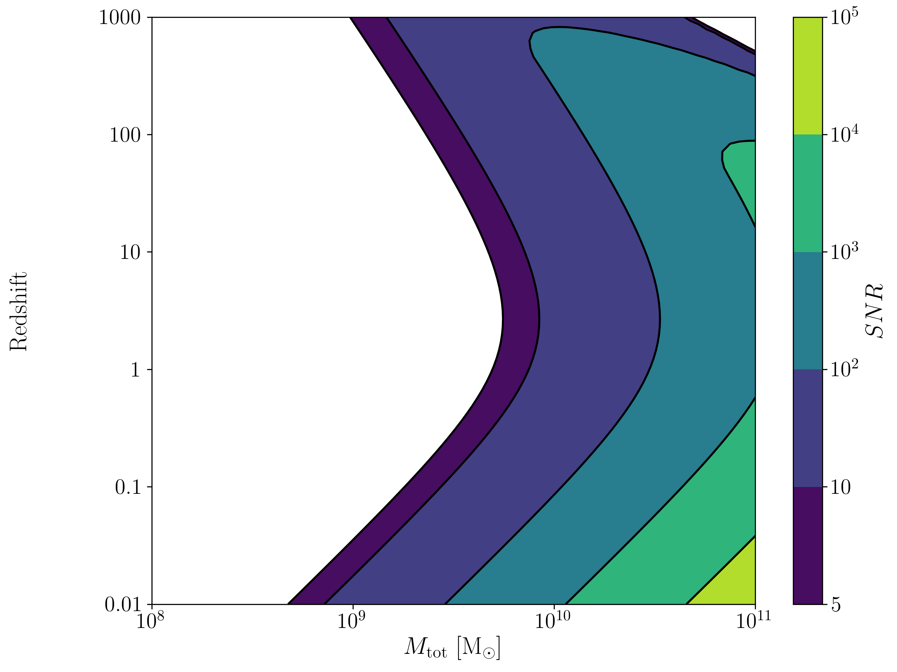

Create SNR Matrices and Samples for a Few Examples
--------------------------------------------------

Ground Based Instruments
~~~~~~~~~~~~~~~~~~~~~~~~

.. code:: python

    #Number of SNRMatrix rows
    sampleRate_y = 50
    #Number of SNRMatrix columns
    sampleRate_x = 50
    #Variable on y-axis
    var_ys = ['z','q','chi2']
    #Variable on x-axis
    var_x = 'M'

Einstein Telescope
^^^^^^^^^^^^^^^^^^

.. code:: python

    model = 0
    instrument = Get_Instrument(model)
    for var_y in var_ys:
        source = Get_Source(model)
        start = time.time()
        [sample_x,sample_y,SNRMatrix] = snr.Get_SNR_Matrix(source,instrument,
                                                           var_x,sampleRate_x,
                                                           var_y,sampleRate_y)
        end = time.time()
        snrplot.Plot_SNR(source,instrument,var_x,sample_x,var_y,sample_y,SNRMatrix,
                         dl_axis=False,smooth_contours=False)
    
        print('Model: ',instrument.name + '_' + var_x + '_vs_' + var_y,',',' done. t = : ',end-start)

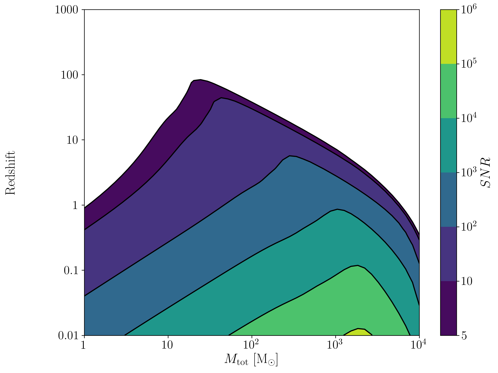

.. parsed-literal::

    Model:  ET_M_vs_z ,  done. t = :  16.7746262550354

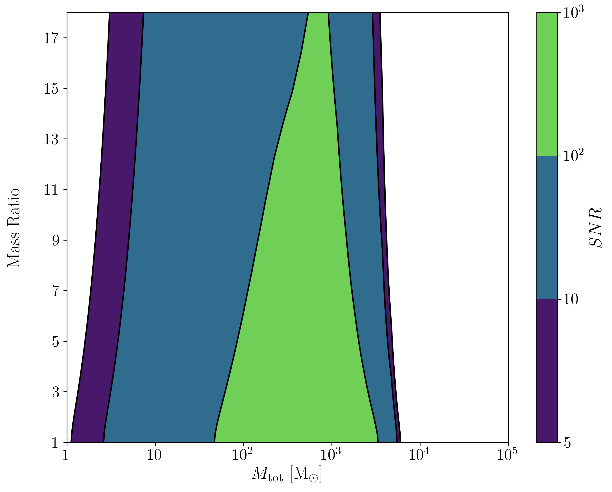

.. parsed-literal::

    Model:  ET_M_vs_q ,  done. t = :  20.113433837890625
    here

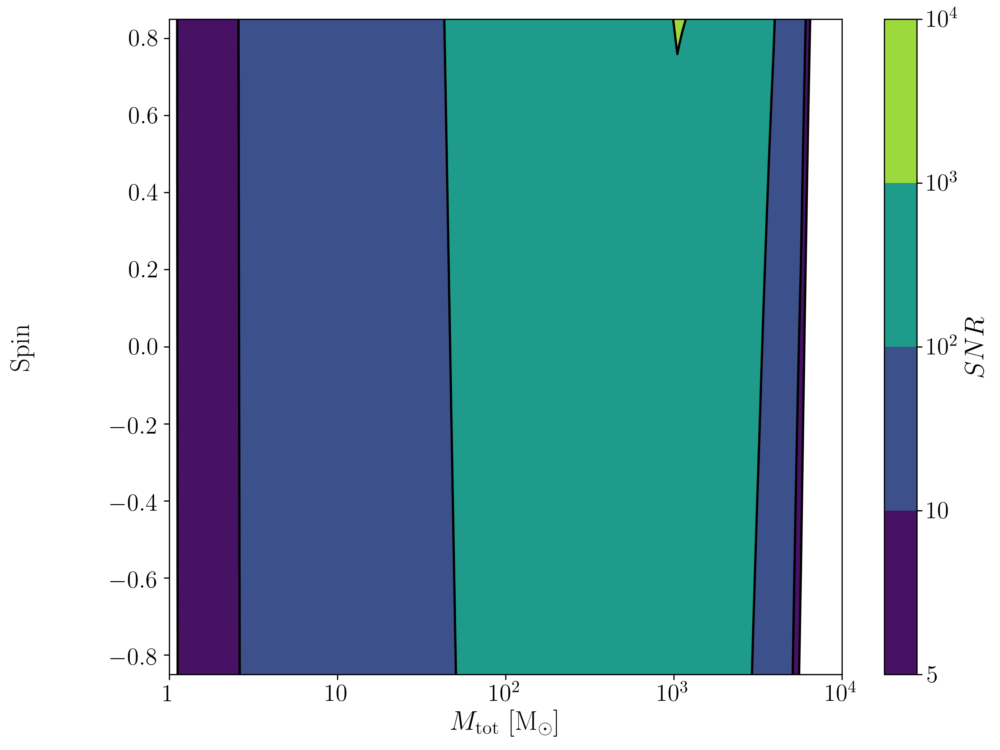

.. parsed-literal::

    Model:  ET_M_vs_chi2 ,  done. t = :  19.889232873916626

aLIGO
^^^^^

.. code:: python

    model = 1
    instrument = Get_Instrument(model)
    for var_y in var_ys:
        source = Get_Source(model)
        start = time.time()
        [sample_x,sample_y,SNRMatrix] = snr.Get_SNR_Matrix(source,instrument,
                                                           var_x,sampleRate_x,
                                                           var_y,sampleRate_y)
        end = time.time()
        snrplot.Plot_SNR(source,instrument,var_x,sample_x,var_y,sample_y,SNRMatrix,
                         dl_axis=False,smooth_contours=False)
    
        print('Model: ',instrument.name + '_' + var_x + '_vs_' + var_y,',',' done. t = : ',end-start)

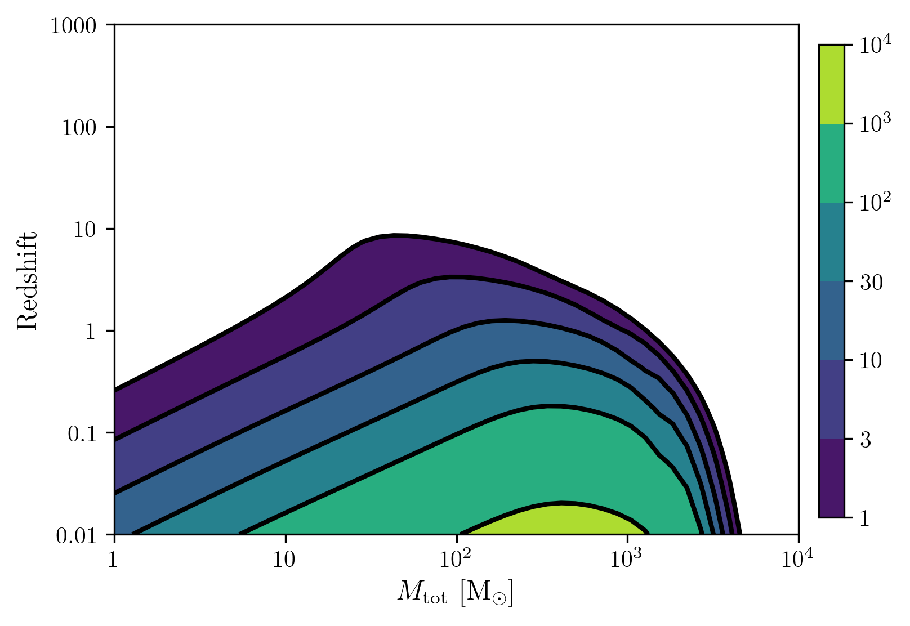

.. parsed-literal::

    Model:  aLIGO_M_vs_z ,  done. t = :  17.014657974243164

.. image:: calcSNR_tutorial_files/calcSNR_tutorial_29_2.png

.. parsed-literal::

    Model:  aLIGO_M_vs_q ,  done. t = :  20.479567766189575
    here

.. image:: calcSNR_tutorial_files/calcSNR_tutorial_29_4.png

.. parsed-literal::

    Model:  aLIGO_M_vs_chi2 ,  done. t = :  19.58860492706299

PTAs
~~~~

These can take a really long time if you vary the instrument parameters.
Be careful with your sample rates!

NANOGrav WN only
^^^^^^^^^^^^^^^^

.. code:: python

    #Number of SNRMatrix rows
    sampleRate_y = 10
    #Number of SNRMatrix columns
    sampleRate_x = 10
    #Variable on y-axis
    var_y = 'cadence'
    #Variable on x-axis
    var_x = 'M'

.. code:: python

    model = 2
    instrument = Get_Instrument(model)
    source = Get_Source(model)
    start = time.time()
    [sample_x,sample_y,SNRMatrix] = snr.Get_SNR_Matrix(source,instrument,
                                                       var_x,sampleRate_x,
                                                       var_y,sampleRate_y)
    end = time.time()
    snrplot.Plot_SNR(source,instrument,var_x,sample_x,var_y,sample_y,SNRMatrix,
                     dl_axis=False,smooth_contours=False)
    
    print('Model: ',instrument.name + '_' + var_x + '_vs_' + var_y,',',' done. t = : ',end-start)

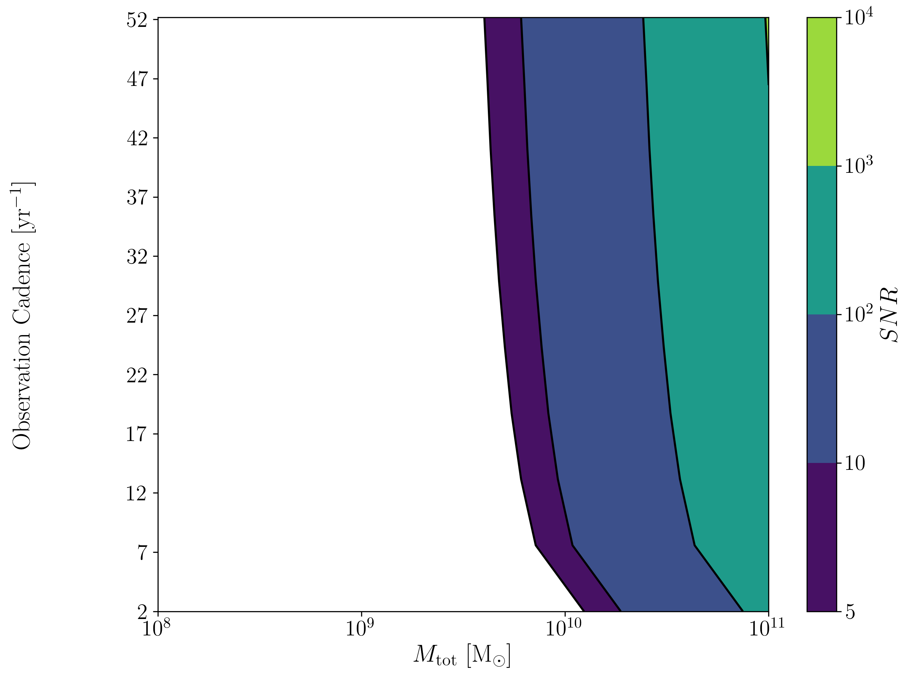

.. parsed-literal::

    Model:  NANOGrav_WN_M_vs_cadence ,  done. t = :  44.62179899215698

NANOGrav Realistic Noise
^^^^^^^^^^^^^^^^^^^^^^^^

.. code:: python

    #Variable on y-axis
    var_y = 'N_p'
    #Variable on x-axis
    var_x = 'M'

.. code:: python

    model = 3
    instrument = Get_Instrument(model)
    source = Get_Source(model)
    start = time.time()
    [sample_x,sample_y,SNRMatrix] = snr.Get_SNR_Matrix(source,instrument,
                                                       var_x,sampleRate_x,
                                                       var_y,sampleRate_y)
    end = time.time()
    snrplot.Plot_SNR(source,instrument,var_x,sample_x,var_y,sample_y,SNRMatrix,
                     dl_axis=False,smooth_contours=False)
    
    print('Model: ',instrument.name + '_' + var_x + '_vs_' + var_y,',',' done. t = : ',end-start)

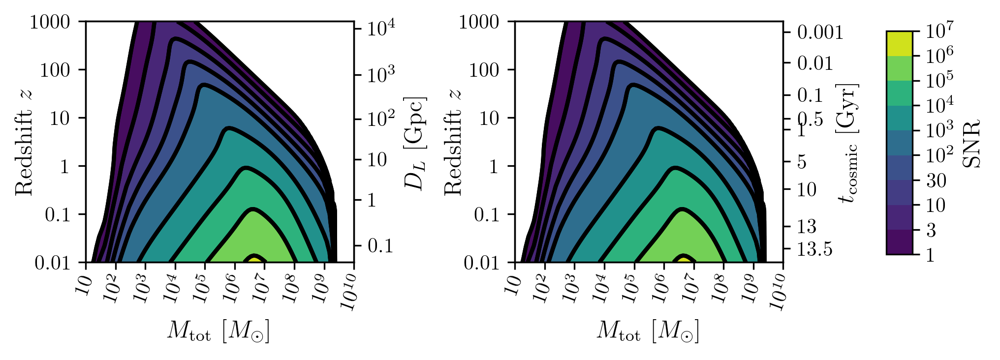

.. parsed-literal::

    Model:  NANOGrav_realistic_noise_M_vs_N_p ,  done. t = :  88.37940716743469

NANOGrav 11yr Data
^^^^^^^^^^^^^^^^^^

.. code:: python

    #Number of SNRMatrix rows
    sampleRate_y = 50
    #Number of SNRMatrix columns
    sampleRate_x = 50
    #Variable on y-axis
    var_y = 'q'
    #Variable on x-axis
    var_x = 'M'

.. code:: python

    model = 4
    instrument = Get_Instrument(model)
    source = Get_Source(model)
    start = time.time()
    [sample_x,sample_y,SNRMatrix] = snr.Get_SNR_Matrix(source,instrument,
                                                       var_x,sampleRate_x,
                                                       var_y,sampleRate_y)
    end = time.time()
    snrplot.Plot_SNR(source,instrument,var_x,sample_x,var_y,sample_y,SNRMatrix,
                     dl_axis=False,smooth_contours=False)
    
    print('Model: ',instrument.name + '_' + var_x + '_vs_' + var_y,',',' done. t = : ',end-start)

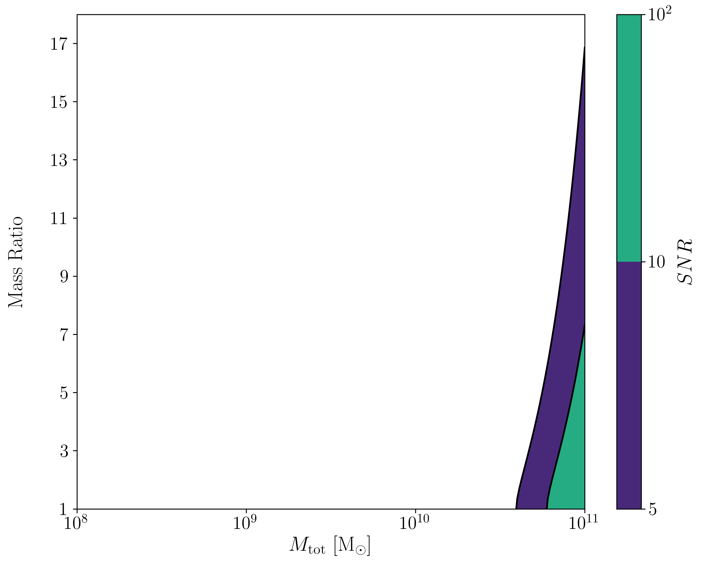

.. parsed-literal::

    Model:  NANOGrav_11yr_M_vs_q ,  done. t = :  11.418483972549438

SKA WN Only
^^^^^^^^^^^

.. code:: python

    #Number of SNRMatrix rows
    sampleRate_y = 10
    #Number of SNRMatrix columns
    sampleRate_x = 10
    #Variable on y-axis
    var_y = 'sigma'
    #Variable on x-axis
    var_x = 'M'

.. code:: python

    model = 5
    instrument = Get_Instrument(model)
    source = Get_Source(model)
    start = time.time()
    [sample_x,sample_y,SNRMatrix] = snr.Get_SNR_Matrix(source,instrument,
                                                       var_x,sampleRate_x,
                                                       var_y,sampleRate_y)
    end = time.time()
    snrplot.Plot_SNR(source,instrument,var_x,sample_x,var_y,sample_y,SNRMatrix,
                     dl_axis=False,smooth_contours=False)
    
    print('Model: ',instrument.name + '_' + var_x + '_vs_' + var_y,',',' done. t = : ',end-start)

.. image:: calcSNR_tutorial_files/calcSNR_tutorial_42_0.png

.. parsed-literal::

    Model:  SKA_WN_M_vs_sigma ,  done. t = :  134.86095309257507

SKA Realistic Noise
^^^^^^^^^^^^^^^^^^^

.. code:: python

    #Variable on y-axis
    var_y = 'T_obs'
    #Variable on x-axis
    var_x = 'M'

.. code:: python

    model = 6
    instrument = Get_Instrument(model)
    source = Get_Source(model)
    start = time.time()
    [sample_x,sample_y,SNRMatrix] = snr.Get_SNR_Matrix(source,instrument,
                                                       var_x,sampleRate_x,
                                                       var_y,sampleRate_y)
    end = time.time()
    snrplot.Plot_SNR(source,instrument,var_x,sample_x,var_y,sample_y,SNRMatrix,
                     dl_axis=False,smooth_contours=False)
    
    print('Model: ',instrument.name + '_' + var_x + '_vs_' + var_y,',',' done. t = : ',end-start)

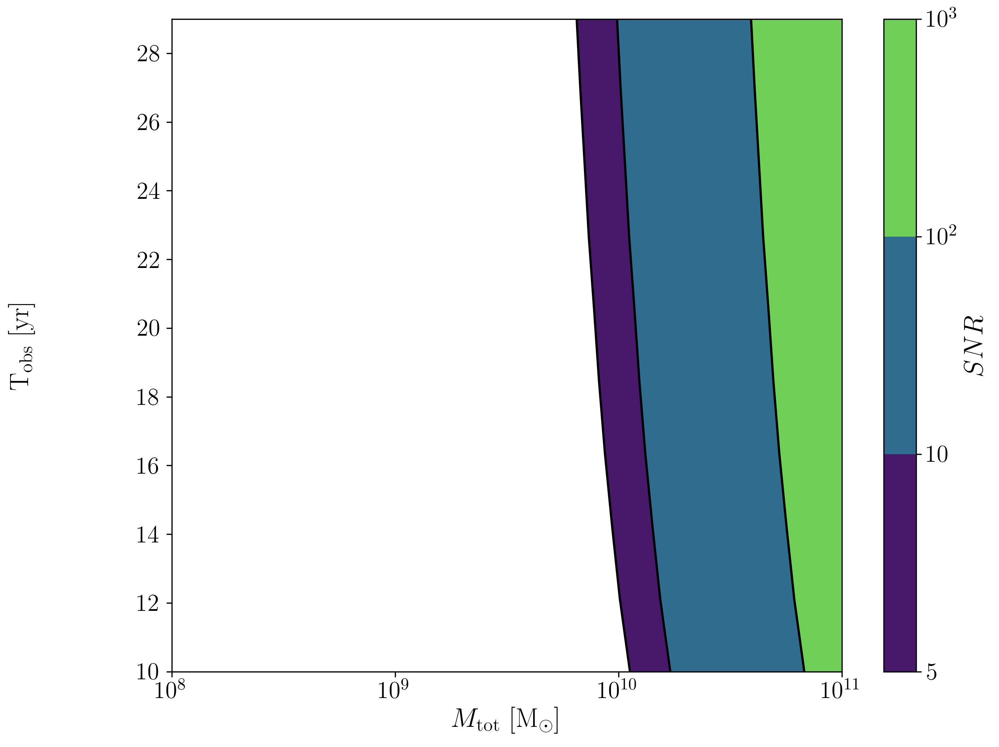

.. parsed-literal::

    Model:  SKA_realistic_noise_M_vs_T_obs ,  done. t = :  324.45782709121704

Space Based Instrument
~~~~~~~~~~~~~~~~~~~~~~

LISA
^^^^

.. code:: python

    #Number of SNRMatrix rows
    sampleRate_y = 50
    #Number of SNRMatrix columns
    sampleRate_x = 50
    #Variable on y-axis
    var_ys = ['z','q','chi1','L','A_acc']
    #Variable on x-axis
    var_x = 'M'

.. code:: python

    model = 7
    instrument = Get_Instrument(model)
    for var_y in var_ys:
        source = Get_Source(model)
        start = time.time()
        [sample_x,sample_y,SNRMatrix] = snr.Get_SNR_Matrix(source,instrument,
                                                           var_x,sampleRate_x,
                                                           var_y,sampleRate_y)
        end = time.time()
        snrplot.Plot_SNR(source,instrument,var_x,sample_x,var_y,sample_y,SNRMatrix,
                         dl_axis=False,smooth_contours=False)
    
        print('Model: ',instrument.name + '_' + var_x + '_vs_' + var_y,',',' done. t = : ',end-start)

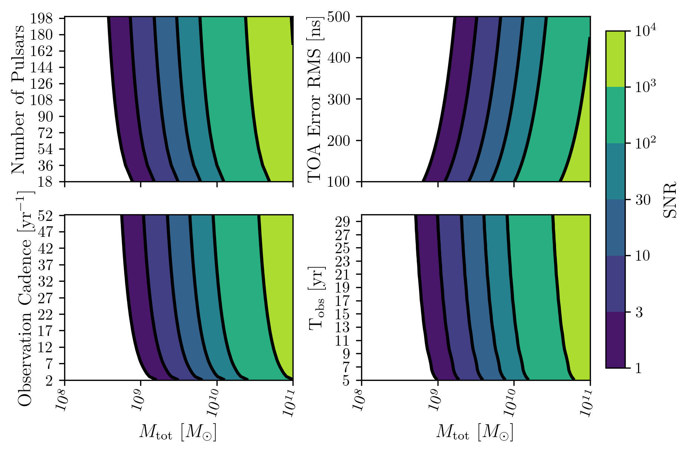

.. parsed-literal::

    Model:  LISA_ESA_M_vs_z ,  done. t = :  23.79416799545288

.. image:: calcSNR_tutorial_files/calcSNR_tutorial_48_2.png

.. parsed-literal::

    Model:  LISA_ESA_M_vs_q ,  done. t = :  28.552029132843018
    here

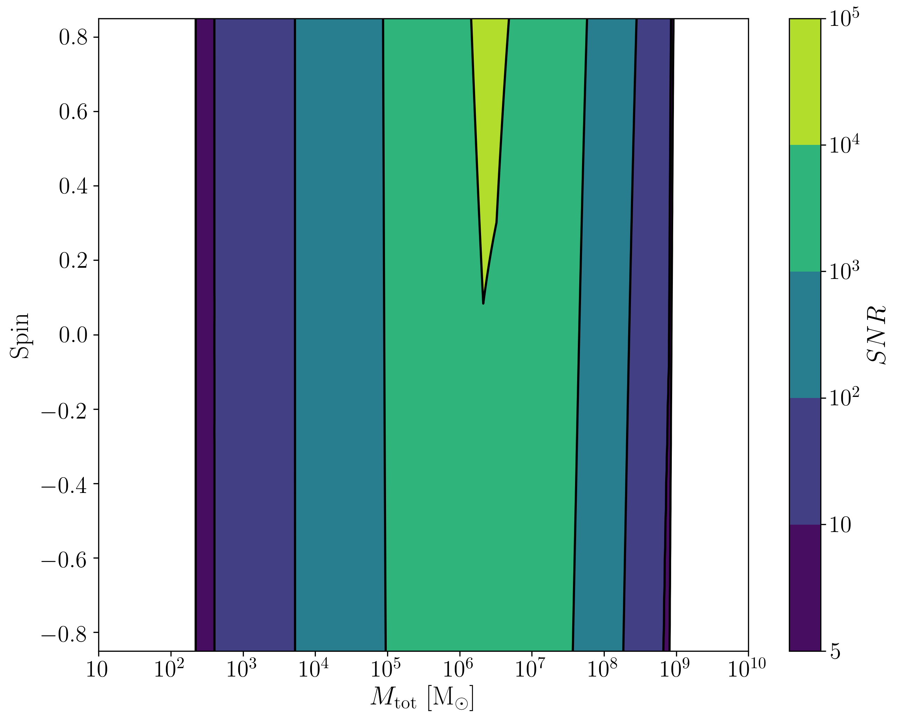

.. parsed-literal::

    Model:  LISA_ESA_M_vs_chi1 ,  done. t = :  28.777315139770508

.. image:: calcSNR_tutorial_files/calcSNR_tutorial_48_6.png

.. parsed-literal::

    Model:  LISA_ESA_M_vs_L ,  done. t = :  22.928117990493774

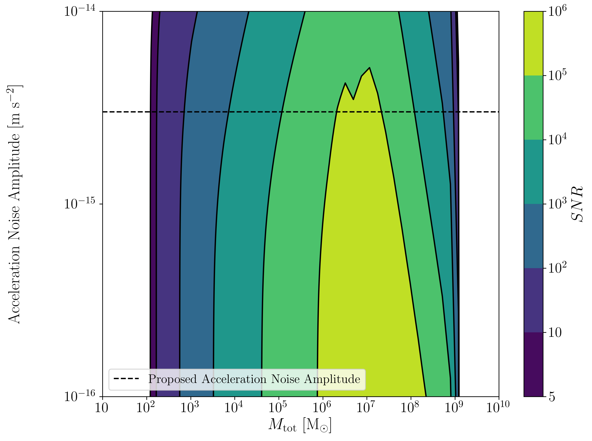

.. parsed-literal::

    Model:  LISA_ESA_M_vs_A_acc ,  done. t = :  22.139339923858643

