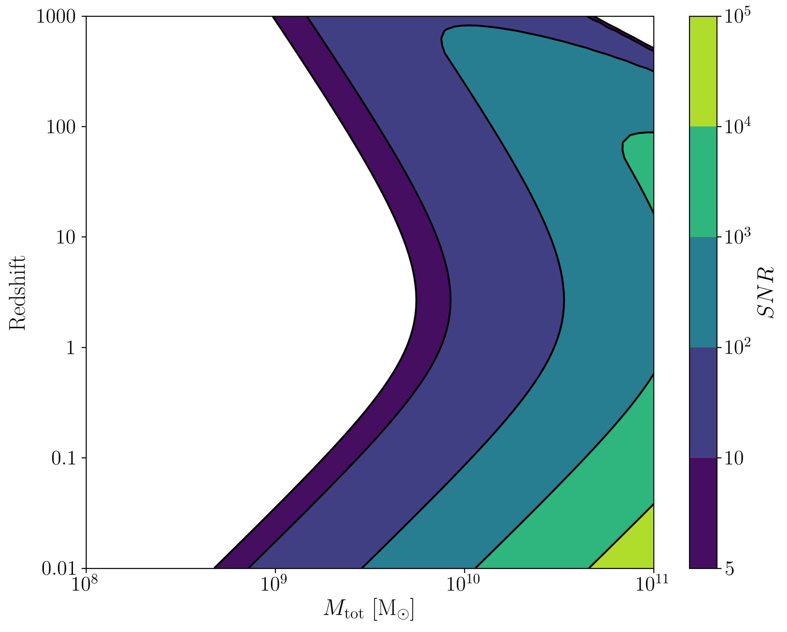
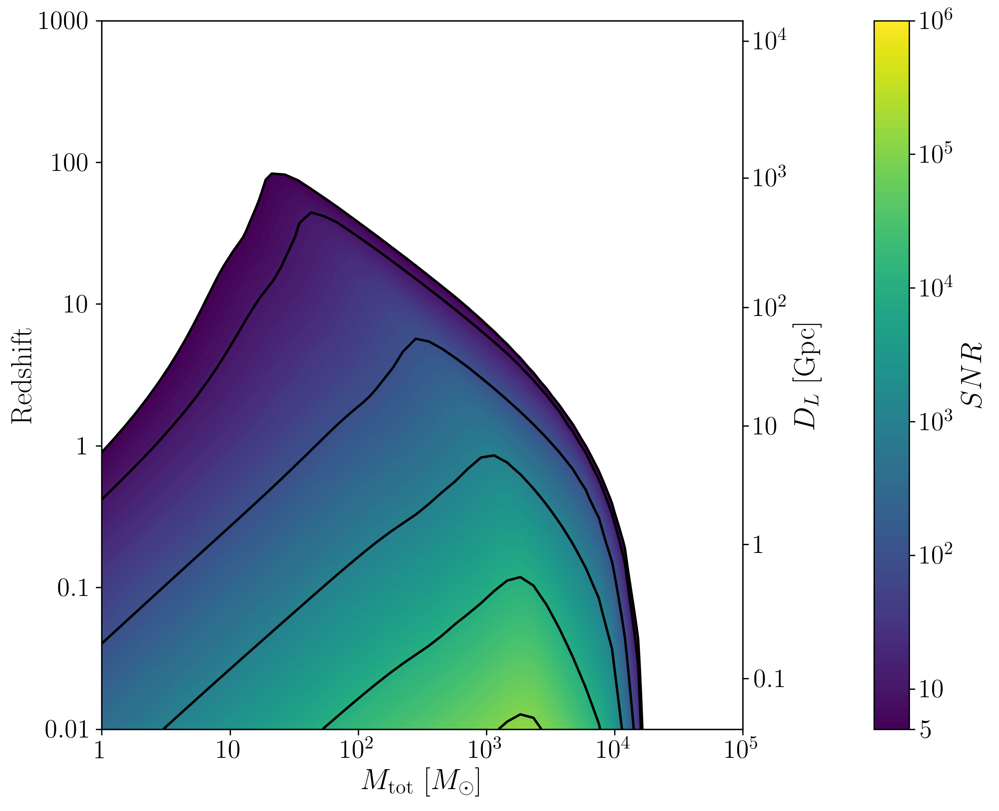
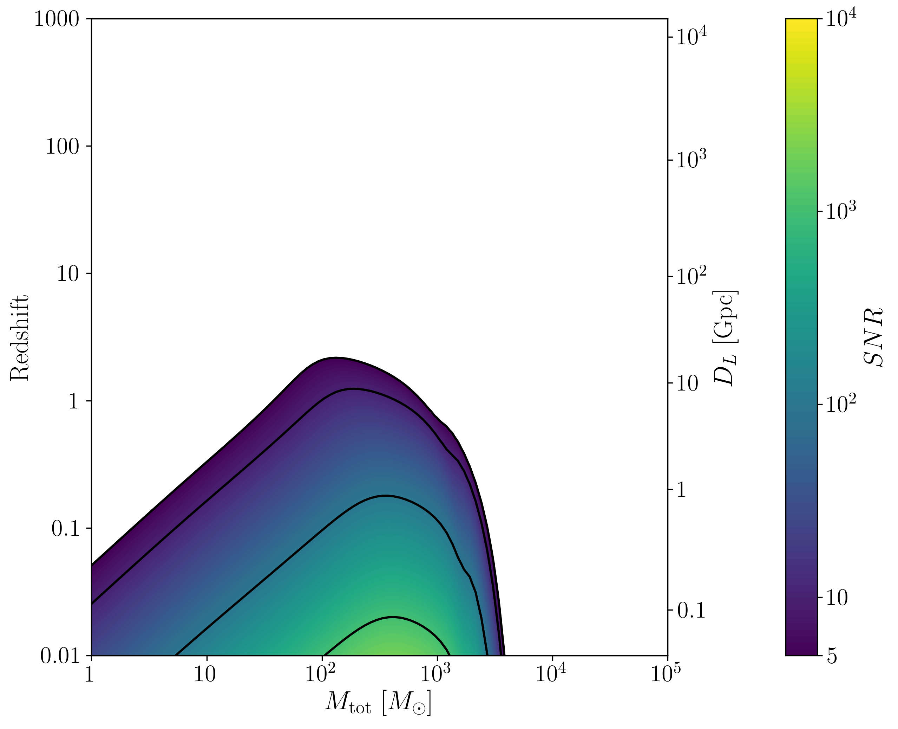
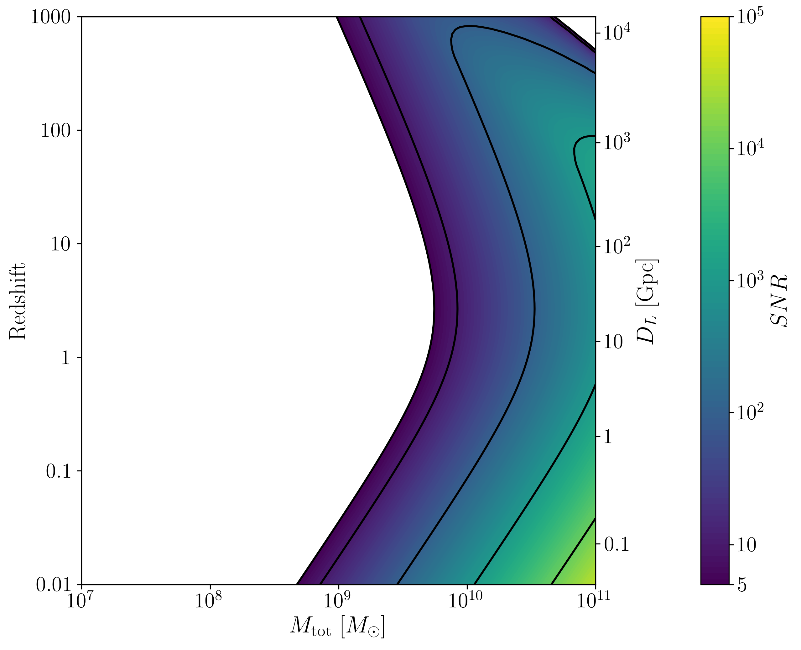
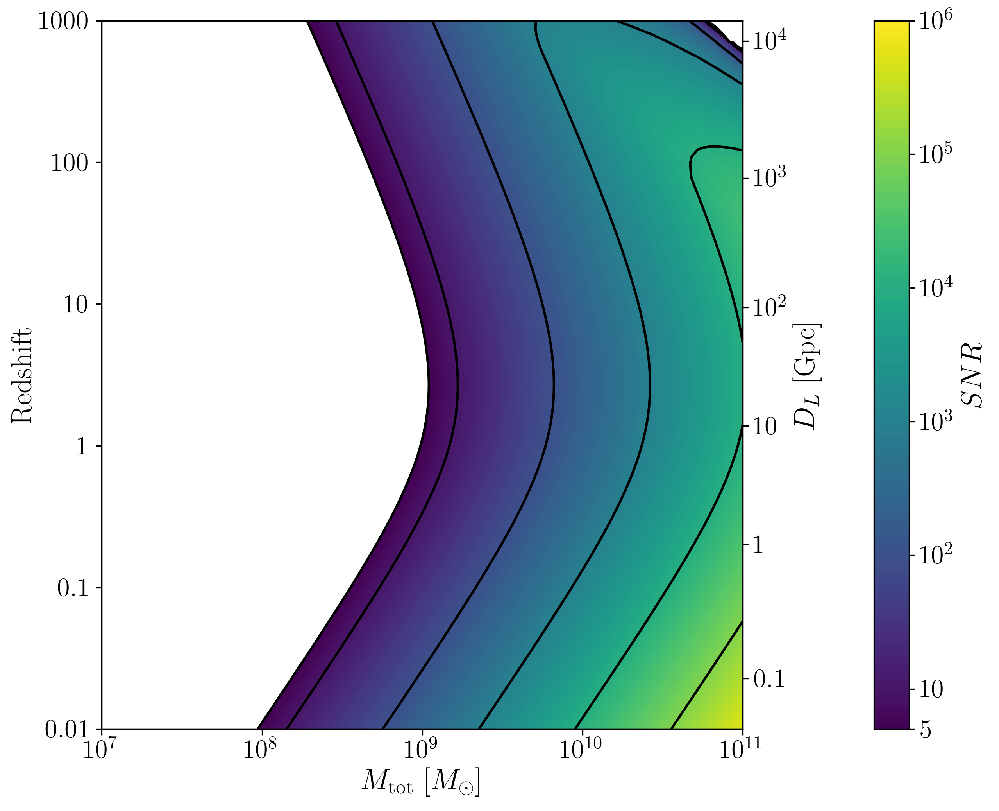
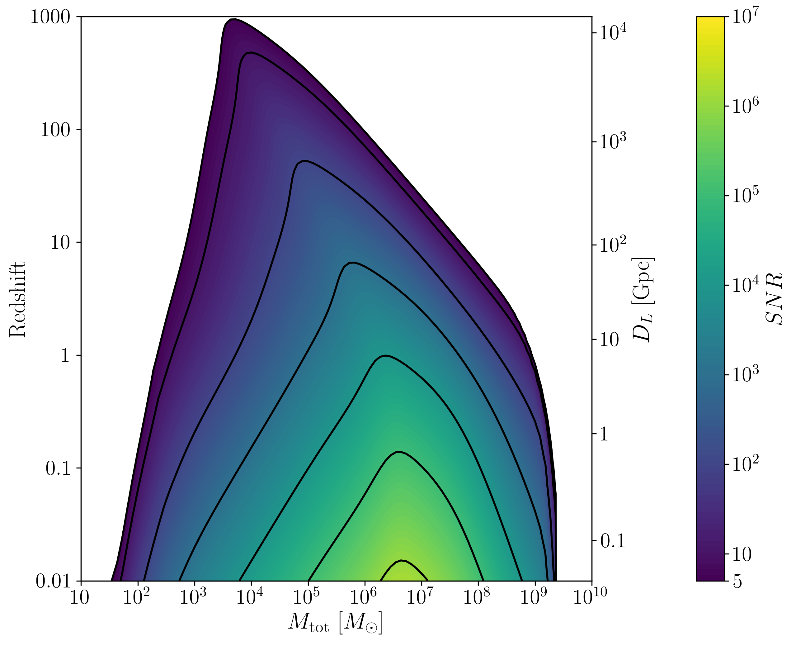

.. module:: hasasia

.. note:: This tutorial was generated from a Jupyter notebook that can be
          downloaded `here <_static/notebooks/calcSNR_tutorial.ipynb>`_.

.. _calcSNR_tutorial:

Using ``gwent`` to Calculate Signal-to-Noise Ratios
===================================================

Here we present a tutorial on how to use ``gwent`` to calculate SNRs for
the instrument models currently implemented (LISA, PTAs, aLIGO, and
Einstein Telescope) with the signal being an array of coalescing Binary
Black Holes.

First, we import important modules.

.. code:: python

    import numpy as np
    import matplotlib.pyplot as plt
    import matplotlib as mpl
    import astropy.constants as const
    import os, sys, time
    import astropy.units as u
    
    import gwent
    import gwent.binary as binary
    import gwent.detector as detector
    import gwent.snr as snr
    import gwent.snrplot as snrplot

Setting matplotlib preferences

.. code:: python

    mpl.rcParams['figure.dpi'] = 300
    mpl.rcParams['figure.figsize'] = [5,3]
    mpl.rcParams['text.usetex'] = True
    mpl.rc('font',**{'family':'serif','serif':['Times New Roman'],'size':14})

We need to get the file directories to load in the instrument files.

.. code:: python

    load_directory = gwent.__path__[0] + '/LoadFiles/InstrumentFiles/'

Declaring x and y variables and Sample Rates
--------------------------------------------

The variables for either axis in the SNR calculation can be: \* GLOBAL:
\* ‘T_obs’ - Detector Observation Time \* SOURCE: \* ‘M’ - Mass (Solar
Units) \* ‘q’ - Mass Ratio \* ‘chi1’ - Dimensionless Spin of Black Hole
1 \* ‘chi2’ - Dimensionless Spin of Black Hole 2 \* ‘z’ - Redshift \*
LISA ONLY: \* ‘L’ - Detector Armlength \* ‘A_acc’ - Detector
Acceleration Noise \* ‘A_IMS’ - Detector Optical Metrology Noise \*
‘f_acc_break_low’ - The Low Acceleration Noise Break Frequency \*
‘f_acc_break_high’ - The High Acceleration Noise Break Frequency \*
‘f_IMS_break’ - The Optical Metrology Noise Break Frequency \* PTAs
ONLY: \* ‘N_p’ - Number of Pulsars \* ‘sigma’ - Root-Mean-Squared Timing
Error \* ‘cadence’ - Observation Cadence

.. code:: python

    #Variable on y-axis
    var_y = 'z'
    #Number of SNRMatrix rows
    sampleRate_y = 100
    #Variable on x-axis
    var_x = 'M'
    #Number of SNRMatrix columns
    sampleRate_x = 100

Source Selection Function
-------------------------

Takes in a an instrument model that dictates reasonable mass ranges for
the particular detector mass regime and instantiates a source with the
variable ranges limited by the waveform calibration region.

The source parameters must be set (ie. M,q,z,chi1,chi2), but one only
needs to set the minima and maxima of the selected SNR axes variables.

.. code:: python

    def Get_Source(model):
        if model == 0 or model == 1:
            #M = m1+m2 Total Mass
            M = 1e2
            M_min = 1e0
            M_max = 1e5
        elif model == 2 or model == 3:
            #M = m1+m2 Total Mass
            M = 1e8
            M_min = 1e7
            M_max = 1e11
        else:
            #M = m1+m2 Total Mass
            M = 1e6
            M_min = 1e1
            M_max = 1e10
            
        #q = m2/m1 reduced mass
        q = 1.0
        q_min = 1.0
        q_max = 18.0
    
        #Chi = S_i*L/m_i**2, spins of each mass i
        chi1 = 0.0 #spin of m1
        chi2 = 0.0 #spin of m2
        chi_min = -0.85 #Limits of PhenomD for unaligned spins
        chi_max = 0.85
        
        z = 3.0 #Redshift
        z_min = 1e-2
        z_max = 1e3
        
        #Doesn't Really work yet
        inc = 0.0
        inc_min = 0.0
        inc_max = 0.0
        
        source = binary.BBHFrequencyDomain(M,q,z,chi1,chi2,inc)
        source.M = [M,M_min,M_max]
        source.q = [q,q_min,q_max]
        source.chi1 = [chi1,chi_min,chi_max]
        source.chi2 = [chi2,chi_min,chi_max]
        source.z = [z,z_min,z_max]
        source.inc = [inc,inc_min,inc_max]
    
        return source

Instrument Selection Function
-----------------------------

Takes in an instrument model then assigns the fiducial noise and
detector values. The model only assigns ranges of calculation for quick
variable calculations, but one only needs to set the minima and maxima
if they wish to use other selected SNR axes variables.

If loading a detector, the file should be frequency in the first column
and either strain, effective strain noise spectral density, or amplitude
spectral density in the second column.

For generating a detector, one must assign a value to each of the
different instrument parameters (see the section on Declaring x and y
variables and Sample Rates).

.. code:: python

    def Get_Instrument(model):
        if model == 0: #Einstein Telescope
            #Loaded from http://www.et-gw.eu/index.php/etsensitivities
            load_name = 'ET_D_data.txt'
            load_location = load_directory + 'EinsteinTelescope/StrainFiles/' + load_name
            
            T_obs = 4*u.yr #Observing time in years
            T_obs_min = 1*u.yr
            T_obs_max = 10*u.yr
            
            instrument = detector.GroundBased('ET',T_obs,load_location=load_location,I_type='A')
            instrument.T_obs = [T_obs,T_obs_min,T_obs_max]
    
        elif model == 1: #aLIGO
            #Loaded from https://dcc.ligo.org/T1800044/public
            load_name = 'aLIGODesign.txt'
            load_location = load_directory + 'aLIGO/StrainFiles/' + load_name
            
            T_obs = 4*u.yr #Observing time in years
            T_obs_min = 1*u.yr
            T_obs_max = 10*u.yr
    
            instrument = detector.GroundBased('aLIGO',T_obs,load_location=load_location,I_type='A')
            instrument.T_obs = [T_obs,T_obs_min,T_obs_max]
    
        elif model == 2: #NANOGrav 15 yr
            #NANOGrav calculation using 11.5yr parameters https://arxiv.org/abs/1801.01837
            T_obs = 15*u.yr #Observing time in years
            T_obs_min = 10*u.yr
            T_obs_max = 30*u.yr
    
            sigma = 100*u.ns.to('s')*u.s #rms timing residuals in seconds
            
            N_p = 18 #Number of pulsars
            
            cadence = 1/(2*u.wk.to('yr')*u.yr) #Avg observation cadence of 1 every 2 weeks in num/year
            
            instrument = detector.PTA('NANOGrav',T_obs,N_p,sigma,cadence)
            instrument.T_obs = [T_obs,T_obs_min,T_obs_max]
    
            
        elif model == 3: #SKA (2030s)
            #SKA calculation using parameters and methods from https://arxiv.org/abs/0804.4476 section 7.1
            T_obs = 15*u.yr #Observing time (years)
            T_obs_min = 10*u.yr
            T_obs_max = 30*u.yr
            
            sigma = 10*u.ns.to('s')*u.s #rms timing residuals in nanoseconds
            
            N_p = 20 #Number of pulsars
            
            cadence = 1/(u.wk.to('yr')*u.yr) #Avg observation cadence of 1 every week in num/year
            
            instrument = detector.PTA('SKA',T_obs,N_p,sigma,cadence)
            instrument.T_obs = [T_obs,T_obs_min,T_obs_max]
            
        elif model == 4: #Robson,Cornish,and Liu 2019, LISA (https://arxiv.org/abs/1803.01944)
            T_obs = 4*u.yr #Observing time in years
            T_obs_min = 1*u.yr
            T_obs_max = 10*u.yr
    
            L = 2.5e9*u.m #armlength in meters
            L_min = 1.0e7*u.m
            L_max = 1.0e11*u.m
              
            A_acc = 3e-15*u.m/u.s/u.s #M/s**2
            A_IMS = 1.5e-11*u.m
            f_IMS_break = 2.*u.mHz.to('Hz')*u.Hz
            f_acc_break_low = .4*u.mHz.to('Hz')*u.Hz
            f_acc_break_high = 8.*u.mHz.to('Hz')*u.Hz
            Background = False
            
            instrument = detector.SpaceBased('Alt_LISA',\
                                           T_obs,L,A_acc,f_acc_break_low,f_acc_break_high,A_IMS,f_IMS_break,\
                                           Background=Background)
            instrument.T_obs = [T_obs,T_obs_min,T_obs_max]
            instrument.L = [L,L_min,L_max]
            
        else: #L3 proposal
            #Default Params from https://arxiv.org/abs/1702.00786
            T_obs = 4*u.yr #Observing time in years
            T_obs_min = 1*u.yr
            T_obs_max = 10*u.yr
            
            L = 2.5e9*u.m #armlength in meters
            L_min = 1.0e7*u.m
            L_max = 1.0e11*u.m
            
            f_acc_break_low = .4*u.mHz.to('Hz')*u.Hz
            f_acc_break_high = 8.*u.mHz.to('Hz')*u.Hz
            f_IMS_break = 2.*u.mHz.to('Hz')*u.Hz
            A_acc = 3e-15*u.m/u.s/u.s
            A_IMS = 10e-12*u.m
            Background = False
            
            instrument = detector.SpaceBased('LISA_ESA',\
                                           T_obs,L,A_acc,f_acc_break_low,f_acc_break_high,A_IMS,f_IMS_break,\
                                           Background=Background)
            instrument.T_obs = [T_obs,T_obs_min,T_obs_max]
            instrument.L = [L,L_min,L_max]
            
        return instrument

SNR Calculation
---------------

Based on the selected model, we use ``Get_Instrument`` and
``Get_Source`` to instantiate both the instrument and the model for the
SNR Calculation.

.. code:: python

    model = 2
    instrument = Get_Instrument(model)
    source = Get_Source(model)

We now use ``Get_SNR_Matrix`` with the variables given and the data
range to sample the space either logrithmically or linearly based on the
selection of variables. It computes the SNR for each value, then returns
the variable ranges used to calculate the SNR for each matrix, then
returns the SNRs with size of the ``sampleRate1``\ X\ ``sampleRate2``

.. code:: python

    start = time.time()
    [sample_x,sample_y,SNRMatrix] = snr.Get_SNR_Matrix(source,instrument,var_x,sampleRate_x,var_y,sampleRate_y)
    end = time.time()
    print(end-start)

.. parsed-literal::

    47.121991872787476

Plot the SNR using the initial variables and the returns from
``Get_SNR_Matrix``

.. code:: python

    snrplot.Plot_SNR(source,instrument,var_x,sample_x,var_y,sample_y,SNRMatrix,smooth_contours=False)

Create of SNR Matrices and Samples for all models
-------------------------------------------------

.. code:: python

    models = [0,1,2,3,4,5]
    for model in models:
        instrument = Get_Instrument(model)
        source = Get_Source(model)
        start = time.time()
        [sample_x,sample_y,SNRMatrix] = snr.Get_SNR_Matrix(source,instrument,\
                                                 var_x,sampleRate_x,var_y,sampleRate_y)
        end = time.time()
        #snr.Save_SNR(sample_x,sample_y,SNRMatrix,save_location,SNR_save_name,Sample_save_name)
        snrplot.Plot_SNR(source,instrument,var_x,sample_x,var_y,sample_y,SNRMatrix,dl_axis=True,smooth_contours=True)
        print('Model: ',instrument.name,',',' done. t = : ',end-start)

.. parsed-literal::

    Model:  ET ,  done. t = :  62.684426069259644

.. parsed-literal::

    Model:  aLIGO ,  done. t = :  63.27045702934265

.. parsed-literal::

    Model:  NANOGrav ,  done. t = :  45.956143856048584

.. parsed-literal::

    Model:  SKA ,  done. t = :  53.798473834991455

.. image:: calcSNR_tutorial_files/calcSNR_tutorial_25_8.png

.. parsed-literal::

    Model:  Alt_LISA ,  done. t = :  72.71657276153564

.. parsed-literal::

    Model:  LISA_ESA ,  done. t = :  72.5990080833435

