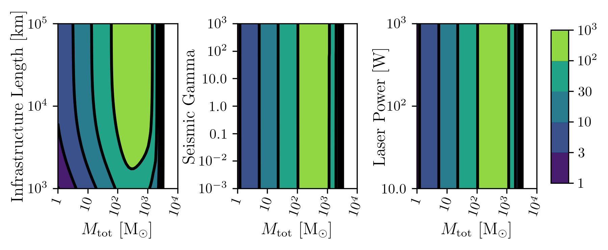
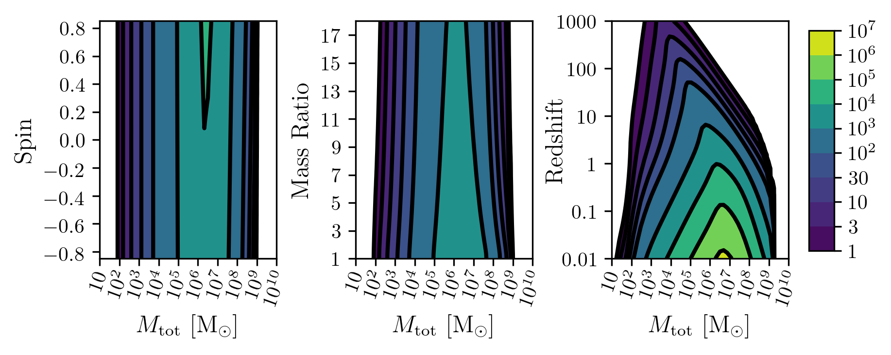
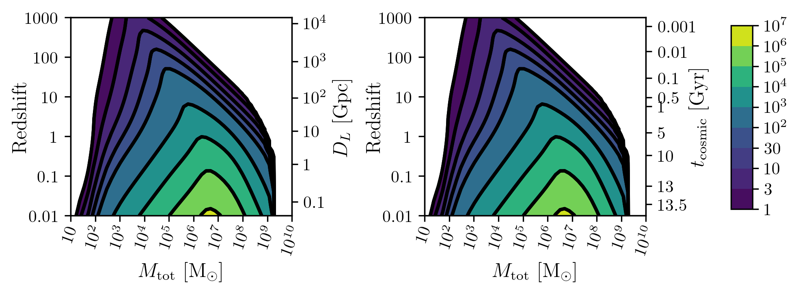

.. module:: hasasia

.. note:: This tutorial was generated from a Jupyter notebook that can be
          downloaded `here <_static/notebooks/calcSNR_tutorial.ipynb>`_.

.. _calcSNR_tutorial:

Using ``gwent`` to Calculate Signal-to-Noise Ratios
===================================================

Here we present a tutorial on how to use ``gwent`` to calculate SNRs for
the instrument models currently implemented (LISA, PTAs, aLIGO, and
Einstein Telescope) with the signal being an array of coalescing Binary
Black Holes.

First, we import important modules.

.. code:: python

    import numpy as np
    import matplotlib.pyplot as plt
    import matplotlib as mpl
    from scipy.constants import golden_ratio
    
    import astropy.constants as const
    import time
    import astropy.units as u
    
    import gwent
    import gwent.binary as binary
    import gwent.detector as detector
    import gwent.snr as snr
    from gwent.snrplot import Plot_SNR
    
    #Turn off warnings for tutorial
    import warnings
    warnings.filterwarnings('ignore')

Setting matplotlib preferences and adding a pretty plot function for fig
sizes

.. code:: python

    def get_fig_size(width=7,scale=2.0):
        #width = 3.36 # 242 pt
        base_size = np.array([1, 1/scale/golden_ratio])
        fig_size = width * base_size
        return(fig_size)
    mpl.rcParams['figure.dpi'] = 300
    #mpl.rcParams['figure.figsize'] = get_fig_size()
    mpl.rcParams['text.usetex'] = True
    mpl.rc('font',**{'family':'serif','serif':['Times New Roman']})
    mpl.rcParams['lines.linewidth'] = 1.3
    mpl.rcParams['axes.labelsize'] = 12
    mpl.rcParams['xtick.labelsize'] = 10
    mpl.rcParams['ytick.labelsize'] = 10
    mpl.rcParams['legend.fontsize'] = 8

We need to get the file directories to load in the instrument files.

.. code:: python

    load_directory = gwent.__path__[0] + '/LoadFiles/InstrumentFiles/'

Fiducial Source Creation
------------------------

To run ``snr.Get_SNR_Matrix``, you need to instantiate a source. Since
we need to reinitialize a few times, we just put it here as a function.

This is an example for reasonable mass ranges for the particular
detector mass regime and the variable ranges limited by the waveform
calibration region.

The source parameters must be set (ie. M,q,z,chi1,chi2), but one also
needs to set the minima and maxima of the selected SNR axes variables.
This takes the form of
``source_param = [fiducial_value,minimum,maximum]``

.. code:: python

    def Initialize_Source(instrument):
        """Initializes a source binary based on the instrument type and returns the source
        """
        
        #q = m2/m1 reduced mass
        q = 1.0
        q_min = 1.0
        q_max = 18.0
        q_list = [q,q_min,q_max]
    
        #Chi = S_i*L/m_i**2, spins of each mass i
        chi1 = 0.0 #spin of m1
        chi2 = 0.0 #spin of m2
        chi_min = -0.85 #Limits of PhenomD for unaligned spins
        chi_max = 0.85
        chi1_list = [chi1,chi_min,chi_max]
        chi2_list = [chi2,chi_min,chi_max]
    
        #Redshift
        z_min = 1e-2
        z_max = 1e3
    
        if isinstance(instrument,detector.GroundBased):
            #Total source mass
            M_ground_source = [10.,1.,1e4]
            #Redshift
            z_ground_source = [0.1,z_min,z_max]
    
            source = binary.BBHFrequencyDomain(M_ground_source,
                                               q_list,
                                               z_ground_source,
                                               chi1_list,
                                               chi2_list)
        elif isinstance(instrument,detector.SpaceBased):
            M_space_source = [1e6,10.,1e10]
            z_space_source = [1.0,z_min,z_max]
            source = binary.BBHFrequencyDomain(M_space_source,
                                               q_list,
                                               z_space_source,
                                               chi1_list,
                                               chi2_list)
        elif isinstance(instrument,detector.PTA):
            M_pta_source = [1e9,1e8,1e11]
            z_pta_source = [0.1,z_min,z_max]
            source = binary.BBHFrequencyDomain(M_pta_source,
                                               q_list,
                                               z_pta_source,
                                               chi1_list,
                                               chi2_list)
        return source

Create SNR Matrices and Samples for a Few Examples
--------------------------------------------------

The variables for either axis in the SNR calculation can be:

-  GLOBAL:

   -  ‘T_obs’ - Detector Observation Time

-  SOURCE:

   -  ‘M’ - Mass (Solar Units)
   -  ‘q’ - Mass Ratio
   -  ‘chi1’ - Dimensionless Spin of Black Hole 1
   -  ‘chi2’ - Dimensionless Spin of Black Hole 2
   -  ‘z’ - Redshift

-  GroundBased ONLY:

   -  Any single valued variable in list of params given by:
      instrument_GroundBased.Get_Noise_Dict()
   -  To make variable in SNR, declare the main variable, then the
      subparameter variable as a string e.g. var_x = ‘Infrastructure
      Length’, the case matters.

-  SpaceBased ONLY:

   -  ‘L’ - Detector Armlength
   -  ‘A_acc’ - Detector Acceleration Noise
   -  ‘A_IFO’ - Detector Optical Metrology Noise
   -  ‘f_acc_break_low’ - The Low Acceleration Noise Break Frequency
   -  ‘f_acc_break_high’ - The High Acceleration Noise Break Frequency
   -  ‘f_IFO_break’ - The Optical Metrology Noise Break Frequency

-  PTA ONLY:

   -  ‘n_p’ - Number of Pulsars
   -  ‘sigma’ - Root-Mean-Squared Timing Error
   -  ‘cadence’ - Observation Cadence

Instrument Creation Examples
----------------------------

For each instrument one wants to investigate, you have to assign the
fiducial noise and detector values. We do the same reinitialization game
here as the source, so each of these are functions.

These examples only assign ranges of calculation for quick variable
calculations, but one only needs to set the minima and maxima if they
wish to use other selected SNR axes variables.

If loading a detector, the file should be frequency in the first column
and either strain, effective strain noise spectral density, or amplitude
spectral density in the second column.

The strain tutorial goes into more detail on initializing detectors, so
if you get lost, look there!

Ground Based Detectors
~~~~~~~~~~~~~~~~~~~~~~

.. code:: python

    def Initialize_aLIGO():
        #Observing time in years
        T_obs_ground_list = [4*u.yr,1*u.yr,10*u.yr]
        #aLIGO
        noise_dict_aLIGO = {'Infrastructure':
                      {'Length':[3995,1000,1e5]},
                      'Laser':
                      {'Power':[125,10,1e3]},
                      'Seismic':
                      {'Gamma':[0.8,1e-3,1e3]}}
        aLIGO = detector.GroundBased('aLIGO',T_obs_ground_list,noise_dict=noise_dict_aLIGO)
        
        return aLIGO

Space Based Detectors
~~~~~~~~~~~~~~~~~~~~~

.. code:: python

    def Initialize_LISA():
        T_obs_space_list = [4*u.yr,1*u.yr,10*u.yr]
    
        #armlength in meters
        L = 2.5e9*u.m
        L_min = 1.0e7*u.m
        L_max = 1.0e11*u.m
        L_list = [L,L_min,L_max]
    
        #Acceleration Noise Amplitude
        A_acc = 3e-15*u.m/u.s/u.s
        A_acc_min = 1e-16*u.m/u.s/u.s
        A_acc_max = 1e-14*u.m/u.s/u.s
        A_acc_list = [A_acc,A_acc_min,A_acc_max]
    
        #The Low Acceleration Noise Break Frequency
        f_acc_break_low = .4*u.mHz.to('Hz')*u.Hz
        f_acc_break_low_min = .1*u.mHz.to('Hz')*u.Hz
        f_acc_break_low_max = 1.0*u.mHz.to('Hz')*u.Hz
        f_acc_break_low_list = [f_acc_break_low,f_acc_break_low_min,f_acc_break_low_max]
    
        #The High Acceleration Noise Break Frequency
        f_acc_break_high = 8.*u.mHz.to('Hz')*u.Hz
        f_acc_break_high_min = 1.*u.mHz.to('Hz')*u.Hz
        f_acc_break_high_max = 10.*u.mHz.to('Hz')*u.Hz
        f_acc_break_high_list = [f_acc_break_high,f_acc_break_high_min,f_acc_break_high_max]
    
        #The Optical Metrology Noise Break Frequency
        f_IFO_break = 2.*u.mHz.to('Hz')*u.Hz
        f_IFO_break_min = 1.*u.mHz.to('Hz')*u.Hz
        f_IFO_break_max = 10.*u.mHz.to('Hz')*u.Hz
        f_IFO_break_list = [f_IFO_break,f_IFO_break_min,f_IFO_break_max]
    
        #Detector Optical Metrology Noise
        A_IFO = 10e-12*u.m
        A_IFO_min = 1.0e-13*u.m
        A_IFO_max = 1.0e-10*u.m
        A_IFO_list = [A_IFO,A_IFO_min,A_IFO_max]
    
        Background = False
    
        #Values taken from the ESA L3 proposal, Amaro-Seaone, et al., 2017 (https://arxiv.org/abs/1702.00786)
        T_type = 'N'
    
        LISA_prop1 = detector.SpaceBased('LISA_prop1',
                                         T_obs_space_list,L_list,A_acc_list,
                                         f_acc_break_low_list,f_acc_break_high_list,
                                         A_IFO_list,f_IFO_break_list,
                                         Background=Background,T_type=T_type)
        return LISA_prop1

PTA Detectors
~~~~~~~~~~~~~

.. code:: python

    def Initialize_NANOGrav():
        #NANOGrav calculation using 11.5yr parameters https://arxiv.org/abs/1801.01837
        #Observing time in years
        T_obs_ptas_list = [11.42*u.yr,5*u.yr,30*u.yr]
        #rms timing residuals in seconds
        sigma = 100*u.ns.to('s')*u.s
        sigma_min = 100*u.ns.to('s')*u.s
        sigma_max = 500*u.ns.to('s')*u.s
        sigma_list = [sigma,sigma_min,sigma_max]
        #Number of pulsars
        n_p = 34
        n_p_min = 18
        n_p_max = 200
        n_p_list = [n_p,n_p_min,n_p_max]
        #Avg observation cadence of 1 every 2 weeks in num/year
        cadence = 1/(2*u.wk.to('yr')*u.yr)
        cadence_min = 2/u.yr
        cadence_max = 1/(u.wk.to('yr')*u.yr)
        cadence_list = [cadence,cadence_min,cadence_max]
    
        #NANOGrav 11.4 yr WN only
        NANOGrav_WN = detector.PTA('NANOGrav_WN',n_p_list,T_obs=T_obs_ptas_list,sigma=sigma_list,cadence=cadence_list)
        return NANOGrav_WN

SNR Calculations
----------------

To actually sample the parameter space, one needs to declare x and y
variables that correspond to the variables inside the relavant
instrument and/or model for the SNR Calculation.

You will also need to assign Sample Rates for each, this will directly
determine how long a calculation will take. I have kept all curves under
100 for paper figures, so I would recommend nothing over that, but I
won’t tell you what to do!

.. code:: python

    #Number of SNRMatrix rows
    sampleRate_y = 50
    #Number of SNRMatrix columns
    sampleRate_x = 50

We now use ``Get_SNR_Matrix`` with the variables given and the data
range to sample the space either logrithmically or linearly based on the
selection of variables. It computes the SNR for each value, then returns
the variable ranges used to calculate the SNR for each matrix, then
returns the SNRs with size of the ``sampleRate_x``\ X\ ``sampleRate_y``

aLIGO
~~~~~

Varying Source Parameters
^^^^^^^^^^^^^^^^^^^^^^^^^

Here we calculate the SNR for three source parameters ``chi1``,\ ``q``,
and ``z`` using ``Get_SNR_Matrix``. For ease of the example, we just do
them all at once.

.. code:: python

    #Variable on y-axis
    var_ys = ['chi1','q','z']
    #Variable on x-axis
    var_x = 'M'
    instrument = Initialize_aLIGO()
    sample_x_array = []
    sample_y_array = []
    SNR_array = []
    for var_y in var_ys:
        source = Initialize_Source(instrument)
        start = time.time()
        [sample_x,sample_y,SNRMatrix] = snr.Get_SNR_Matrix(source,instrument,
                                                           var_x,sampleRate_x,
                                                           var_y,sampleRate_y)
        end = time.time()
        sample_x_array.append(sample_x)
        sample_y_array.append(sample_y)
        SNR_array.append(SNRMatrix)
    
        print('Model: ',instrument.name + '_' + var_x + '_vs_' + var_y,',',' done. t = : ',end-start)

.. parsed-literal::

    Model:  aLIGO_M_vs_chi1 ,  done. t = :  18.480900287628174
    Model:  aLIGO_M_vs_q ,  done. t = :  19.485161066055298
    Model:  aLIGO_M_vs_z ,  done. t = :  15.475419044494629

Plotting SNRs
^^^^^^^^^^^^^

This is just an example of plotting the above SNRs using the
``Plot_SNR`` function. The function can take a *ton* of parameters, but
for simple plots most of them are unneccessary.

.. code:: python

    figsize = get_fig_size()
    fig, axes = plt.subplots(1,3,figsize=figsize)
    loglevelMin=-1.0
    loglevelMax=4.0
    hspace = .1
    wspace = .45
    
    ii = 0
    for i,ax in enumerate(axes):
        if ii == (len(axes))-1:
            Plot_SNR('M',sample_x_array[ii],var_ys[ii],
                     sample_y_array[ii],SNR_array[ii],
                     fig=fig,ax=ax,display=True,display_cbar=True,
                     logLevels_min=loglevelMin,logLevels_max=loglevelMax,
                     hspace=hspace,wspace=wspace,
                     xticklabels_kwargs={'rotation':70,'y':0.02},
                     ylabels_kwargs={'labelpad':-5})
        else:
            Plot_SNR('M',sample_x_array[ii],var_ys[ii],
                     sample_y_array[ii],SNR_array[ii],
                     fig=fig,ax=ax,display=False,display_cbar=False,
                     logLevels_min=loglevelMin,logLevels_max=loglevelMax,
                     hspace=hspace,wspace=wspace,xticklabels_kwargs={'rotation':70,'y':0.02})
        ii += 1

.. image:: calcSNR_tutorial_files/calcSNR_tutorial_27_0.png

A simple example for just one figure.

.. code:: python

    Plot_SNR('M',sample_x_array[-1],'z',sample_y_array[-1],SNR_array[-1])

.. image:: calcSNR_tutorial_files/calcSNR_tutorial_29_0.png

Varying Instrument Parameters
^^^^^^^^^^^^^^^^^^^^^^^^^^^^^

This is very similar to the previous example, but with varying the
instrument parameters ``Infrastructure Length``, ``Seismic Gamma``, and
``Laser Power``\ vs. ``M``.

One thing to note is that we moved the instrument initialization inside
the for loop this time since we don’t want the parameters to stay at the
max value from the previous run.

.. code:: python

    #Variable on y-axis
    var_ys = ['Infrastructure Length','Seismic Gamma','Laser Power']
    #Variable on x-axis
    var_x = 'M'
    sample_x_array = []
    sample_y_array = []
    SNR_array = []
    for var_y in var_ys:
        instrument = Initialize_aLIGO()
        source = Initialize_Source(instrument)
        start = time.time()
        [sample_x,sample_y,SNRMatrix] = snr.Get_SNR_Matrix(source,instrument,
                                                           var_x,sampleRate_x,
                                                           var_y,sampleRate_y)
        end = time.time()
        sample_x_array.append(sample_x)
        sample_y_array.append(sample_y)
        SNR_array.append(SNRMatrix)
    
        print('Model: ',instrument.name + '_' + var_x + '_vs_' + var_y,',',' done. t = : ',end-start)

.. parsed-literal::

    Model:  aLIGO_M_vs_Infrastructure Length ,  done. t = :  0.6834201812744141
    Model:  aLIGO_M_vs_Seismic Gamma ,  done. t = :  0.7128200531005859
    Model:  aLIGO_M_vs_Laser Power ,  done. t = :  0.686460018157959

.. code:: python

    figsize = get_fig_size()
    fig, axes = plt.subplots(1,3,figsize=figsize)
    loglevelMin=-1.0
    loglevelMax=3.0
    
    wspace = .5
    
    ii = 0
    for i,ax in enumerate(axes):
        if ii == (len(axes))-1:
            Plot_SNR('M',sample_x_array[ii],var_ys[ii],
                     sample_y_array[ii],SNR_array[ii],
                     fig=fig,ax=ax,display=True,display_cbar=True,
                     logLevels_min=loglevelMin,logLevels_max=loglevelMax,
                     hspace=hspace,wspace=wspace,
                     xticklabels_kwargs={'rotation':70,'y':0.02},ylabels_kwargs={'labelpad':-5})
        else:
            Plot_SNR('M',sample_x_array[ii],var_ys[ii],
                     sample_y_array[ii],SNR_array[ii],
                     fig=fig,ax=ax,display=False,display_cbar=False,
                     logLevels_min=loglevelMin,logLevels_max=loglevelMax,
                     xticklabels_kwargs={'rotation':70,'y':0.02},
                     ylabels_kwargs={'labelpad':1})
        ii += 1

LISA SNR
~~~~~~~~

We now just for examples repeat the above few SNR calculations for LISA
parameters.

.. code:: python

    #Variable on y-axis
    var_ys = ['chi1','q','z']
    #Variable on x-axis
    var_x = 'M'
    instrument = Initialize_LISA()
    sample_x_array = []
    sample_y_array = []
    SNR_array = []
    for var_y in var_ys:
        source = Initialize_Source(instrument)
        start = time.time()
        [sample_x,sample_y,SNRMatrix] = snr.Get_SNR_Matrix(source,instrument,
                                                           var_x,sampleRate_x,
                                                           var_y,sampleRate_y)
        end = time.time()
        sample_x_array.append(sample_x)
        sample_y_array.append(sample_y)
        SNR_array.append(SNRMatrix)
    
        print('Model: ',instrument.name + '_' + var_x + '_vs_' + var_y,',',' done. t = : ',end-start)

.. parsed-literal::

    Model:  LISA_prop1_M_vs_chi1 ,  done. t = :  22.185662031173706
    Model:  LISA_prop1_M_vs_q ,  done. t = :  22.43631887435913
    Model:  LISA_prop1_M_vs_z ,  done. t = :  18.2937490940094

.. code:: python

    figsize = get_fig_size()
    fig, axes = plt.subplots(1,3,figsize=figsize)
    loglevelMin=-1.0
    loglevelMax=7.0
    hspace = .1
    wspace = .45
    
    ii = 0
    for i,ax in enumerate(axes):
        if ii == (len(axes))-1:
            Plot_SNR('M',sample_x_array[ii],var_ys[ii],
                     sample_y_array[ii],SNR_array[ii],
                     fig=fig,ax=ax,display=True,display_cbar=True,
                     logLevels_min=loglevelMin,logLevels_max=loglevelMax,
                     hspace=hspace,wspace=wspace,
                     xticklabels_kwargs={'rotation':70,'y':0.02},
                     ylabels_kwargs={'labelpad':-5})
        else:
            Plot_SNR('M',sample_x_array[ii],var_ys[ii],
                     sample_y_array[ii],SNR_array[ii],
                     fig=fig,ax=ax,display=False,display_cbar=False,
                     logLevels_min=loglevelMin,logLevels_max=loglevelMax,
                     hspace=hspace,wspace=wspace,xticklabels_kwargs={'rotation':70,'y':0.02})
        ii += 1

Another included feature is the ability to add luminosity distance or
lookback times onto the right hand axes of the redshift vs. total mass
plots.

.. code:: python

    figsize = get_fig_size()
    fig, axes = plt.subplots(1,2,figsize=figsize)
    wspace = 0.6
    Plot_SNR('M',sample_x_array[-1],'z',sample_y_array[-1],SNR_array[-1],fig=fig,ax=axes[0],
             display=False,display_cbar=False,dl_axis=True,
             xticklabels_kwargs={'rotation':70,'y':0.02},
             ylabels_kwargs={'labelpad':-3})
    Plot_SNR('M',sample_x_array[-1],'z',sample_y_array[-1],SNR_array[-1],fig=fig,ax=axes[1],
             lb_axis=True,wspace=wspace,xticklabels_kwargs={'rotation':70,'y':0.02},
             ylabels_kwargs={'labelpad':-3})

.. code:: python

    #Variable on y-axis
    var_ys = ['L','A_acc','A_IFO','f_acc_break_low','f_acc_break_high','f_IFO_break']
    #Variable on x-axis
    var_x = 'M'
    sample_x_array = []
    sample_y_array = []
    SNR_array = []
    for var_y in var_ys:
        instrument = Initialize_LISA()
        source = Initialize_Source(instrument)
        start = time.time()
        [sample_x,sample_y,SNRMatrix] = snr.Get_SNR_Matrix(source,instrument,
                                                           var_x,sampleRate_x,
                                                           var_y,sampleRate_y)
        end = time.time()
        sample_x_array.append(sample_x)
        sample_y_array.append(sample_y)
        SNR_array.append(SNRMatrix)
    
        print('Model: ',instrument.name + '_' + var_x + '_vs_' + var_y,',',' done. t = : ',end-start)

.. parsed-literal::

    Model:  LISA_prop1_M_vs_L ,  done. t = :  17.450850009918213
    Model:  LISA_prop1_M_vs_A_acc ,  done. t = :  17.71195697784424
    Model:  LISA_prop1_M_vs_A_IFO ,  done. t = :  18.5645112991333
    Model:  LISA_prop1_M_vs_f_acc_break_low ,  done. t = :  18.719192028045654
    Model:  LISA_prop1_M_vs_f_acc_break_high ,  done. t = :  17.924755096435547
    Model:  LISA_prop1_M_vs_f_IFO_break ,  done. t = :  17.63184094429016

.. code:: python

    figsize = get_fig_size(scale=1.0)
    fig, axes = plt.subplots(2,3,figsize=figsize)
    
    loglevelMin=-1.0
    loglevelMax=6.0
    hspace = .1
    wspace = .55
    
    ii = 0
    for i in range(np.shape(axes)[0]):
        for j in range(np.shape(axes)[1]):
            if ii == (np.shape(axes)[0]*np.shape(axes)[1])-1:
                Plot_SNR('M',sample_x_array[ii],var_ys[ii],
                         sample_y_array[ii],SNR_array[ii],
                         fig=fig,ax=axes[i,j],display=True,display_cbar=True,
                         logLevels_min=loglevelMin,logLevels_max=loglevelMax,
                         hspace=hspace,wspace=wspace,
                         xticklabels_kwargs={'rotation':70,'y':0.02},
                         ylabels_kwargs={'labelpad':1})
            elif ii in [(np.shape(axes)[0]*np.shape(axes)[1])-2,(np.shape(axes)[0]*np.shape(axes)[1])-3]:
                Plot_SNR('M',sample_x_array[ii],var_ys[ii],
                         sample_y_array[ii],SNR_array[ii],
                         fig=fig,ax=axes[i,j],display=False,display_cbar=False,
                         logLevels_min=loglevelMin,logLevels_max=loglevelMax,
                         hspace=hspace,wspace=wspace,
                         xticklabels_kwargs={'rotation':70,'y':0.02},
                         ylabels_kwargs={'labelpad':0})
            else:
                Plot_SNR('M',sample_x_array[ii],var_ys[ii],
                         sample_y_array[ii],SNR_array[ii],
                         fig=fig,ax=axes[i,j],display=False,display_cbar=False,x_axis_label=False,
                         logLevels_min=loglevelMin,logLevels_max=loglevelMax,
                         hspace=hspace,wspace=wspace,
                         xticklabels_kwargs={'rotation':70,'y':0.02},
                         ylabels_kwargs={'labelpad':1})
            ii += 1

.. image:: calcSNR_tutorial_files/calcSNR_tutorial_39_0.png

PTA SNRs
~~~~~~~~

Same as the rest, just for example purposes!

.. code:: python

    #Variable on y-axis
    var_ys = ['chi1','q','z']
    #Variable on x-axis
    var_x = 'M'
    instrument = Initialize_NANOGrav()
    sample_x_array = []
    sample_y_array = []
    SNR_array = []
    for var_y in var_ys:
        source = Initialize_Source(instrument)
        start = time.time()
        [sample_x,sample_y,SNRMatrix] = snr.Get_SNR_Matrix(source,instrument,
                                                           var_x,sampleRate_x,
                                                           var_y,sampleRate_y)
        end = time.time()
        sample_x_array.append(sample_x)
        sample_y_array.append(sample_y)
        SNR_array.append(SNRMatrix)
    
        print('Model: ',instrument.name + '_' + var_x + '_vs_' + var_y,',',' done. t = : ',end-start)

.. parsed-literal::

    Model:  NANOGrav_WN_M_vs_chi1 ,  done. t = :  15.365206003189087
    Model:  NANOGrav_WN_M_vs_q ,  done. t = :  10.81308102607727
    Model:  NANOGrav_WN_M_vs_z ,  done. t = :  15.231884002685547

.. code:: python

    figsize = get_fig_size()
    fig, axes = plt.subplots(1,3,figsize=figsize)
    loglevelMin=-1.0
    loglevelMax=5.0
    hspace = .1
    wspace = .45
    
    ii = 0
    for i,ax in enumerate(axes):
        if ii == (len(axes))-1:
            Plot_SNR('M',sample_x_array[ii],var_ys[ii],
                     sample_y_array[ii],SNR_array[ii],
                     fig=fig,ax=ax,display=True,display_cbar=True,
                     logLevels_min=loglevelMin,logLevels_max=loglevelMax,
                     hspace=hspace,wspace=wspace,
                     xticklabels_kwargs={'rotation':70,'y':0.02},
                     ylabels_kwargs={'labelpad':-5})
        else:
            Plot_SNR('M',sample_x_array[ii],var_ys[ii],
                     sample_y_array[ii],SNR_array[ii],
                     fig=fig,ax=ax,display=False,display_cbar=False,
                     logLevels_min=loglevelMin,logLevels_max=loglevelMax,
                     hspace=hspace,wspace=wspace,xticklabels_kwargs={'rotation':70,'y':0.02})
        ii += 1

.. image:: calcSNR_tutorial_files/calcSNR_tutorial_42_0.png

There is also functionality to plot two different plots together for
eazy comparison.

.. code:: python

    instrument = Initialize_NANOGrav()
    source = Initialize_Source(instrument)
    [sample_x,sample_y,SNRMatrix] = snr.Get_SNR_Matrix(source,instrument,
                                                       'M',sampleRate_x,
                                                       'z',sampleRate_y,inc=np.pi/2)

.. code:: python

    fig,ax = plt.subplots()
    Plot_SNR('M',sample_x_array[-1],'z',sample_y_array[-1],SNR_array[-1],
             display=False,display_cbar=False,fig=fig,ax=ax,
             contour_kwargs={'cmap':'viridis'},cfill=False)
    Plot_SNR('M',sample_x,'z',sample_y,SNRMatrix,fig=fig,ax=ax,
             contour_kwargs={'cmap':'viridis','linestyles':'--'},cfill=False)

.. image:: calcSNR_tutorial_files/calcSNR_tutorial_45_0.png

These can take a long time if you vary the instrument parameters. Be
careful with your sample rates!

.. code:: python

    #Variable on y-axis
    var_ys = ['n_p','sigma','cadence','T_obs']
    #Variable on x-axis
    var_x = 'M'
    sample_x_array = []
    sample_y_array = []
    SNR_array = []
    for var_y in var_ys:
        instrument = Initialize_NANOGrav()
        source = Initialize_Source(instrument)
        start = time.time()
        [sample_x,sample_y,SNRMatrix] = snr.Get_SNR_Matrix(source,instrument,
                                                           var_x,sampleRate_x,
                                                           var_y,sampleRate_y)
        end = time.time()
        sample_x_array.append(sample_x)
        sample_y_array.append(sample_y)
        SNR_array.append(SNRMatrix)
    
        print('Model: ',instrument.name + '_' + var_x + '_vs_' + var_y,',',' done. t = : ',end-start)

.. parsed-literal::

    Model:  NANOGrav_WN_M_vs_n_p ,  done. t = :  204.38892197608948
    Model:  NANOGrav_WN_M_vs_sigma ,  done. t = :  230.15640377998352
    Model:  NANOGrav_WN_M_vs_cadence ,  done. t = :  285.314738035202
    Model:  NANOGrav_WN_M_vs_T_obs ,  done. t = :  451.1644449234009

.. code:: python

    figsize = get_fig_size(scale=1.0)
    fig, axes = plt.subplots(2,2,figsize=figsize)
    
    loglevelMax=4.0
    hspace = .2
    wspace = .3
    
    ii = 0
    for i in range(np.shape(axes)[0]):
        for j in range(np.shape(axes)[1]):
            if ii == (np.shape(axes)[0]*np.shape(axes)[1])-1:
                Plot_SNR('M',sample_x_array[ii],var_ys[ii],
                         sample_y_array[ii],SNR_array[ii],
                         fig=fig,ax=axes[i,j],
                         logLevels_max=loglevelMax,
                         hspace=hspace,wspace=wspace,
                         xticklabels_kwargs={'rotation':70,'y':0.02},
                         ylabels_kwargs={'labelpad':5})
            elif ii == (np.shape(axes)[0]*np.shape(axes)[1])-2:
                Plot_SNR('M',sample_x_array[ii],var_ys[ii],
                         sample_y_array[ii],SNR_array[ii],
                         fig=fig,ax=axes[i,j],display=False,display_cbar=False,
                         logLevels_max=loglevelMax,
                         hspace=hspace,wspace=wspace,
                         xticklabels_kwargs={'rotation':70,'y':0.02},
                         ylabels_kwargs={'labelpad':2})
            else:
                Plot_SNR('M',sample_x_array[ii],var_ys[ii],
                         sample_y_array[ii],SNR_array[ii],
                         fig=fig,ax=axes[i,j],display=False,display_cbar=False,x_axis_label=False,
                         logLevels_max=loglevelMax,
                         hspace=hspace,wspace=wspace,
                         xticklabels_kwargs={'rotation':70,'y':0.02},
                         ylabels_kwargs={'labelpad':2})
            ii += 1

.. image:: calcSNR_tutorial_files/calcSNR_tutorial_48_0.png

