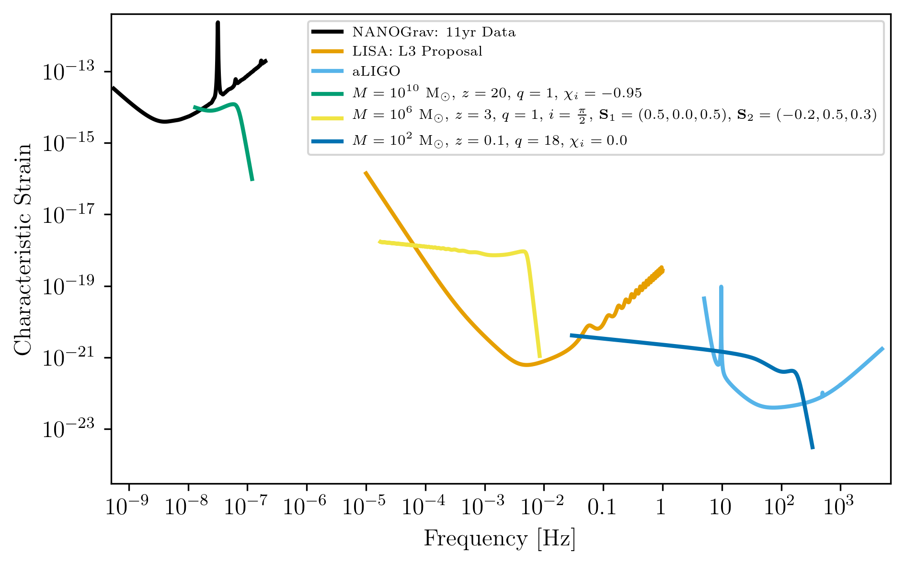

.. module:: hasasia

.. note:: This tutorial was generated from a Jupyter notebook that can be
          downloaded `here <_static/notebooks/source_plot_tutorial.ipynb>`_.

.. _source_plot_tutorial:

Using ``gwent`` to Generate Source Characteristic Strain Curves
===============================================================

Here we show examples of using the different classes in ``gwent`` for
various black holes binaries (BHBs), both in the frequency and time
domain.

First, we load important packages

.. code:: python

    import numpy as np
    import matplotlib as mpl
    import matplotlib.pyplot as plt
    
    from cycler import cycler
    from scipy.constants import golden_ratio
    import astropy.units as u
    
    import gwent
    import gwent.detector as detector
    import gwent.binary as binary
    import gwent.snr as snr
    
    #Turn off warnings for tutorial
    import warnings
    warnings.filterwarnings('ignore')

Setting matplotlib and plotting preferences

.. code:: python

    def get_fig_size(width=7,scale=1.0):
        #width = 3.36 # 242 pt
        base_size = np.array([1, 1/scale/golden_ratio])
        fig_size = width * base_size
        return(fig_size)
    mpl.rcParams['figure.dpi'] = 300
    mpl.rcParams['figure.figsize'] = get_fig_size()
    mpl.rcParams['text.usetex'] = True
    mpl.rc('font',**{'family':'serif','serif':['Times New Roman']})
    mpl.rcParams['lines.linewidth'] = 2
    mpl.rcParams['axes.labelsize'] = 12
    mpl.rcParams['xtick.labelsize'] = 12
    mpl.rcParams['ytick.labelsize'] = 12
    mpl.rcParams['legend.fontsize'] = 10
    color_cycle_wong = ['#000000','#E69F00','#56B4E9','#009E73','#F0E442','#0072B2','#D55E00','#CC79A7']
    mpl.rcParams['axes.prop_cycle'] = cycler(color=color_cycle_wong)

We need to get the file directories to load in the instrument files.

.. code:: python

    load_directory = gwent.__path__[0] + '/LoadFiles'

Initialize different instruments
--------------------------------

To compare BHB strains and assess their detectability, we load in a few
example detectors. For more information about loading instruments, see
the tutorial on detectors.

NANOGrav 11yr Characteristic Strain
~~~~~~~~~~~~~~~~~~~~~~~~~~~~~~~~~~~

Using real NANOGrav 11yr data put through ``hasasia``

.. code:: python

    NANOGrav_filedirectory = load_directory + '/InstrumentFiles/NANOGrav/StrainFiles/' 
    NANOGrav_11yr_hasasia_file = NANOGrav_filedirectory + 'NANOGrav_11yr_S_eff.txt'
    NANOGrav_11yr_hasasia = detector.PTA('NANOGrav 11yr',load_location=NANOGrav_11yr_hasasia_file,I_type='E')
    NANOGrav_11yr_hasasia.T_obs = 11.4*u.yr

LISA Proposal 1
~~~~~~~~~~~~~~~

Values taken from the ESA L3 proposal, Amaro-Seaone, et al., 2017
(https://arxiv.org/abs/1702.00786)

.. code:: python

    L = 2.5*u.Gm  #armlength in Gm
    L = L.to('m')
    LISA_T_obs = 4*u.yr
    
    f_acc_break_low = .4*u.mHz.to('Hz')*u.Hz
    f_acc_break_high = 8.*u.mHz.to('Hz')*u.Hz
    f_IMS_break = 2.*u.mHz.to('Hz')*u.Hz
    A_acc = 3e-15*u.m/u.s/u.s
    A_IMS = 10e-12*u.m
    
    Background = False
    
    LISA_prop1 = detector.SpaceBased('LISA',
                                     LISA_T_obs,L,A_acc,f_acc_break_low,
                                     f_acc_break_high,A_IMS,f_IMS_break,
                                     Background=Background)

aLIGO
~~~~~

.. code:: python

    Ground_T_obs = 4*u.yr
    #aLIGO
    aLIGO_filedirectory = load_directory + '/InstrumentFiles/aLIGO/'
    aLIGO_1_filename = 'aLIGODesign.txt'
    
    aLIGO_1_filelocation = aLIGO_filedirectory + aLIGO_1_filename
    
    aLIGO_1 = detector.GroundBased('aLIGO 1',Ground_T_obs,load_location=aLIGO_1_filelocation,I_type='A')

Generating Binary Black Holes with ``gwent`` in the Frequency Domain
--------------------------------------------------------------------

We start with BHB parameters that exemplify the range of IMRPhenomD’s
waveforms from Khan, et al. 2016 https://arxiv.org/abs/1508.07253 and
Husa, et al. 2016 https://arxiv.org/abs/1508.07250

.. code:: python

    M = [1e6,65.0,1e10]
    q = [1.0,18.0,1.0]
    x1 = [0.5,0.0,-0.95]
    x2 = [0.3,0.0,-0.95]
    z = [3.0,0.093,20.0]

Uses the first parameter values that lie in the ``LISA_prop1`` detector
band with the precessing phenomenological ``lalsuite`` waveform
IMRPhenomPv3.

.. code:: python

    lalsuite_kwargs = {"S1x": 0.5, "S1y": 0., "S1z": x1[0],
                       "S2x": -0.2, "S2y": 0.5, "S2z": x2[0],
                       "inclination":np.pi/2}
    source_1 = binary.BBHFrequencyDomain(M[0],q[0],z[0],approximant='IMRPhenomPv3',lalsuite_kwargs=lalsuite_kwargs)

Uses the second parameter values that lie in the ``aLIGO`` detector
band.

.. code:: python

    source_2 = binary.BBHFrequencyDomain(M[1],q[1],z[1],x1[1],x2[1])

Uses the third parameter values that lie in the
``NANOGrav_11yr_hasasia`` detector band.

.. code:: python

    source_3 = binary.BBHFrequencyDomain(M[2],q[2],z[2],x1[2],x2[2])

How to Get Information about BHB
--------------------------------

Find out source 1’s frequency given some time from merger.
~~~~~~~~~~~~~~~~~~~~~~~~~~~~~~~~~~~~~~~~~~~~~~~~~~~~~~~~~~

.. code:: python

    print("Source frequency 10 years prior to merger in Observer frame: ",
          binary.Get_Source_Freq(source_1,10*u.yr,in_frame='observer',out_frame='source'))
    print("Source frequency 10 years prior to merger in Source frame: ",
          binary.Get_Source_Freq(source_1,10*u.yr,in_frame='source',out_frame='source'))
    print("Observed frequency 10 years prior to merger in Observer frame: ",
          binary.Get_Source_Freq(source_1,10*u.yr,in_frame='observer',out_frame='observer'))
    print("Observed frequency 10 years prior to merger in Source frame: ",
          binary.Get_Source_Freq(source_1,10*u.yr,in_frame='source',out_frame='observer'))

.. parsed-literal::

    Source frequency 10 years prior to merger in Observer frame:  4.9371229709723884e-05 1 / s
    Source frequency 10 years prior to merger in Source frame:  2.9356308823618684e-05 1 / s
    Observed frequency 10 years prior to merger in Observer frame:  1.2342807427430971e-05 1 / s
    Observed frequency 10 years prior to merger in Source frame:  7.339077205904671e-06 1 / s

Find out source 2’s time to merger from a given frequency.
~~~~~~~~~~~~~~~~~~~~~~~~~~~~~~~~~~~~~~~~~~~~~~~~~~~~~~~~~~

.. code:: python

    print("Source time from merger for BHB with GW frequency of 1/minute (~17mHz) in the Observer frame: ",
          binary.Get_Time_From_Merger(source_2,freq=1/u.minute,in_frame='observer',out_frame='source').to('yr'))
    print("Source time from merger for BHB with GW frequency of 1/minute (~17mHz) in the Source frame: ",
          binary.Get_Time_From_Merger(source_2,freq=1/u.minute,in_frame='source',out_frame='source').to('yr'))
    print("Observed ime from merger for BHB with GW frequency of 1/minute (~17mHz) in the Observer frame: ",
          binary.Get_Time_From_Merger(source_2,freq=1/u.minute,in_frame='observer',out_frame='observer').to('yr'))
    print("Observed time from merger for BHB with GW frequency of 1/minute (~17mHz) in the Source frame: ",
          binary.Get_Time_From_Merger(source_2,freq=1/u.minute,in_frame='source',out_frame='observer').to('yr'))

.. parsed-literal::

    Source time from merger for BHB with GW frequency of 1/minute (~17mHz) in the Observer frame:  17.032270309184415 yr
    Source time from merger for BHB with GW frequency of 1/minute (~17mHz) in the Source frame:  21.590347849144273 yr
    Observed ime from merger for BHB with GW frequency of 1/minute (~17mHz) in the Observer frame:  18.61627144793857 yr
    Observed time from merger for BHB with GW frequency of 1/minute (~17mHz) in the Source frame:  23.59825019911469 yr

Find out source 3’s observed frequency given some evolved time.
~~~~~~~~~~~~~~~~~~~~~~~~~~~~~~~~~~~~~~~~~~~~~~~~~~~~~~~~~~~~~~~

And whether the source is monochromatic or chirping for the evolved time
in the observer frame.

.. code:: python

    #First we have to give the source some initial frequency
    source_3.f_gw = 8*u.nHz
    
    binary.Check_Freq_Evol(source_3,T_evol=5*u.yr,T_evol_frame='observer')
    print("Observed frequency after 5 years of evolution in Observer frame: ",
          source_3.f_T_obs)
    print("Does the source change a resolvable amount after evolving for 5 years in the Observer frame?: ",
          source_3.ismono)
    print("\n")
    binary.Check_Freq_Evol(source_3,T_evol=5*u.yr,T_evol_frame='source')
    print("Observed frequency after 5 years of evolution in Source frame: ",
          source_3.f_T_obs)
    print("Does the source change a resolvable amount after evolving for 5 years in the Source frame?: ",
          source_3.ismono)

.. parsed-literal::

    Observed frequency after 5 years of evolution in Observer frame:  1.7955629558729957e-08 1 / s
    Does the source change a resolvable amount after evolving for 5 years in the Observer frame?:  True
    
    
    Observed frequency after 5 years of evolution in Source frame:  5.732821260078733e-09 1 / s
    Does the source change a resolvable amount after evolving for 5 years in the Source frame?:  False

We can set the instrument that “observes” the source. If you orginally
assign the source an instrument (which we show in a bit), the initial
frequency (``f_gw``) is set to the instrument’s most sensitive frequency

.. code:: python

    source_3.instrument = NANOGrav_11yr_hasasia
    binary.Check_Freq_Evol(source_3)
    print(f"Observed frequency after {np.max(source_3.instrument.T_obs)} years of evolution in Observer frame: ",
          source_3.f_T_obs)

.. parsed-literal::

    Observed frequency after 11.4 yr years of evolution in Observer frame:  1.3181810661218933e-08 1 / s

Plots of Example GW Band
------------------------

Displays only generated detectors: WN only PTAs, ESA L3 proposal LISA,
aLIGO, and Einstein Telescope.

Chirping Sources
~~~~~~~~~~~~~~~~

Displays two sources’ waveform throughout its observing run (from left
to right: ``NANOGrav_11yr_hasasia``,\ ``LISA_prop1``,\ ``ET``). Since
the default frame for each source is the observer frame, we get the
observed frequency of each source ``T_obs`` before merger.

.. code:: python

    source_1_t_T_obs_f = binary.Get_Source_Freq(source_1,LISA_prop1.T_obs,in_frame="observer",out_frame="observer")
    source_1_idx = np.abs(source_1.f-source_1_t_T_obs_f).argmin()
    
    source_2_t_T_obs_f = binary.Get_Source_Freq(source_2,aLIGO_1.T_obs,in_frame="observer",out_frame="observer")
    source_2_idx = np.abs(source_2.f-source_2_t_T_obs_f).argmin()
    
    source_3_t_T_obs_f = binary.Get_Source_Freq(source_3,NANOGrav_11yr_hasasia.T_obs,in_frame="observer",out_frame="observer")
    source_3_idx = np.abs(source_3.f-source_3_t_T_obs_f).argmin()

.. code:: python

    plt.figure(figsize=get_fig_size())
    
    plt.loglog(NANOGrav_11yr_hasasia.fT,NANOGrav_11yr_hasasia.h_n_f,label='NANOGrav: 11yr Data')
    plt.loglog(LISA_prop1.fT,LISA_prop1.h_n_f,label='LISA: L3 Proposal')
    plt.loglog(aLIGO_1.fT,aLIGO_1.h_n_f,label='aLIGO')
    
    plt.loglog(source_3.f[source_3_idx:],binary.Get_Char_Strain(source_3)[source_3_idx:],
              label=r'$M = 10^{%.0f}$ $\mathrm{M}_{\odot}$, $z = %.0f$, $q = %.0f$, $\chi_{i} = %.2f$'
                  %(np.log10(source_3.M.value),source_3.z,source_3.q,source_3.chi1))
    plt.loglog(source_1.f[source_1_idx:],binary.Get_Char_Strain(source_1)[source_1_idx:],
              label=r'$M = 10^{%.0f}$ $\mathrm{M}_{\odot}$, $z = %.0f$, $q = %.0f$, $i = \frac{\pi}{2}$,'\
               %(np.log10(source_1.M.value),source_1.z,source_1.q) +\
               r' $\textbf{S}_{1} = (%.1f,%.1f,%.1f)$, $\textbf{S}_{2} = (%.1f,%.1f,%.1f)$'\
               %(source_1.lalsuite_kwargs['S1x'],source_1.lalsuite_kwargs['S1y'],source_1.lalsuite_kwargs['S1z'],
                 source_1.lalsuite_kwargs['S2x'],source_1.lalsuite_kwargs['S2y'],source_1.lalsuite_kwargs['S2z']))
    plt.loglog(source_2.f[source_2_idx:],binary.Get_Char_Strain(source_2)[source_2_idx:],
              label=r'$M = 10^{%.0f}$ $\mathrm{M}_{\odot}$, $z = %.1f$, $q = %.0f$, $\chi_{i} = %.1f$'
                  %(np.log10(source_2.M.value),source_2.z,source_2.q,source_2.chi1))
    
    xlabel_min = -10
    xlabel_mplt = 5
    xlabels = np.arange(xlabel_min,xlabel_mplt+1)
    xlabels = xlabels[1::]
    
    print_xlabels = []
    for x in xlabels:
        if abs(x) > 1:
            print_xlabels.append(r'$10^{%i}$' %x)
        elif x == -1:
            print_xlabels.append(r'$%.1f$' %10.**x)
        else:
            print_xlabels.append(r'$%.0f$' %10.**x)
    plt.xticks(10.**xlabels,print_xlabels)
    
    plt.xlim([5e-10, 7e3])
    plt.ylim([3e-25, 4e-12])
    
    plt.xlabel('Frequency [Hz]')
    plt.ylabel('Characteristic Strain')
    plt.legend(fontsize=7)
    plt.show()

Monochromatic Sources
~~~~~~~~~~~~~~~~~~~~~

Displays a comparison between two monochromatic strain sources, one
equal mass, the other at a mass ratio of 18. The initial frequency is
set by the NANOGrav 11yr at the detector’s most sensitive frequency. The
NANOGrav 11yr data in this plot corresponds to a source strain
(:math:`h_{0}`) with SNR of one; note that this is not characteristic
strain.

.. code:: python

    source_4 = binary.BBHFrequencyDomain(1e10,1.0,0.1,0.0,0.0,instrument=NANOGrav_11yr_hasasia)
    source_5 = binary.BBHFrequencyDomain(1e10,18.0,0.1,0.0,0.0,instrument=NANOGrav_11yr_hasasia)

.. code:: python

    plt.figure(figsize=get_fig_size())
    
    plt.loglog(NANOGrav_11yr_hasasia.fT,
               np.sqrt(NANOGrav_11yr_hasasia.S_n_f/np.max(np.unique(NANOGrav_11yr_hasasia.T_obs.to('s').value))),
               label=r'NANOGrav: 11yr Data')
    plt.scatter(source_4.f_gw,
                source_4.h_gw,
                color='C1',
                label=r'$M = 10^{%.0f}$ $\mathrm{M}_{\odot}$, $z = %.1f$, $q = %.0f$'
                  %(np.log10(source_4.M.value),source_4.z,source_4.q))
    plt.scatter(source_5.f_gw,
                source_5.h_gw,
                color='C2',
                label=r'$M = 10^{%.0f}$ $\mathrm{M}_{\odot}$, $z = %.1f$, $q = %.0f$'
                  %(np.log10(source_5.M.value),source_5.z,source_5.q))
    
    plt.xlabel('Frequency [Hz]')
    plt.ylabel('Strain')
    plt.legend(loc='upper left')
    plt.show()

.. image:: source_plot_tutorial_files/source_plot_tutorial_37_0.png

Calculating the SNR
-------------------

For the two sources displayed in the plot above, we will calculate the
SNRs for monochromatic and chirping versions.

Source 4: Monochromatic Case
~~~~~~~~~~~~~~~~~~~~~~~~~~~~

Response in LISA data First we set the source frequency. If you assign
an instrument and not a frequency, ``gwent`` does this step internally
and sets ``f_gw`` to the instruments optimal frequency (like we have
done above too).

.. code:: python

    snr.Calc_Mono_SNR(source_4,NANOGrav_11yr_hasasia).to('')

.. math::

    2.7270486 \; \mathrm{}

One can also change the inclination of the source for calculating the
monochromatic SNR.

.. code:: python

    snr.Calc_Mono_SNR(source_4,NANOGrav_11yr_hasasia,inc=np.pi/2).to('')

.. math::

    1.5244665 \; \mathrm{}

Source 2: Chirping Case
~~~~~~~~~~~~~~~~~~~~~~~

Response in aLIGO data

To set the start frequency of integration, you need to set the amount of
time the instrument observes the source. This is done automatically for
the given instrument.

.. code:: python

    snr.Calc_Chirp_SNR(source_2,aLIGO_1)

.. parsed-literal::

    19.29898065079436

Source 1: Chirping Case
~~~~~~~~~~~~~~~~~~~~~~~

Response in LISA data

.. code:: python

    snr.Calc_Chirp_SNR(source_1,LISA_prop1)

.. parsed-literal::

    1038.9835482056897

Other ways this can be done is by setting the instrument’s observation
time or by using ``binary.Check_Freq_Evol`` and setting the optional
``T_evol`` parameter to the new observation time.

You can see in tis case, we have to drastically shorten the observed
time to visibly change the SNR because the source waveform is so close
to merger at the edge of LISA’s frequency band.

.. code:: python

    binary.Check_Freq_Evol(source_1,T_evol=1*u.hr)
    snr.Calc_Chirp_SNR(source_1,LISA_prop1)

.. parsed-literal::

    1035.346096569876

Generate Frequency Data from Given Time Domain
----------------------------------------------

Uses waveforms that are the difference between Effective One Body
waveforms subtracted from Numerical Relativity waveforms for different
harmonics.

This method and use is fairly untested, so proceed with caution and feel
free to help out!

.. code:: python

    EOBdiff_filedirectory = load_directory + '/DiffStrain/EOBdiff/'
    diff0002 = binary.BBHTimeDomain(M[1],q[0],z[1],load_location=EOBdiff_filedirectory+'diff0002.dat')
    diff0114 = binary.BBHTimeDomain(M[1],q[0],z[1],load_location=EOBdiff_filedirectory+'diff0114.dat')
    diff0178 = binary.BBHTimeDomain(M[1],q[0],z[1],load_location=EOBdiff_filedirectory+'diff0178.dat')
    diff0261 = binary.BBHTimeDomain(M[1],q[0],z[1],load_location=EOBdiff_filedirectory+'diff0261.dat')
    diff0303 = binary.BBHTimeDomain(M[1],q[0],z[1],load_location=EOBdiff_filedirectory+'diff0303.dat')

.. code:: python

    fig,ax = plt.subplots()
    plt.loglog(aLIGO_1.fT,aLIGO_1.h_n_f,label = aLIGO_1.name)
    plt.loglog(diff0002.f,binary.Get_Char_Strain(diff0002),label = 'diff0002')
    plt.loglog(diff0114.f,binary.Get_Char_Strain(diff0114),label = 'diff0114')
    plt.loglog(diff0178.f,binary.Get_Char_Strain(diff0178),label = 'diff0178')
    plt.loglog(diff0261.f,binary.Get_Char_Strain(diff0261),label = 'diff0261')
    plt.loglog(diff0303.f,binary.Get_Char_Strain(diff0303),label = 'diff0303')
    plt.xlabel(r'Frequency $[Hz]$')
    plt.ylabel('Characteristic Strain')
    plt.legend()
    plt.show()

.. image:: source_plot_tutorial_files/source_plot_tutorial_51_0.png

