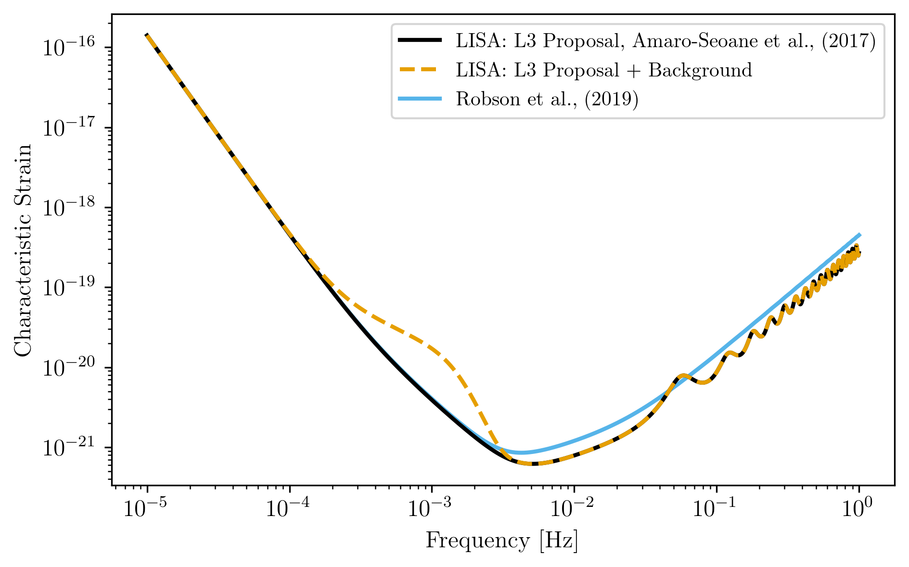
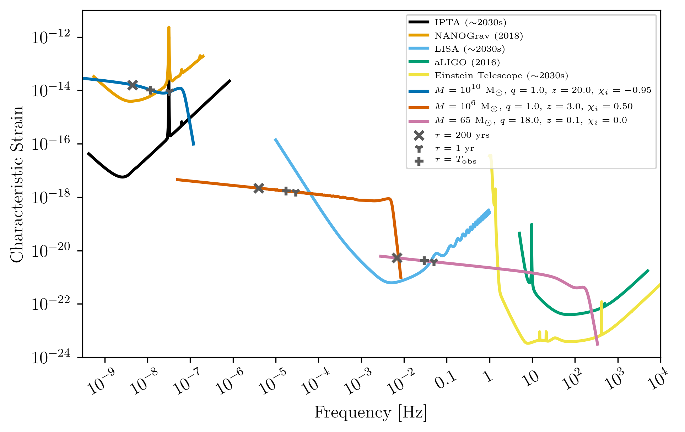

.. module:: hasasia

.. note:: This tutorial was generated from a Jupyter notebook that can be
          downloaded `here <_static/notebooks/strain_plot_tutorial.ipynb>`_.

.. _strain_plot_tutorial:

Using ``gwent`` to Generate Characteristic Strain Curves
========================================================

Here we show examples of using the different classes in ``gwent`` for
various detectors, both loading in from a file and generating with
``gwent``, and binary black holes, both in the frequency and time
domain.

First, we load important packages

.. code:: python

    import numpy as np
    
    import matplotlib as mpl
    import matplotlib.pyplot as plt
    
    from cycler import cycler
    from scipy.constants import golden_ratio
    
    import astropy.constants as const
    import astropy.units as u
    
    import gwent
    import gwent.detector as detector
    import gwent.binary as binary
    
    #Turn off warnings for tutorial
    import warnings
    warnings.filterwarnings('ignore')

Setting matplotlib and plotting preferences

.. code:: python

    def get_fig_size(width=7,scale=1.0):
        #width = 3.36 # 242 pt
        base_size = np.array([1, 1/scale/golden_ratio])
        fig_size = width * base_size
        return(fig_size)
    mpl.rcParams['figure.dpi'] = 300
    mpl.rcParams['figure.figsize'] = get_fig_size()
    mpl.rcParams['text.usetex'] = True
    mpl.rc('font',**{'family':'serif','serif':['Times New Roman']})
    mpl.rcParams['lines.linewidth'] = 2
    mpl.rcParams['axes.labelsize'] = 12
    mpl.rcParams['xtick.labelsize'] = 12
    mpl.rcParams['ytick.labelsize'] = 12
    mpl.rcParams['legend.fontsize'] = 10
    color_cycle_wong = ['#000000','#E69F00','#56B4E9','#009E73','#F0E442','#0072B2','#D55E00','#CC79A7','#5a5a5a']
    mpl.rcParams['axes.prop_cycle'] = cycler(color=color_cycle_wong)

We need to get the file directories to load in the instrument files.

.. code:: python

    load_directory = gwent.__path__[0] + '/LoadFiles'

Initialize different instruments
--------------------------------

If loading a detector, the file should be frequency in the first column
and either strain, effective strain noise spectral density, or amplitude
spectral density in the second column.

For generating a detector, one must assign a value to each of the
different instrument parameters (see the section on Declaring x and y
variables and Sample Rates).

Load ground instruments from files
----------------------------------

aLIGO
^^^^^

.. code:: python

    Ground_T_obs = 4*u.yr

.. code:: python

    #aLIGO
    aLIGO_filedirectory = load_directory + '/InstrumentFiles/aLIGO/'
    aLIGO_1_filename = 'aLIGODesign.txt'
    aLIGO_2_filename = 'ZERO_DET_high_P.txt'
    
    aLIGO_1_filelocation = aLIGO_filedirectory + aLIGO_1_filename
    aLIGO_2_filelocation = aLIGO_filedirectory + aLIGO_2_filename
    
    aLIGO_1 = detector.GroundBased('aLIGO 1',Ground_T_obs,load_location=aLIGO_1_filelocation,I_type='A')
    aLIGO_2 = detector.GroundBased('aLIGO 2',Ground_T_obs,load_location=aLIGO_2_filelocation,I_type='A')

Einstein Telescope
^^^^^^^^^^^^^^^^^^

.. code:: python

    #Einstein Telescope
    ET_filedirectory = load_directory + '/InstrumentFiles/EinsteinTelescope/'
    ET_B_filename = 'ET_B_data.txt'
    ET_C_filename = 'ET_C_data.txt'
    ET_D_filename = 'ET_D_data.txt'
    
    ET_B_filelocation = ET_filedirectory + ET_B_filename
    ET_C_filelocation = ET_filedirectory + ET_C_filename
    ET_D_filelocation = ET_filedirectory + ET_D_filename
    
    ET_B = detector.GroundBased('ET',Ground_T_obs,load_location=ET_B_filelocation,I_type='A')
    ET_C = detector.GroundBased('ET',Ground_T_obs,load_location=ET_C_filelocation,I_type='A')
    ET_D = detector.GroundBased('ET',Ground_T_obs,load_location=ET_D_filelocation,I_type='A')

Plots of Ground Detectors
~~~~~~~~~~~~~~~~~~~~~~~~~

.. code:: python

    fig = plt.figure()
    plt.loglog(ET_B.fT,ET_B.h_n_f,label='Hild et al., (2008) ET Design B')
    plt.loglog(ET_C.fT,ET_C.h_n_f,label='Einstein Telescope Design C')
    plt.loglog(ET_D.fT,ET_D.h_n_f,label='Hild et al., (2011) ET Design D')
    plt.loglog(aLIGO_1.fT,aLIGO_1.h_n_f,label='Advanced LIGO')
    plt.loglog(aLIGO_2.fT,aLIGO_2.h_n_f,label='Advanced LIGO 2')
    plt.xlabel(r'Frequency [Hz]')
    plt.ylabel(r'Characteristic Strain')
    plt.tick_params(axis = 'both',which = 'major')
    plt.legend()
    plt.show()

.. image:: strain_plot_tutorial_files/strain_plot_tutorial_14_0.png

Load LISA Instruments from File
-------------------------------

LISA Example 1
^^^^^^^^^^^^^^

Modelled off of the Science Requirements document from
https://lisa.nasa.gov/documentsReference.html.

.. code:: python

    SpaceBased_T_obs = 4*u.yr

.. code:: python

    LISA_Other_filedirectory = load_directory + '/InstrumentFiles/LISA_Other/'
    LISA_ex1_filename = 'LISA_Allocation_S_h_tot.txt'
    LISA_ex1_filelocation = LISA_Other_filedirectory + LISA_ex1_filename
    
    #`I_type` should be Effective Noise Spectral Density
    LISA_ex1 = detector.SpaceBased('LISA Example 1',SpaceBased_T_obs,load_location=LISA_ex1_filelocation,I_type='E')

LISA Example 2
^^^^^^^^^^^^^^

Modelled off of Robson,Cornish,and Liu 2018, LISA
(https://arxiv.org/abs/1803.01944).

.. code:: python

    LISA_ex2_filedirectory = load_directory + '/InstrumentFiles/LISA_Other/'
    LISA_ex2_filename = 'LISA_sensitivity.txt'
    LISA_ex2_filelocation = LISA_ex2_filedirectory + LISA_ex2_filename
    
    #`I_type` should be Effective Noise Spectral Density
    LISA_ex2 = detector.SpaceBased('LISA Example 2',SpaceBased_T_obs,load_location=LISA_ex2_filelocation,I_type='E')

LISA Example 3
^^^^^^^^^^^^^^

Generated by http://www.srl.caltech.edu/~shane/sensitivity/

.. code:: python

    LISA_ex3_filename = 'scg_6981.dat'
    LISA_ex3_filelocation = LISA_Other_filedirectory + LISA_ex3_filename
    
    #`I_type` should be Amplitude Spectral Density
    LISA_ex3 = detector.SpaceBased('LISA Example 3',SpaceBased_T_obs,load_location=LISA_ex3_filelocation,I_type='A')

Plots of loaded LISA examples.
~~~~~~~~~~~~~~~~~~~~~~~~~~~~~~

.. code:: python

    fig = plt.figure()
    plt.loglog(LISA_ex1.fT,LISA_ex1.h_n_f,label=LISA_ex1.name)
    plt.loglog(LISA_ex2.fT,LISA_ex2.h_n_f,label=LISA_ex2.name)
    plt.loglog(LISA_ex3.fT,LISA_ex3.h_n_f,label=LISA_ex3.name)
    plt.xlabel(r'Frequency [Hz]')
    plt.ylabel(r'Characteristic Strain')
    plt.tick_params(axis = 'both',which = 'major')
    plt.legend()
    plt.show()

.. image:: strain_plot_tutorial_files/strain_plot_tutorial_23_0.png

Loading PTA Detection Curves and Upper Limits
---------------------------------------------

Simulated NANOGrav Continuous Wave Detection Sensitivity
^^^^^^^^^^^^^^^^^^^^^^^^^^^^^^^^^^^^^^^^^^^^^^^^^^^^^^^^

Samples from Mingarelli, et al. 2017 (https://arxiv.org/abs/1708.03491)
of the Simulated NANOGrav Continuous Wave Detection Sensitivity.

.. code:: python

    NANOGrav_filedirectory = load_directory + '/InstrumentFiles/NANOGrav/StrainFiles/' 

.. code:: python

    #NANOGrav continuous wave sensitivity
    NANOGrav_background = 4e-16 # Unsubtracted GWB amplitude: 0,4e-16
    NANOGrav_dp = 0.95 #Detection Probablility: 0.95,0.5
    NANOGrav_fap = 0.0001 #False Alarm Probability: 0.05,0.003,0.001,0.0001
    NANOGrav_Tobs = 15 #Observation years: 15,20,25
    
    NANOGrav_filename = 'cw_simulation_Ared_' + str(NANOGrav_background) + '_dp_' + str(NANOGrav_dp) \
                        + '_fap_' + str(NANOGrav_fap) + '_T_' + str(NANOGrav_Tobs) + '.txt'
    NANOGrav_filelocation = NANOGrav_filedirectory + NANOGrav_filename
    
    NANOGrav_cw_GWB = detector.PTA('NANOGrav CW Detection w/ GWB',load_location=NANOGrav_filelocation,I_type='h')

.. code:: python

    #NANOGrav continuous wave sensitivity
    NANOGrav_background_2 = 0 # Unsubtracted GWB amplitude: 0,4e-16
    NANOGrav_dp_2 = 0.95 #Detection Probablility: 0.95,0.5
    NANOGrav_fap_2 = 0.0001 #False Alarm Probability: 0.05,0.003,0.001,0.0001
    NANOGrav_Tobs_2 = 15 #Observation years: 15,20,25
    
    NANOGrav_filename_2 = 'cw_simulation_Ared_' + str(NANOGrav_background_2) + '_dp_' + str(NANOGrav_dp_2) \
                        + '_fap_' + str(NANOGrav_fap_2) + '_T_' + str(NANOGrav_Tobs_2) + '.txt'
    NANOGrav_filelocation_2 = NANOGrav_filedirectory + NANOGrav_filename_2
    
    NANOGrav_cw_no_GWB = detector.PTA('NANOGrav CW Detection no GWB',load_location=NANOGrav_filelocation_2,I_type='h')

NANOGrav Continuous Wave 11yr Upper Limit
^^^^^^^^^^^^^^^^^^^^^^^^^^^^^^^^^^^^^^^^^

Sample from Aggarwal, et al. 2019 (https://arxiv.org/abs/1812.11585) of
the NANOGrav 11yr continuous wave upper limit.

.. code:: python

    NANOGrav_cw_ul_file = NANOGrav_filedirectory + 'smoothed_11yr.txt'
    NANOGrav_cw_ul = detector.PTA('NANOGrav CW Upper Limit',load_location=NANOGrav_cw_ul_file,I_type='h')

NANOGrav 11yr Characteristic Strain
^^^^^^^^^^^^^^^^^^^^^^^^^^^^^^^^^^^

Using real NANOGrav 11yr data put through ``hasasia``. We need to
initialize and fill the values used in the plots (i.e.,
``NANOGrav_11yr_hasasia.T_obs`` isn’t known until we set the values
since we loaded it from a file.

.. code:: python

    NANOGrav_11yr_hasasia_file = NANOGrav_filedirectory + 'NANOGrav_11yr_S_eff.txt'
    NANOGrav_11yr_hasasia = detector.PTA('NANOGrav 11yr',load_location=NANOGrav_11yr_hasasia_file,I_type='E')
    NANOGrav_11yr_hasasia.T_obs = 11.4*u.yr

Plots of the loaded PTAs
~~~~~~~~~~~~~~~~~~~~~~~~

.. code:: python

    fig = plt.figure()
    plt.loglog(NANOGrav_cw_GWB.fT,NANOGrav_cw_GWB.h_n_f,label = r'Mingarelli et al. (2017), CW Detection Probability w/GWB')
    plt.loglog(NANOGrav_cw_no_GWB.fT,NANOGrav_cw_no_GWB.h_n_f, label =r'Mingarelli et al. (2017), CW Detection Probability w/o GWB')
    plt.loglog(NANOGrav_cw_ul.fT,NANOGrav_cw_ul.h_n_f, label = r'Aggarwal et al. (2018), CW Upper Limit')
    plt.loglog(NANOGrav_11yr_hasasia.fT,np.sqrt(NANOGrav_11yr_hasasia.S_n_f/np.max(np.unique(NANOGrav_11yr_hasasia.T_obs.to('s').value))),
               label = r'NANOGrav: 11yr Data  corresponding to a source strain with SNR of one')
    
    plt.tick_params(axis = 'both',which = 'major')
    plt.ylim([2e-15,6e-12])
    plt.xlim([4e-10,4e-7])
    plt.xlabel(r'Frequency [Hz]')
    plt.ylabel('Strain')
    plt.legend(loc='upper left',fontsize=8)
    plt.show()

.. image:: strain_plot_tutorial_files/strain_plot_tutorial_33_0.png

Generating PTAs with ``gwent``
------------------------------

Generated using the code ``hasasia``
(https://hasasia.readthedocs.io/en/latest/) via the methods of Hazboun,
Romano, and Smith, 2019 (https://arxiv.org/abs/1907.04341)

SKA-esque Detector
^^^^^^^^^^^^^^^^^^

Fiducial parameter estimates from Sesana, Vecchio, and Colacino, 2008
(https://arxiv.org/abs/0804.4476) section 7.1.

.. code:: python

    sigma_SKA = 10*u.ns.to('s')*u.s #sigma_rms timing residuals in nanoseconds to seconds
    T_SKA = 15*u.yr #Observing time in years
    N_p_SKA = 20 #Number of pulsars
    cadence_SKA = 1/(u.wk.to('yr')*u.yr) #Avg observation cadence of 1 every week in [number/yr]

SKA with White noise only

.. code:: python

    SKA_WN = detector.PTA('SKA, WN Only',N_p_SKA,T_obs=T_SKA,sigma=sigma_SKA,cadence=cadence_SKA)

SKA with White and Varied Red Noise

.. code:: python

    SKA_WN_RN = detector.PTA('SKA, WN and RN',N_p_SKA,T_obs=T_SKA,sigma=sigma_SKA,cadence=cadence_SKA,
                             rn_amp=[1e-16,1e-12],rn_alpha=[-1/2,1.25])

SKA with White Noise and a Stochastic Gravitational Wave Background

.. code:: python

    SKA_WN_GWB = detector.PTA('SKA, WN and GWB',N_p_SKA,T_obs=T_SKA,sigma=sigma_SKA,cadence=cadence_SKA,
                              sb_amp=4e-16,sb_alpha=-2/3)

SKA with Sampled Noise for each pulsar, no GWB

.. code:: python

    SKA_Sampled_Noise = detector.PTA('SKA, Sampled Noise',N_p_SKA,cadence=[cadence_SKA,cadence_SKA/4.],
                                     sigma=[sigma_SKA,10*sigma_SKA],T_obs=T_SKA,use_11yr=True,use_rn=True)

Plots for Simulated SKA PTAs
~~~~~~~~~~~~~~~~~~~~~~~~~~~~

.. code:: python

    fig = plt.figure()
    plt.loglog(SKA_WN.fT,SKA_WN.h_n_f,label = SKA_WN.name)
    plt.loglog(SKA_WN_GWB.fT,SKA_WN_GWB.h_n_f, linestyle=':',label = SKA_WN_GWB.name)
    plt.loglog(SKA_WN_RN.fT,SKA_WN_RN.h_n_f, linestyle='-.',label = SKA_WN_RN.name)
    plt.loglog(SKA_Sampled_Noise.fT,SKA_Sampled_Noise.h_n_f,linestyle='--',label=SKA_Sampled_Noise.name)
    
    plt.tick_params(axis = 'both',which = 'major')
    plt.ylim([1e-18,2e-11])
    plt.xlim([3e-10,1e-6])
    
    plt.xlabel('Frequency [Hz]')
    plt.ylabel('Characteristic Strain')
    plt.legend(loc='upper left')
    plt.show()

.. image:: strain_plot_tutorial_files/strain_plot_tutorial_45_0.png

NANOGrav-esque Detector
^^^^^^^^^^^^^^^^^^^^^^^

Fiducial 11yr parameter estimates from Arzoumanian, et al., 2018
https://arxiv.org/abs/1801.01837

.. code:: python

    ###############################################
    #NANOGrav calculation using 11.5yr parameters https://arxiv.org/abs/1801.01837
    sigma_nano = 100*u.ns.to('s')*u.s #rms timing residuals in nanoseconds to seconds
    T_nano = 11.4*u.yr #Observing time in years
    N_p_nano = 34 #Number of pulsars
    cadence_nano = 1/(2*u.wk.to('yr')*u.yr) #Avg observation cadence of 1 every 2 weeks in number/year

NANOGrav with White Noise only

.. code:: python

    NANOGrav_WN = detector.PTA('NANOGrav, WN Only',N_p_nano,T_obs=T_nano,sigma=sigma_nano,cadence=cadence_nano)

NANOGrav with White and Varied Red Noise

.. code:: python

    NANOGrav_WN_RN = detector.PTA('NANOGrav, WN and RN',N_p_nano,T_obs=T_nano,sigma=sigma_nano,cadence=cadence_nano,
                                  rn_amp=[1e-16,1e-12],rn_alpha=[-1/2,1.25])

NANOGrav with White Noise and a Stochastic Gravitational Wave Background

.. code:: python

    NANOGrav_WN_GWB = detector.PTA('NANOGrav, WN and GWB',N_p_nano,
                                   T_obs=T_nano,sigma=sigma_nano,cadence=cadence_nano,sb_amp=4e-16)

NANOGrav with Sampled Noise for each pulsar, no GWB

.. code:: python

    NANOGrav_Sampled_Noise = detector.PTA('NANOGrav, Sampled Noise',N_p_nano,use_11yr=True,use_rn=True)

Plots for Simulated NANOGrav PTAs
~~~~~~~~~~~~~~~~~~~~~~~~~~~~~~~~~

.. code:: python

    fig = plt.figure()
    plt.loglog(NANOGrav_WN.fT,NANOGrav_WN.h_n_f,
               label=NANOGrav_WN.name)
    plt.loglog(NANOGrav_WN_GWB.fT,NANOGrav_WN_GWB.h_n_f,
               linestyle=':',label=NANOGrav_WN_GWB.name)
    plt.loglog(NANOGrav_WN_RN.fT,NANOGrav_WN_RN.h_n_f,
               linestyle='-.',label=NANOGrav_WN_RN.name)
    plt.loglog(NANOGrav_Sampled_Noise.fT,NANOGrav_Sampled_Noise.h_n_f,
               linestyle='--',label=NANOGrav_Sampled_Noise.name)
    
    plt.loglog(NANOGrav_11yr_hasasia.fT,NANOGrav_11yr_hasasia.h_n_f,
               label = r'NANOGrav: 11yr Data')
    
    plt.tick_params(axis = 'both',which = 'major')
    plt.ylim([3e-17,2e-11])
    plt.xlim([3e-10,5e-7])
    
    plt.xlabel('Frequency [Hz]')
    plt.ylabel('Characteristic Strain')
    plt.legend(loc='upper left')
    plt.show()

.. image:: strain_plot_tutorial_files/strain_plot_tutorial_57_0.png

Generating LISA designs with ``gwent``
--------------------------------------

First we set a fiducial armlength and observation time-length

.. code:: python

    L = 2.5*u.Gm  #armlength in Gm
    L = L.to('m')
    LISA_T_obs = 4*u.yr

LISA Proposal 1
^^^^^^^^^^^^^^^

Values taken from the ESA L3 proposal, Amaro-Seaone, et al., 2017
(https://arxiv.org/abs/1702.00786)

.. code:: python

    f_acc_break_low = .4*u.mHz.to('Hz')*u.Hz
    f_acc_break_high = 8.*u.mHz.to('Hz')*u.Hz
    f_IMS_break = 2.*u.mHz.to('Hz')*u.Hz
    A_acc = 3e-15*u.m/u.s/u.s
    A_IMS = 10e-12*u.m
    
    Background = False
    
    LISA_prop1 = detector.SpaceBased('LISA',\
                              LISA_T_obs,L,A_acc,f_acc_break_low,f_acc_break_high,A_IMS,f_IMS_break,\
                              Background=Background)

LISA Proposal 1 with Galactic Binary Background
^^^^^^^^^^^^^^^^^^^^^^^^^^^^^^^^^^^^^^^^^^^^^^^

Values taken from the ESA L3 proposal, Amaro-Seaone, et al., 2017
(https://arxiv.org/abs/1702.00786)

.. code:: python

    f_acc_break_low = .4*u.mHz.to('Hz')*u.Hz
    f_acc_break_high = 8.*u.mHz.to('Hz')*u.Hz
    f_IMS_break = 2.*u.mHz.to('Hz')*u.Hz
    A_acc = 3e-15*u.m/u.s/u.s
    A_IMS = 10e-12*u.m
    
    Background = True
    
    LISA_prop1_w_background = detector.SpaceBased('LISA w/Background',\
                              LISA_T_obs,L,A_acc,f_acc_break_low,f_acc_break_high,A_IMS,f_IMS_break,\
                              Background=Background)

LISA Proposal 2
^^^^^^^^^^^^^^^

Values from Robson, Cornish, and Liu 2019
https://arxiv.org/abs/1803.01944 using the Transfer Function
Approximation within. (Note the factor of 2 change from summing 2
independent low-frequency data channels assumed in the paper.)

.. code:: python

    f_acc_break_low = .4*u.mHz.to('Hz')*u.Hz
    f_acc_break_high = 8.*u.mHz.to('Hz')*u.Hz
    f_IMS_break = 2.*u.mHz.to('Hz')*u.Hz
    A_acc = 3e-15*u.m/u.s/u.s
    A_IMS = 1.5e-11*u.m
    Background = False
        
    LISA_prop2 = detector.SpaceBased('LISA Approximate',
                                     LISA_T_obs,L,A_acc,f_acc_break_low,f_acc_break_high,A_IMS,f_IMS_break,
                                     Background=Background,T_type='A')

Plots of Generated LISA Detectors
~~~~~~~~~~~~~~~~~~~~~~~~~~~~~~~~~

.. code:: python

    fig = plt.figure()
    plt.loglog(LISA_prop1.fT,LISA_prop1.h_n_f,label=r'LISA: L3 Proposal, Amaro-Seoane et al., (2017)')
    plt.loglog(LISA_prop1_w_background.fT,LISA_prop1_w_background.h_n_f,label=r'LISA: L3 Proposal + Background',
               linestyle='--')
    plt.loglog(LISA_prop2.fT,LISA_prop2.h_n_f,label=r'Robson et al., (2019)',zorder=-1)
    plt.xlabel(r'Frequency [Hz]')
    plt.ylabel(r'Characteristic Strain')
    plt.tick_params(axis = 'both',which = 'major')
    plt.legend()
    plt.show()

Generating Ground Based Detector Designs with ``gwent``
-------------------------------------------------------

First we set a fiducial observation time-length

.. code:: python

    Ground_T_obs = 4*u.yr

aLIGO
^^^^^

.. code:: python

    aLIGO_prop1 = detector.GroundBased('aLIGO',Ground_T_obs,f_low=min(aLIGO_1.fT),f_high=max(aLIGO_1.fT))

If one wanted to change the parameters from the fiducial values, you
could set up a new noise dictionary, then initialize that instument with
the new values. It also works for updating the current instrument
values.

.. code:: python

    noise_dict = {'Infrastructure':
                    {'Length':2500},
                  'Materials':
                    {'Substrate':{'Temp':500}}}
    aLIGO_prop2 = detector.GroundBased('aLIGO prop 2',Ground_T_obs,noise_dict=noise_dict)

A+
^^

.. code:: python

    Aplus_prop1 = detector.GroundBased('Aplus',Ground_T_obs,f_low=min(aLIGO_1.fT),f_high=max(aLIGO_1.fT))

If you want to see what the current instrument parameters are, and what
you can vary, you can use the ``instrument.Get_Noise_Dict()``. To access
each parameter, you must make a noise dictionary like above that matches
the depth of the parameter you wish to change.

.. code:: python

    Aplus_prop1.Get_Noise_Dict()

.. parsed-literal::

    Infrastructure Parameters:
         Length : 3995
         Temp : 290
         ResidualGas Subparameters:
              pressure : 4e-07
              mass : 3.35e-27
              polarizability : 7.8e-31
    TCS Parameters:
         s_cc : 7.024
         s_cs : 7.321
         s_ss : 7.631
         SRCloss : 0.0
    Seismic Parameters:
         Site : LHO
         KneeFrequency : 10
         LowFrequencyLevel : 1e-09
         Gamma : 0.8
         Rho : 1800.0
         Beta : 0.8
         Omicron : 1
         TestMassHeight : 1.5
         RayleighWaveSpeed : 250
    Suspension Parameters:
         Type : Quad
         FiberType : Tapered
         BreakStress : 750000000.0
         Temp : 290
         Silica Subparameters:
              Rho : 2200.0
              C : 772
              K : 1.38
              Alpha : 3.9e-07
              dlnEdT : 0.000152
              Phi : 4.1e-10
              Y : 72000000000.0
              Dissdepth : 0.015
         C70Steel Subparameters:
              Rho : 7800
              C : 486
              K : 49
              Alpha : 1.2e-05
              dlnEdT : -0.00025
              Phi : 0.0002
              Y : 212000000000.0
         MaragingSteel Subparameters:
              Rho : 7800
              C : 460
              K : 20
              Alpha : 1.1e-05
              dlnEdT : 0
              Phi : 0.0001
              Y : 187000000000.0
         Silicon Subparameters:
              Rho : 2329
              C : 300
              K : 700
              Alpha : 1e-10
              dlnEdT : -2e-05
              Phi : 2e-09
              Y : 155800000000.0
              Dissdepth : 0.0015
         Stage : array of shape 4
         Ribbon Subparameters:
              Thickness : 0.000115
              Width : 0.00115
         Fiber Subparameters:
              Radius : 0.000205
              EndRadius : 0.0004
              EndLength : 0.045
         VHCoupling Subparameters:
              theta : 0.0006263620827519167
         hForce : array of shape (1000,)
         vForce : array of shape (1000,)
         hForce_singlylossy : array of shape (4, 1000)
         vForce_singlylossy : array of shape (4, 1000)
         hTable : array of shape (1000,)
         vTable : array of shape (1000,)
    Materials Parameters:
         MassRadius : 0.17
         MassThickness : 0.2
         Coating Subparameters:
              Yhighn : 124000000000.0
              Sigmahighn : 0.28
              CVhighn : 2100000.0
              Alphahighn : 3.6e-06
              Betahighn : 1.4e-05
              ThermalDiffusivityhighn : 33
              Indexhighn : 2.06539
              Phihighn : 9e-05
              Phihighn_slope : 0.1
              Ylown : 72000000000.0
              Sigmalown : 0.17
              CVlown : 1641200.0
              Alphalown : 5.1e-07
              Betalown : 8e-06
              ThermalDiffusivitylown : 1.38
              Indexlown : 1.45
              Philown : 1.25e-05
              Philown_slope : 0.4
         Substrate Subparameters:
              Temp : 295
              c2 : 7.6e-12
              MechanicalLossExponent : 0.77
              Alphas : 5.2e-12
              MirrorY : 72700000000.0
              MirrorSigma : 0.167
              MassDensity : 2200.0
              MassAlpha : 3.9e-07
              MassCM : 739
              MassKappa : 1.38
              RefractiveIndex : 1.45
         MirrorVolume : 0.01815840553774901
         MirrorMass : 39.948492183047826
    Laser Parameters:
         Wavelength : 1.064e-06
         Power : 125
    Optics Parameters:
         Type : SignalRecycled
         PhotoDetectorEfficiency : 0.9
         Loss : 3.75e-05
         BSLoss : 0.0005
         coupling : 1.0
         SubstrateAbsorption : 5e-05
         pcrit : 10
         Quadrature Subparameters:
              dc : 1.5707963
         ITM Subparameters:
              Transmittance : 0.014
              CoatingThicknessLown : 0.308
              CoatingThicknessCap : 0.5
              CoatingAbsorption : 5e-07
              Thickness : 0.2
              CoatLayerOpticalThickness : array of shape (16,)
              BeamRadius : 0.05549089680470938
         ETM Subparameters:
              Transmittance : 5e-06
              CoatingThicknessLown : 0.27
              CoatingThicknessCap : 0.5
              CoatLayerOpticalThickness : array of shape (38,)
              BeamRadius : 0.06203311014519086
         PRM Subparameters:
              Transmittance : 0.03
         SRM Subparameters:
              Transmittance : 0.325
              CavityLength : 55
              Tunephase : 0.0
         Curvature Subparameters:
              ITM : 1970
              ETM : 2192
    Squeezer Parameters:
         Type : Freq Dependent
         AmplitudedB : 12
         InjectionLoss : 0.05
         SQZAngle : 0
         LOAngleRMS : 0.03
         FilterCavity Subparameters:
              L : 300
              Te : 1e-06
              Lrt : 6e-05
              Rot : 0
              fdetune : -45.78
              Ti : 0.0012
    gwinc Parameters:
         PRfixed : True
         pbs : 5351.309810308315
         parm : 750599.8555500002
         finesse : 446.4074818600061
         prfactor : 42.81047848246652
         gITM : -1.0279187817258881
         gETM : -0.822536496350365
         BeamWaist : 0.011750961823848846
         BeamRayleighRange : 407.7134846079674
         BeamWaistToITM : 1881.657523510972
         BeamWaistToETM : 2113.3424764890283
         dhdl_sqr : array of shape (1000,)
         sinc_sqr : array of shape (1000,)
     
    Number of Variables:  150

Voyager
^^^^^^^

.. code:: python

    Voyager_prop1 = detector.GroundBased('Voyager',Ground_T_obs)

Cosmic Explorer
^^^^^^^^^^^^^^^

.. code:: python

    CE1_prop1 = detector.GroundBased('CE1',Ground_T_obs)

Plots of Generated Ground Based Detectors
~~~~~~~~~~~~~~~~~~~~~~~~~~~~~~~~~~~~~~~~~

.. code:: python

    fig = plt.figure()
    plt.loglog(aLIGO_prop1.fT,aLIGO_prop1.h_n_f,label='Advanced LIGO Prop 1')
    plt.loglog(aLIGO_prop2.fT,aLIGO_prop2.h_n_f,label='Advanced LIGO Prop 2')
    
    plt.loglog(ET_D.fT,ET_D.h_n_f,label='Hild et al., (2011) ET Design D')
    plt.loglog(Aplus_prop1.fT,Aplus_prop1.h_n_f,label='LIGO A+',
               linestyle=':')
    plt.loglog(Voyager_prop1.fT,Voyager_prop1.h_n_f,label='Voyager',
               linestyle='--')
    plt.loglog(CE1_prop1.fT,CE1_prop1.h_n_f,label='Cosmic Explorer Proposal 1')
    plt.xlabel(r'Frequency [Hz]')
    plt.ylabel(r'Characteristic Strain')
    plt.tick_params(axis = 'both',which = 'major')
    plt.legend()
    plt.show()

.. image:: strain_plot_tutorial_files/strain_plot_tutorial_83_0.png

Generating Binary Black Holes with ``gwent`` in the Frequency Domain
--------------------------------------------------------------------

We start with BBH parameters that exemplify the range of IMRPhenomD’s
waveforms from Khan, et al. 2016 https://arxiv.org/abs/1508.07253 and
Husa, et al. 2016 https://arxiv.org/abs/1508.07250

For more information see the tutorial on source strains.

.. code:: python

    M = [1e6,65.0,1e10]
    q = [1.0,18.0,1.0]
    x1 = [0.5,0.0,-0.95]
    x2 = [0.2,0.0,-0.95]
    z = [3.0,0.093,20.0]

Uses the first parameter values and the ``LISA_prop1`` detector model
for the observation time with the precessing phenomenological
``lalsuite`` waveform IMRPhenomPv3.

.. code:: python

    lalsuite_kwargs = {"S1x": 0.5, "S1y": 0., "S1z": x1[0],
                       "S2x": -0.2, "S2y": 0.5, "S2z": x2[0],
                       "inclination":np.pi/2}
    source_1 = binary.BBHFrequencyDomain(M[0],q[0],z[0],instrument=LISA_prop1,
                                         approximant='IMRPhenomPv3',lalsuite_kwargs=lalsuite_kwargs)

Uses the first parameter values and the ``aLIGO`` detector model for the
observation time.

.. code:: python

    source_2 = binary.BBHFrequencyDomain(M[1],q[1],z[1],x1[1],x2[1],instrument=aLIGO_1)

Uses the first parameter values and the ``SKA_WN`` detector model for
the observation time.

.. code:: python

    source_3 = binary.BBHFrequencyDomain(M[2],q[2],z[2],x1[2],x2[2],instrument=SKA_WN)

To display the time it takes for each source to evolve, we find several
markers in time: 200 years prior to merger, ``T_obs`` until merger, and
one year until merger. In each call, we assume the time to merger is in
the observer frame (i.e., ``in_frame = 'observer'``)

.. code:: python

    t_year = u.yr.to('s')*u.s
    t_200_year = 200.*t_year

.. code:: python

    #Source 1
    source_1_t_200_year_f = binary.Get_Source_Freq(source_1,t_200_year,
                                                   in_frame='observer',out_frame='observer')
    idx1 = np.abs(source_1.f-source_1_t_200_year_f).argmin()
    source_1_t_200_year_h = binary.Get_Char_Strain(source_1)[idx1]
    
    source_1_t_year_f = binary.Get_Source_Freq(source_1,t_year,
                                               in_frame='observer',out_frame='observer')
    idx2 = np.abs(source_1.f-source_1_t_year_f).argmin()
    source_1_t_year_h = binary.Get_Char_Strain(source_1)[idx2]
    
    source_1_t_T_obs_f = binary.Get_Source_Freq(source_1,source_1.instrument.T_obs,
                                                in_frame='observer',out_frame='observer')
    idx3 = np.abs(source_1.f-source_1_t_T_obs_f).argmin()
    source_1_t_T_obs_h = binary.Get_Char_Strain(source_1)[idx3]

.. code:: python

    #Source 2
    source_2_t_200_year_f = binary.Get_Source_Freq(source_2,t_200_year,
                                                   in_frame='observer',out_frame='observer')
    idx4 = np.abs(source_2.f-source_2_t_200_year_f).argmin()
    source_2_t_200_year_h = binary.Get_Char_Strain(source_2)[idx4]
    
    source_2_t_year_f = binary.Get_Source_Freq(source_2,t_year,
                                               in_frame='observer',out_frame='observer')
    idx5 = np.abs(source_2.f-source_2_t_year_f).argmin()
    source_2_t_year_h = binary.Get_Char_Strain(source_2)[idx5]
    
    source_2_t_T_obs_f = binary.Get_Source_Freq(source_2,source_2.instrument.T_obs,
                                                in_frame='observer',out_frame='observer')
    idx6 = np.abs(source_2.f-source_2_t_T_obs_f).argmin()
    source_2_t_T_obs_h = binary.Get_Char_Strain(source_2)[idx6]

.. code:: python

    #Source 3
    source_3_t_200_year_f = binary.Get_Source_Freq(source_3,t_200_year,
                                                   in_frame='observer',out_frame='observer')
    idx7 = np.abs(source_3.f-source_3_t_200_year_f).argmin()
    source_3_t_200_year_h = binary.Get_Char_Strain(source_3)[idx7]
    
    source_3_t_year_f = binary.Get_Source_Freq(source_3,t_year,
                                               in_frame='observer',out_frame='observer')
    idx8 = np.abs(source_3.f-source_3_t_year_f).argmin()
    source_3_t_year_h = binary.Get_Char_Strain(source_3)[idx8]
    
    source_3_t_T_obs_f = binary.Get_Source_Freq(source_3,np.unique(np.max(source_3.instrument.T_obs)),
                                                in_frame='observer',out_frame='observer')
    idx9 = np.abs(source_3.f-source_3_t_T_obs_f).argmin()
    source_3_t_T_obs_h = binary.Get_Char_Strain(source_3)[idx9]

Plots of Entire GW Band
-----------------------

Displays only generated detectors: WN only PTAs, ESA L3 proposal LISA,
aLIGO, and Einstein Telescope.

Displays three sources’ waveform along with their monochromatic strain
if they were observed by the initialized instrument at the detector’s
most sensitive frequency throughout its observing run (from left to
right: ``SKA_WN``,\ ``LISA_prop1``,\ ``ET``).

.. code:: python

    fig,ax = plt.subplots()
    zord = 10.
    
    ax.loglog(SKA_WN.fT,SKA_WN.h_n_f,label = r'IPTA ($\sim$2030s)')
    ax.loglog(NANOGrav_11yr_hasasia.fT,NANOGrav_11yr_hasasia.h_n_f,label = 'NANOGrav (2018)')
    ax.loglog(LISA_prop1.fT,LISA_prop1.h_n_f,label = 'LISA ($\sim$2030s)')
    ax.loglog(aLIGO_1.fT,aLIGO_1.h_n_f,label = 'aLIGO (2016)')
    ax.loglog(ET_D.fT,ET_D.h_n_f,label = 'Einstein Telescope ($\sim$2030s)')
    
    ax.loglog(source_3.f,binary.Get_Char_Strain(source_3),
              label = r'$M = 10^{%.0f}$ $\mathrm{M}_{\odot}$, $q = %.1f$, $z = %.1f$, $\chi_{i} = %.2f$' %(np.log10(M[2]),q[2],z[2],x1[2]))
    
    ax.loglog(source_1.f,binary.Get_Char_Strain(source_1),
              label = r'$M = 10^{%.0f}$ $\mathrm{M}_{\odot}$, $q = %.1f$, $z = %.1f$, $\chi_{i} = %.2f$' %(np.log10(M[0]),q[0],z[0],x1[0]))
    
    ax.loglog(source_2.f,binary.Get_Char_Strain(source_2),
              label = r'$M = %.0f$ $\mathrm{M}_{\odot}$, $q = %.1f$, $z = %.1f$, $\chi_{i} = %.1f$' %(M[1],q[1],z[1],x1[1]))
    
    #Source 1
    ax.scatter(source_1_t_200_year_f.value,source_1_t_200_year_h,color='C8',zorder=zord,marker='x',
                label=r'$\tau = %.0f$ yrs' %t_200_year.to('yr').value)
    ax.scatter(source_1_t_year_f.value,source_1_t_year_h,color='C8',zorder=zord,marker='1',
                label=r'$\tau = %.0f$ yr' %t_year.to('yr').value)
    ax.scatter(source_1_t_T_obs_f.value,source_1_t_T_obs_h,color='C8',zorder=zord,marker='+',
                label=r'$\tau = T_{\mathrm{obs}}$')
    #Source 2
    ax.scatter(source_2_t_200_year_f.value,source_2_t_200_year_h,color='C8',zorder=zord,marker='x')
    ax.scatter(source_2_t_year_f.value,source_2_t_year_h,color='C8',zorder=zord,marker='1')
    ax.scatter(source_2_t_T_obs_f.value,source_2_t_T_obs_h,color='C8',zorder=zord,marker='+')
    #Source 3
    ax.scatter(source_3_t_200_year_f.value,source_3_t_200_year_h,color='C8',zorder=zord,marker='x')
    ax.scatter(source_3_t_year_f.value,source_3_t_year_h,color='C8',zorder=zord,marker='1')
    ax.scatter(source_3_t_T_obs_f.value,source_3_t_T_obs_h,color='C8',zorder=zord,marker='+')
    
    xlabel_min = -10
    xlabel_max = 4
    xlabels = np.arange(xlabel_min,xlabel_max+1)
    #xlabels = xlabels[1::2]
    
    ax.set_xticks(10.**xlabels)
    print_xlabels = []
    for x in xlabels:
        if abs(x) > 1:
            print_xlabels.append(r'$10^{%i}$' %x)
        elif x == -1:
            print_xlabels.append(r'$%.1f$' %10.**x)
        else:
            print_xlabels.append(r'$%.0f$' %10.**x)
    ax.set_xticklabels([label for label in print_xlabels],rotation=30)
    
    ax.set_xlim([3e-10, 1e4])
    ax.set_ylim([1e-24, 1e-11])
    
    ax.set_xlabel('Frequency [Hz]')
    ax.set_ylabel('Characteristic Strain')
    ax.legend(loc='upper right',fontsize=6)
    plt.show()

