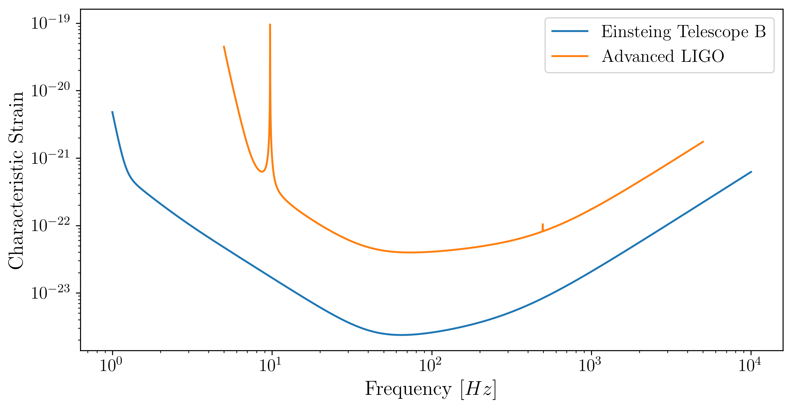
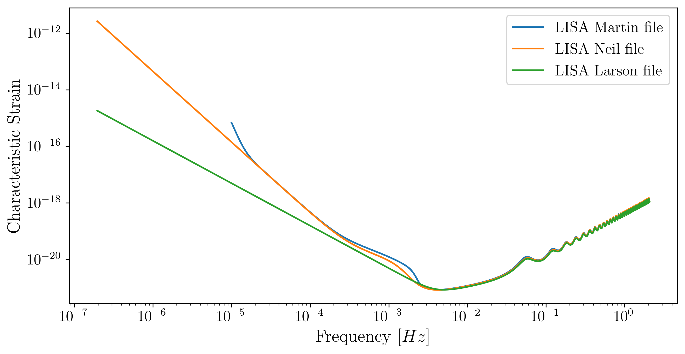
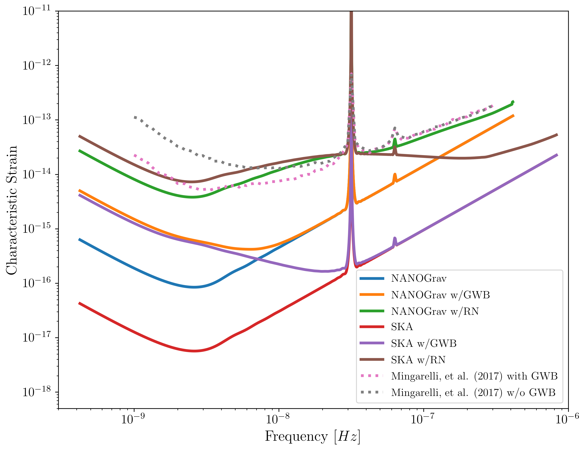
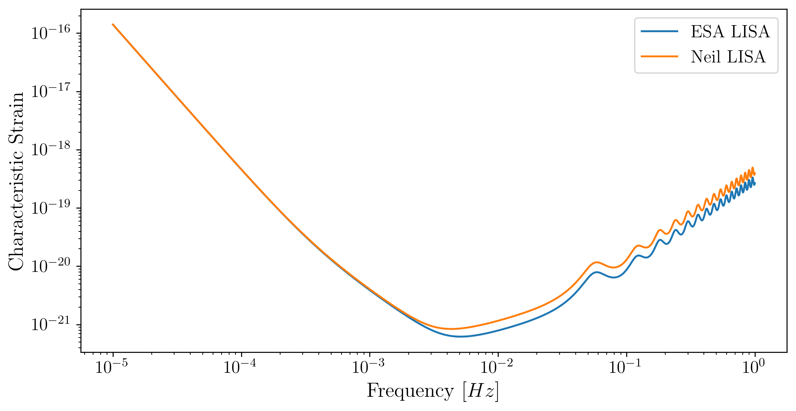
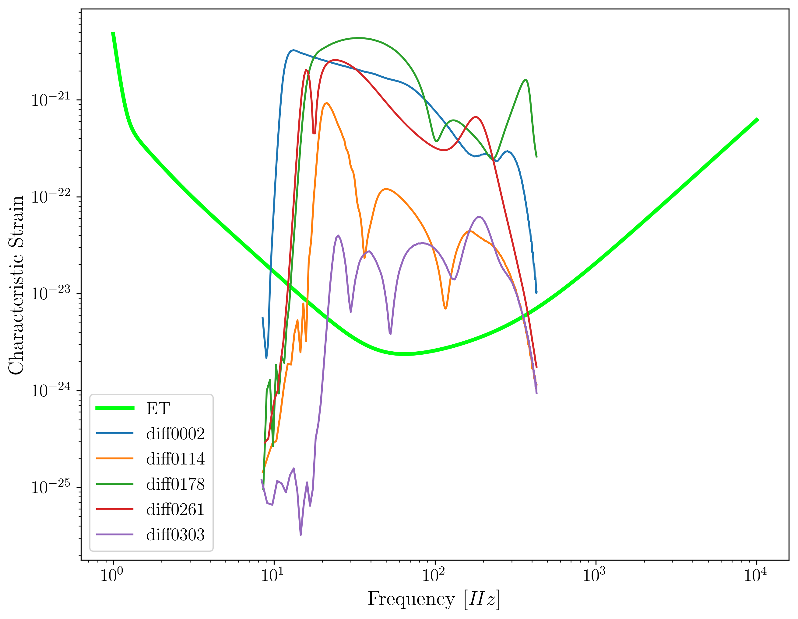
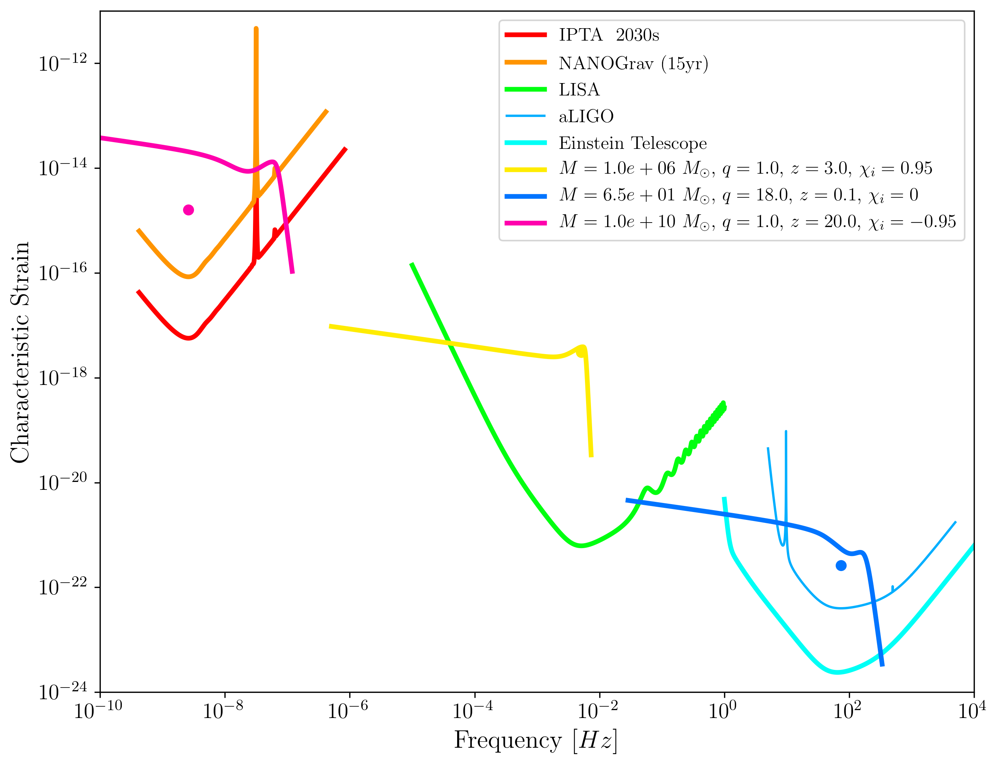

.. module:: hasasia

.. note:: This tutorial was generated from a Jupyter notebook that can be
          downloaded `here <_static/notebooks/strain_plot_tutorial.ipynb>`_.

.. _strain_plot_tutorial:

.. code:: python

    import numpy as np
    
    import matplotlib as mpl
    import matplotlib.pyplot as plt
    import matplotlib.colors as colors
    from matplotlib import cm
    
    import astropy.constants as const
    import astropy.units as u
    from astropy.cosmology import z_at_value
    from astropy.cosmology import WMAP9 as cosmo
    from fractions import Fraction
    
    import hasasia.sensitivity as hassens
    import hasasia.sim as hassim
    import hasasia.skymap as hassky
    
    import gwent
    import gwent.detector as detector
    import gwent.binary as binary

.. code:: python

    mpl.rcParams['figure.dpi'] = 300
    mpl.rcParams['figure.figsize'] = [5,3]
    mpl.rcParams['text.usetex'] = True
    mpl.rc('font',**{'family':'serif','serif':['Times New Roman'],'size':14})

.. code:: python

    load_directory = gwent.__path__[0] + '/LoadFiles'

.. code:: python

    axissize = 14
    labelsize = 16
    legendsize = 12
    figsize = (10,8)
    colornorm = colors.Normalize(vmin=0.0, vmax=5.0)
    linesize = 3

Initialize different instruments
================================

aLIGO
~~~~~

.. code:: python

    Ground_T_obs = 4*u.yr

.. code:: python

    #aLIGO
    aLIGO_filedirectory = load_directory + '/InstrumentFiles/aLIGO/StrainFiles/'
    aLIGO_filename = 'aLIGODesign.txt'
    aLIGO_filelocation = aLIGO_filedirectory + aLIGO_filename
    
    aLIGO = detector.GroundBased('aLIGO',Ground_T_obs,load_location=aLIGO_filelocation,I_type='A')

Einstein Telescope
~~~~~~~~~~~~~~~~~~

.. code:: python

    #Einstein Telescope
    ET_filedirectory = load_directory + '/InstrumentFiles/EinsteinTelescope/StrainFiles/'
    ET_filename = 'ET_B_data.txt'
    ET_filelocation = ET_filedirectory + ET_filename
    
    ET = detector.GroundBased('ET',Ground_T_obs,load_location=ET_filelocation,I_type='A')

Plots of Ground Detectors
~~~~~~~~~~~~~~~~~~~~~~~~~

.. code:: python

    fig = plt.figure(figsize=(10,5))
    plt.loglog(ET.fT,ET.h_n_f,label='Einsteing Telescope B')
    plt.loglog(aLIGO.fT,aLIGO.h_n_f,label='Advanced LIGO')
    plt.xlabel(r'Frequency $[Hz]$',fontsize = labelsize)
    plt.ylabel('Characteristic Strain',fontsize = labelsize)
    plt.legend()
    plt.show()

LISA Martin data
~~~~~~~~~~~~~~~~

.. code:: python

    SpaceBased_T_obs = 4*u.yr

.. code:: python

    #Martin data
    LISA_Other_filedirectory = load_directory + '/InstrumentFiles/LISA_Other/StrainFiles/'
    LISA_Martin_filename = 'LISA_Allocation_S_h_tot.txt'
    LISA_Martin_filelocation = LISA_Other_filedirectory + LISA_Martin_filename
    
    #Should be ENSD
    LISA_Martin = detector.SpaceBased('LISA_Martin',SpaceBased_T_obs,load_location=LISA_Martin_filelocation,I_type='E')

LISA Neil Cornish data
~~~~~~~~~~~~~~~~~~~~~~

.. code:: python

    #Neil Cornish data
    LISA_Neil_filedirectory = load_directory + '/InstrumentFiles/LISA_Neil/StrainFiles/'
    LISA_Neil_filename = 'LISA_sensitivity.txt'
    LISA_Neil_filelocation = LISA_Neil_filedirectory + LISA_Neil_filename
    
    #Should be ENSD
    LISA_Neil = detector.SpaceBased('LISA_Neil',SpaceBased_T_obs,load_location=LISA_Neil_filelocation,I_type='E')

LISA Larson Sensitivity Curve
~~~~~~~~~~~~~~~~~~~~~~~~~~~~~

.. code:: python

    #Larson Sensitivity Curve
    LISA_Larson_filename = 'scg_6981.dat'
    LISA_Larson_filelocation = LISA_Other_filedirectory + LISA_Larson_filename
    
    #Should be ASD
    LISA_Larson = detector.SpaceBased('LISA_Larson',SpaceBased_T_obs,load_location=LISA_Larson_filelocation,I_type='A')

.. code:: python

    fig = plt.figure(figsize=(10,5))
    plt.loglog(LISA_Martin.fT,LISA_Martin.h_n_f,label='LISA Martin file')
    plt.loglog(LISA_Neil.fT,LISA_Neil.h_n_f,label='LISA Neil file')
    plt.loglog(LISA_Larson.fT,LISA_Larson.h_n_f,label='LISA Larson file')
    plt.xlabel(r'Frequency $[Hz]$',fontsize = labelsize)
    plt.ylabel('Characteristic Strain',fontsize = labelsize)
    plt.legend()
    plt.show()

NANOGrav continuous wave sensitivity
~~~~~~~~~~~~~~~~~~~~~~~~~~~~~~~~~~~~

.. code:: python

    NANOGrav_filedirectory = load_directory + '/InstrumentFiles/NANOGrav/StrainFiles/' 

.. code:: python

    #NANOGrav continuous wave sensitivity
    NANOGrav_background = 4e-16 # Unsubtracted GWB amplitude: 0,4e-16
    NANOGrav_dp = 0.95 #Detection Probablility: 0.95,0.5
    NANOGrav_fap = 0.0001 #False Alarm Probability: 0.05,0.003,0.001,0.0001
    NANOGrav_Tobs = 15 #Observation years: 15,20,25
    
    NANOGrav_filename = 'cw_simulation_Ared_' + str(NANOGrav_background) + '_dp_' + str(NANOGrav_dp) \
                        + '_fap_' + str(NANOGrav_fap) + '_T_' + str(NANOGrav_Tobs) + '.txt'
    NANOGrav_filelocation = NANOGrav_filedirectory + NANOGrav_filename
    
    NANOGrav_Mingarelli_no_GWB = detector.PTA('NANOGrav_Mingarelli_no_GWB',load_location=NANOGrav_filelocation)

.. code:: python

    #NANOGrav continuous wave sensitivity
    NANOGrav_background_2 = 0 # Unsubtracted GWB amplitude: 0,4e-16
    NANOGrav_dp_2 = 0.95 #Detection Probablility: 0.95,0.5
    NANOGrav_fap_2 = 0.0001 #False Alarm Probability: 0.05,0.003,0.001,0.0001
    NANOGrav_Tobs_2 = 15 #Observation years: 15,20,25
    
    NANOGrav_filename_2 = 'cw_simulation_Ared_' + str(NANOGrav_background_2) + '_dp_' + str(NANOGrav_dp_2) \
                        + '_fap_' + str(NANOGrav_fap_2) + '_T_' + str(NANOGrav_Tobs_2) + '.txt'
    NANOGrav_filelocation_2 = NANOGrav_filedirectory + NANOGrav_filename_2
    
    NANOGrav_Mingarelli_GWB = detector.PTA('NANOGrav_Mingarelli_GWB',load_location=NANOGrav_filelocation_2)

SKA parameters and methods from arXiv:0804.4476 section 7.1
~~~~~~~~~~~~~~~~~~~~~~~~~~~~~~~~~~~~~~~~~~~~~~~~~~~~~~~~~~~

.. code:: python

    ###############################################
    #SKA calculation using parameters and methods from arXiv:0804.4476 section 7.1
    sigma_SKA = 10*u.ns.to('s')*u.s #sigma_rms timing residuals in nanoseconds to seconds
    T_SKA = 15*u.yr #Observing time in years
    N_p_SKA = 20 #Number of pulsars
    cadence_SKA = 1/(u.wk.to('yr')*u.yr) #Avg observation cadence of 1 every week in [number/yr]

.. code:: python

    SKA_Hazboun = detector.PTA('SKA_Hazboun',T_SKA,N_p_SKA,sigma_SKA,cadence_SKA)

.. code:: python

    SKA_Hazboun_wRN = detector.PTA('SKA_Hazboun_wRN',T_SKA,N_p_SKA,sigma_SKA,cadence_SKA,A_rn=[1e-16,1e-12],alpha_rn=[-3/4,1])

.. code:: python

    SKA_Hazboun_wGWB = detector.PTA('SKA_Hazboun_wGWB',T_SKA,N_p_SKA,sigma_SKA,cadence_SKA,A_GWB=4e-16)

Using Jeff's Methods/code https://arxiv.org/abs/1907.04341
^^^^^^^^^^^^^^^^^^^^^^^^^^^^^^^^^^^^^^^^^^^^^^^^^^^^^^^^^^

NANOGrav 11.5yr parameters https://arxiv.org/abs/1801.01837
~~~~~~~~~~~~~~~~~~~~~~~~~~~~~~~~~~~~~~~~~~~~~~~~~~~~~~~~~~~

.. code:: python

    ###############################################
    #NANOGrav calculation using 11.5yr parameters https://arxiv.org/abs/1801.01837
    sigma_nano = 100*u.ns.to('s')*u.s #rms timing residuals in nanoseconds to seconds
    T_nano = 15*u.yr #Observing time in years
    N_p_nano = 18 #Number of pulsars
    cadence_nano = 1/(2*u.wk.to('yr')*u.yr) #Avg observation cadence of 1 every 2 weeks in number/year

.. code:: python

    NANOGrav_Hazboun = detector.PTA('NANOGrav_Hazboun',T_nano,N_p_nano,sigma_nano,cadence_nano)

.. code:: python

    NANOGrav_Hazboun_wRN = detector.PTA('NANOGrav_Hazboun_wRN',T_nano,N_p_nano,sigma_nano,cadence_nano,A_rn=[1e-16,1e-12],alpha_rn=[-3/4,1])

.. code:: python

    NANOGrav_Hazboun_wGWB = detector.PTA('NANOGrav_Hazboun_wGWB',T_nano,N_p_nano,sigma_nano,cadence_nano,A_GWB=4e-16)

.. code:: python

    fig = plt.figure(figsize=(10,8))
    plt.loglog(NANOGrav_Hazboun.fT,NANOGrav_Hazboun.h_n_f, linewidth = linesize,label = r'NANOGrav')
    plt.loglog(NANOGrav_Hazboun_wGWB.fT,NANOGrav_Hazboun_wGWB.h_n_f, linewidth = linesize,label = r'NANOGrav w/GWB')
    plt.loglog(NANOGrav_Hazboun_wRN.fT,NANOGrav_Hazboun_wRN.h_n_f, linewidth = linesize,label = r'NANOGrav w/RN')
    
    plt.loglog(SKA_Hazboun.fT,SKA_Hazboun.h_n_f, linewidth = linesize,label = r'SKA')
    plt.loglog(SKA_Hazboun_wGWB.fT,SKA_Hazboun_wGWB.h_n_f, linewidth = linesize,label = r'SKA w/GWB')
    plt.loglog(SKA_Hazboun_wRN.fT,SKA_Hazboun_wRN.h_n_f, linewidth = linesize,label = r'SKA w/RN')
    
    plt.loglog(NANOGrav_Mingarelli_GWB.fT,NANOGrav_Mingarelli_GWB.h_n_f,linestyle = ':', linewidth = linesize,\
               label = r'Mingarelli, et al. (2017) with GWB')
    plt.loglog(NANOGrav_Mingarelli_no_GWB.fT,NANOGrav_Mingarelli_no_GWB.h_n_f,linestyle = ':', linewidth = linesize,\
               label = r'Mingarelli, et al. (2017) w/o GWB')
    
    plt.tick_params(axis = 'both',which = 'major', labelsize = axissize)
    plt.ylim([5e-19,1e-11])
    plt.xlim([3e-10,1e-6])
    #plt.title('NANOGrav (15yr)',fontsize=labelsize)
    plt.xlabel(r'Frequency $[Hz]$',fontsize = labelsize)
    plt.ylabel('Characteristic Strain',fontsize = labelsize)
    plt.legend(loc='lower right', fontsize = 12)
    plt.show()

Calculate LISA amplitude spectral densities for various models
==============================================================

.. code:: python

    L = 2.5*u.Gm  #armlength in Gm
    L = L.to('m')
    LISA_T_obs = 4*u.yr

LISA Calculation from https://arxiv.org/pdf/1702.00786.pdf (Amaro-Seaone 2017)
~~~~~~~~~~~~~~~~~~~~~~~~~~~~~~~~~~~~~~~~~~~~~~~~~~~~~~~~~~~~~~~~~~~~~~~~~~~~~~

.. code:: python

    f_acc_break_low = .4*u.mHz.to('Hz')*u.Hz
    f_acc_break_high = 8.*u.mHz.to('Hz')*u.Hz
    f_IMS_break = 2.*u.mHz.to('Hz')*u.Hz
    A_acc = 3e-15*u.m/u.s/u.s
    A_IMS = 10e-12*u.m
    
    Background = False
    
    ESA_LISA = detector.SpaceBased('ESA_LISA',\
                              LISA_T_obs,L,A_acc,f_acc_break_low,f_acc_break_high,A_IMS,f_IMS_break,\
                              Background=Background)

Neil Calculation from https://arxiv.org/pdf/1803.01944.pdf
~~~~~~~~~~~~~~~~~~~~~~~~~~~~~~~~~~~~~~~~~~~~~~~~~~~~~~~~~~

.. code:: python

    #Neil Calculation from https://arxiv.org/pdf/1803.01944.pdf
    f_acc_break_low = .4*u.mHz.to('Hz')*u.Hz
    f_acc_break_high = 8.*u.mHz.to('Hz')*u.Hz
    f_IMS_break = 2.*u.mHz.to('Hz')*u.Hz
    A_acc = 3e-15*u.m/u.s/u.s
    A_IMS = 1.5e-11*u.m
    Background = False
        
    Neil_LISA = detector.SpaceBased('Neil_LISA',\
                               LISA_T_obs,L,A_acc,f_acc_break_low,f_acc_break_high,A_IMS,f_IMS_break,\
                               Background=Background)

Plots of Space-Based Detectors
~~~~~~~~~~~~~~~~~~~~~~~~~~~~~~

.. code:: python

    fig = plt.figure(figsize=(10,5))
    plt.loglog(ESA_LISA.fT,ESA_LISA.h_n_f,label='ESA LISA')
    plt.loglog(Neil_LISA.fT,Neil_LISA.h_n_f,label='Neil LISA')
    #plt.loglog(LISA_Martin.fT,LISA_Martin.h_n_f,label='LISA Martin file')
    #plt.loglog(LISA_Neil.fT,LISA_Neil.h_n_f,label='LISA Neil file')
    #plt.loglog(LISA_Larson.fT,LISA_Larson.h_n_f,label='LISA Larson file')
    plt.xlabel(r'Frequency $[Hz]$',fontsize = labelsize)
    plt.ylabel('Characteristic Strain',fontsize = labelsize)
    plt.legend()
    plt.show()

BBH strain calculation
======================

.. code:: python

    #Vars = [M,q,chi1,chi2,z]
    M = [1e6,65.0,1e10]
    q = [1.0,18.0,1.0]
    x1 = [0.95,0.0,-0.95]
    x2 = [0.95,0.0,-0.95]
    z = [3.0,0.093,20.0]
    inc = 0.0 #Doesn't really work...
    
    Vars1 = [M[0],q[0],x1[0],x2[0],z[0]]
    Vars2 = [M[1],q[1],x1[1],x2[1],z[1]]
    Vars3 = [M[2],q[2],x1[2],x2[2],z[2]]
    Vars4 = [M[1],q[0],x1[1],x2[1],z[1]]

.. code:: python

    source_1 = binary.BBHFrequencyDomain(M[0],q[0],z[0],x1[0],x2[0],inc,instrument=ESA_LISA)

.. code:: python

    source_2 = binary.BBHFrequencyDomain(M[1],q[1],z[1],x1[1],x2[1],inc,instrument=aLIGO)

.. code:: python

    source_3 = binary.BBHFrequencyDomain(M[2],q[2],z[2],x1[2],x2[2],inc,instrument=SKA_Hazboun)

.. code:: python

    source_4 = binary.BBHFrequencyDomain(M[1],q[0],z[1],x1[1],x2[1],inc,instrument=ET)

Numerical Relativity from EOB subtraction
~~~~~~~~~~~~~~~~~~~~~~~~~~~~~~~~~~~~~~~~~

.. code:: python

    EOBdiff_filedirectory = load_directory + '/DiffStrain/EOBdiff/'
    diff0002 = binary.BBHTimeDomain(M[1],q[0],z[1],load_location=EOBdiff_filedirectory+'diff0002.dat')
    diff0114 = binary.BBHTimeDomain(M[1],q[0],z[1],load_location=EOBdiff_filedirectory+'diff0114.dat')
    diff0178 = binary.BBHTimeDomain(M[1],q[0],z[1],load_location=EOBdiff_filedirectory+'diff0178.dat')
    diff0261 = binary.BBHTimeDomain(M[1],q[0],z[1],load_location=EOBdiff_filedirectory+'diff0261.dat')
    diff0303 = binary.BBHTimeDomain(M[1],q[0],z[1],load_location=EOBdiff_filedirectory+'diff0303.dat')

.. code:: python

    fig,ax = plt.subplots(figsize = figsize)
    plt.loglog(ET.fT,ET.h_n_f, linewidth = linesize,color = cm.hsv(colornorm(1.75)),label = 'ET')
    plt.loglog(diff0002.f,binary.Get_Char_Strain(diff0002),label = 'diff0002')
    plt.loglog(diff0114.f,binary.Get_Char_Strain(diff0114),label = 'diff0114')
    plt.loglog(diff0178.f,binary.Get_Char_Strain(diff0178),label = 'diff0178')
    plt.loglog(diff0261.f,binary.Get_Char_Strain(diff0261),label = 'diff0261')
    plt.loglog(diff0303.f,binary.Get_Char_Strain(diff0303),label = 'diff0303')
    plt.xlabel(r'Frequency $[Hz]$',fontsize = labelsize)
    plt.ylabel('Characteristic Strain',fontsize = labelsize)
    plt.legend()
    plt.show()

.. code:: python

    fig,ax = plt.subplots(figsize = figsize)
    #plt.loglog(NANOGrav_f,NANOGrav_h_f)
    ax.loglog(SKA_Hazboun.fT,SKA_Hazboun.h_n_f, linewidth = linesize,color = cm.hsv(colornorm(0.0)),label = 'IPTA ~2030s')
    ax.loglog(NANOGrav_Hazboun.fT,NANOGrav_Hazboun.h_n_f, linewidth = linesize,color = cm.hsv(colornorm(0.5)),\
              label = 'NANOGrav (15yr)')
    ax.loglog(ESA_LISA.fT,ESA_LISA.h_n_f, linewidth = linesize,color = cm.hsv(colornorm(1.75)),label = 'LISA')
    ax.loglog(aLIGO.fT,aLIGO.h_n_f,color = cm.hsv(colornorm(2.8)),label = 'aLIGO')
    ax.loglog(ET.fT,ET.h_n_f, linewidth = linesize,color = cm.hsv(colornorm(2.5)),label = 'Einstein Telescope')
    
    ax.loglog(source_1.f,binary.Get_Char_Strain(source_1), linewidth = linesize,color = cm.hsv(colornorm(0.8)),\
              label = r'$M = %.1e$ $M_{\odot}$, $q = %.1f$, $z = %.1f$, $\chi_{i} = %.2f$' %(M[0],q[0],z[0],x1[0]))
    ax.scatter(source_1.instrument.f_opt,source_1.h_gw,color = cm.hsv(colornorm(0.8)))
    
    ax.loglog(source_2.f,binary.Get_Char_Strain(source_2), linewidth = linesize,color = cm.hsv(colornorm(3.0)),\
              label = r'$M = %.1e$ $M_{\odot}$, $q = %.1f$, $z = %.1f$, $\chi_{i} = %.0f$' %(M[1],q[1],z[1],x1[1]))
    ax.scatter(source_2.instrument.f_opt,source_2.h_gw,color = cm.hsv(colornorm(3.0)))
    
    ax.loglog(source_3.f,binary.Get_Char_Strain(source_3), linewidth = linesize,color = cm.hsv(colornorm(4.5)),\
              label = r'$M = %.1e$ $M_{\odot}$, $q = %.1f$, $z = %.1f$, $\chi_{i} = %.2f$' %(M[2],q[2],z[2],x1[2]))
    ax.scatter(source_3.instrument.f_opt,source_3.h_gw,color = cm.hsv(colornorm(4.5)))
    
    
    ax.set_xlim([1e-10, 1e4])
    ax.set_ylim([1e-24, 1e-11])
    ax.tick_params(axis = 'both',which = 'major', labelsize = axissize)
    
    ax.set_xlabel(r'Frequency $[Hz]$',fontsize = labelsize)
    ax.set_ylabel('Characteristic Strain',fontsize = labelsize)
    ax.legend(loc='upper right', fontsize = legendsize)
    plt.show()

