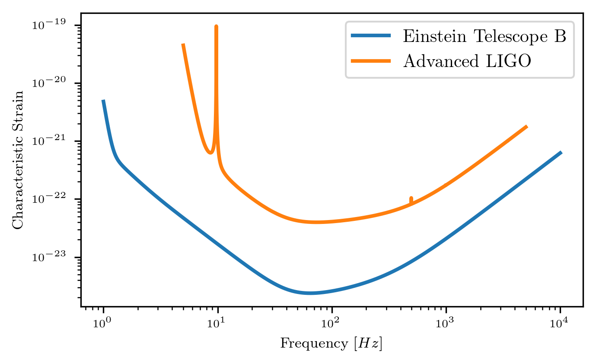
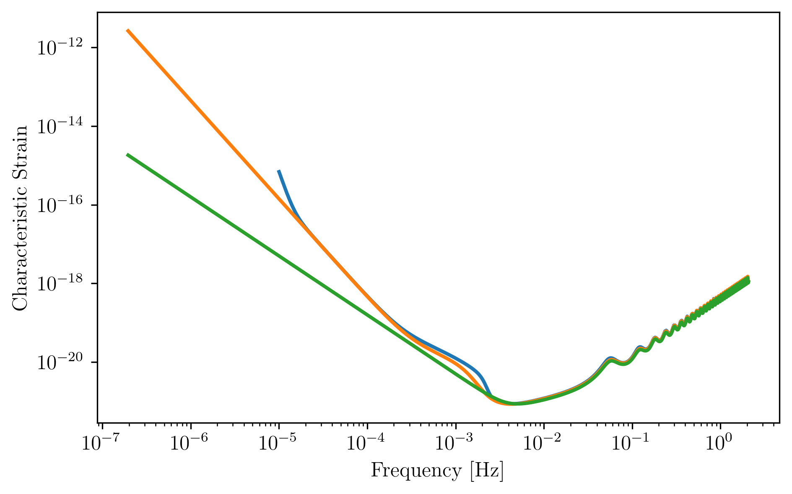
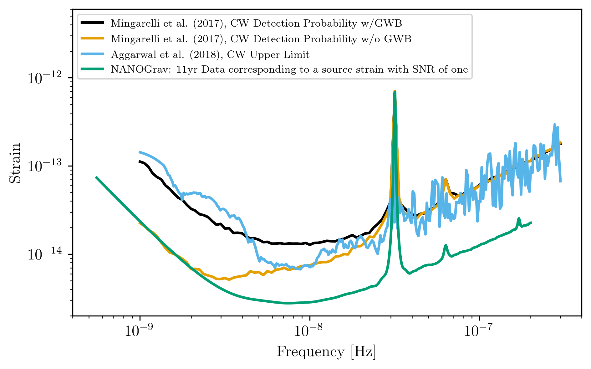
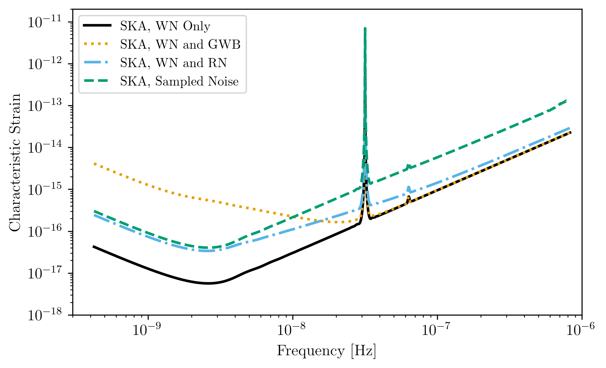
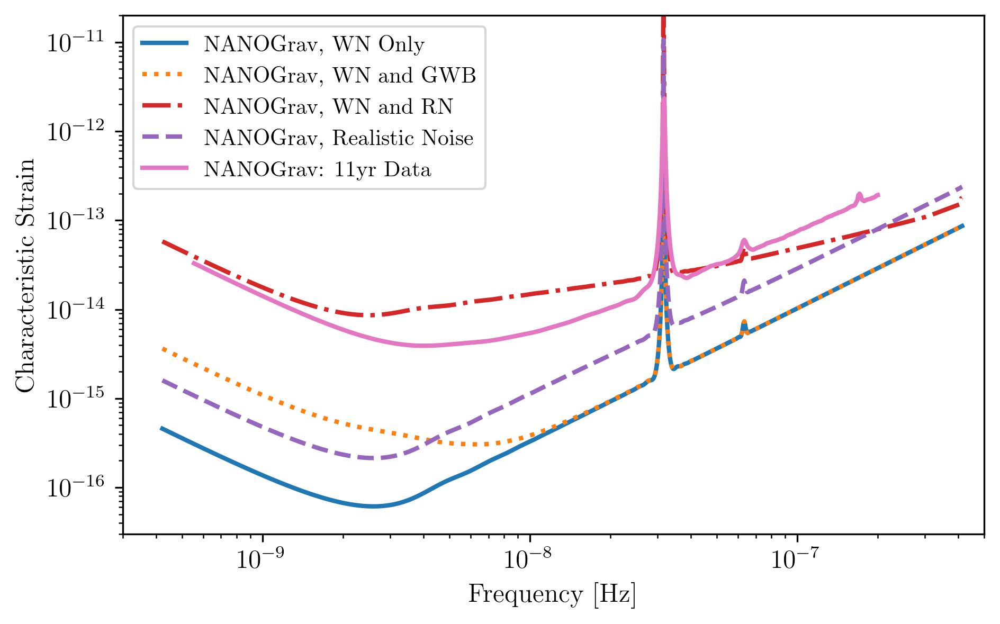
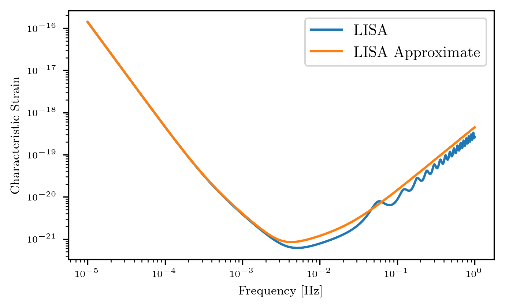
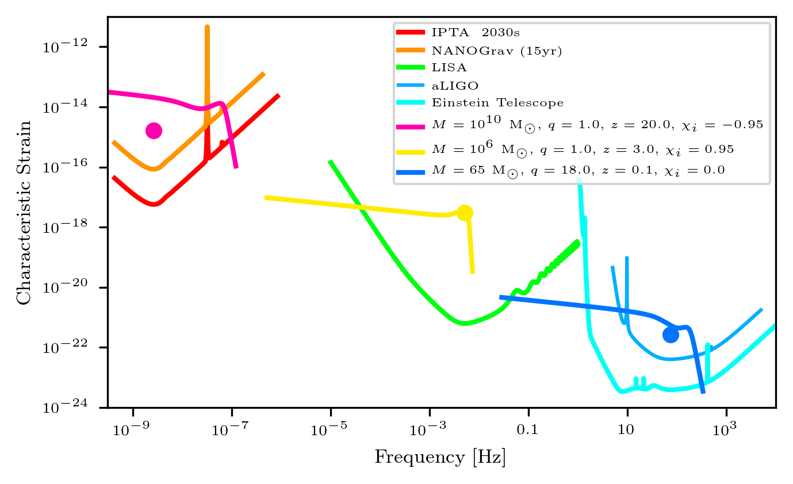

.. module:: hasasia

.. note:: This tutorial was generated from a Jupyter notebook that can be
          downloaded `here <_static/notebooks/strain_plot_tutorial.ipynb>`_.

.. _strain_plot_tutorial:

Using ``gwent`` to Generate Characteristic Strain Curves
========================================================

Here we show examples of using the different classes in ``gwent`` for
various detectors, both loading in from a file and generating with
``gwent``, and binary black holes, both in the frequency and time
domain.

First, we load important packages

.. code:: python

    import numpy as np
    
    import matplotlib as mpl
    import matplotlib.pyplot as plt
    import matplotlib.colors as colors
    from matplotlib import cm
    
    import astropy.constants as const
    import astropy.units as u
    from astropy.cosmology import z_at_value
    from astropy.cosmology import WMAP9 as cosmo
    
    import gwent
    import gwent.detector as detector
    import gwent.binary as binary

Setting matplotlib and plotting preferences

.. code:: python

    mpl.rcParams['figure.dpi'] = 300
    mpl.rcParams['figure.figsize'] = [5,3]
    mpl.rcParams['text.usetex'] = True
    mpl.rc('font',**{'family':'serif','serif':['Times New Roman'],'size':14})
    
    axissize = 6
    labelsize = 8
    legendsize = 10
    colornorm = colors.Normalize(vmin=0.0, vmax=5.0)
    linesize = 2

We need to get the file directories to load in the instrument files.

.. code:: python

    load_directory = gwent.__path__[0] + '/LoadFiles'

Initialize different instruments
--------------------------------

If loading a detector, the file should be frequency in the first column
and either strain, effective strain noise spectral density, or amplitude
spectral density in the second column.

For generating a detector, one must assign a value to each of the
different instrument parameters (see the section on Declaring x and y
variables and Sample Rates).

Load ground instruments from files
----------------------------------

aLIGO
^^^^^

.. code:: python

    Ground_T_obs = 4*u.yr

.. code:: python

    #aLIGO
    aLIGO_filedirectory = load_directory + '/InstrumentFiles/aLIGO/'
    aLIGO_filename = 'aLIGODesign.txt'
    aLIGO_filelocation = aLIGO_filedirectory + aLIGO_filename
    
    aLIGO = detector.GroundBased('aLIGO',Ground_T_obs,load_location=aLIGO_filelocation,I_type='A')

Einstein Telescope
^^^^^^^^^^^^^^^^^^

.. code:: python

    #Einstein Telescope
    ET_filedirectory = load_directory + '/InstrumentFiles/EinsteinTelescope/'
    ET_filename = 'ET_D_data.txt'
    ET_filelocation = ET_filedirectory + ET_filename
    
    ET = detector.GroundBased('ET',Ground_T_obs,load_location=ET_filelocation,I_type='A')

Plots of Ground Detectors
~~~~~~~~~~~~~~~~~~~~~~~~~

.. code:: python

    fig = plt.figure()
    plt.loglog(ET.fT,ET.h_n_f,label='Einstein Telescope D', linewidth = linesize)
    plt.loglog(aLIGO.fT,aLIGO.h_n_f,label='Advanced LIGO', linewidth = linesize)
    plt.xlabel(r'Frequency [Hz]',fontsize = labelsize)
    plt.ylabel(r'Characteristic Strain',fontsize = labelsize)
    plt.tick_params(axis = 'both',which = 'major', labelsize = axissize)
    plt.legend(fontsize = legendsize)
    plt.show()

Load LISA Instruments from File
-------------------------------

LISA Example 1
^^^^^^^^^^^^^^

Modelled off of the Science Requirements document from
https://lisa.nasa.gov/documentsReference.html.

.. code:: python

    SpaceBased_T_obs = 4*u.yr

.. code:: python

    LISA_Other_filedirectory = load_directory + '/InstrumentFiles/LISA_Other/'
    LISA_ex1_filename = 'LISA_Allocation_S_h_tot.txt'
    LISA_ex1_filelocation = LISA_Other_filedirectory + LISA_ex1_filename
    
    #`I_type` should be Effective Noise Spectral Density
    LISA_ex1 = detector.SpaceBased('LISA Example 1',SpaceBased_T_obs,load_location=LISA_ex1_filelocation,I_type='E')

LISA Example 2
^^^^^^^^^^^^^^

Modelled off of Robson,Cornish,and Liu 2018, LISA
(https://arxiv.org/abs/1803.01944).

.. code:: python

    LISA_ex2_filedirectory = load_directory + '/InstrumentFiles/LISA_Other/'
    LISA_ex2_filename = 'LISA_sensitivity.txt'
    LISA_ex2_filelocation = LISA_ex2_filedirectory + LISA_ex2_filename
    
    #`I_type` should be Effective Noise Spectral Density
    LISA_ex2 = detector.SpaceBased('LISA Example 2',SpaceBased_T_obs,load_location=LISA_ex2_filelocation,I_type='E')

LISA Example 3
^^^^^^^^^^^^^^

Generated by http://www.srl.caltech.edu/~shane/sensitivity/

.. code:: python

    LISA_ex3_filename = 'scg_6981.dat'
    LISA_ex3_filelocation = LISA_Other_filedirectory + LISA_ex3_filename
    
    #`I_type` should be Amplitude Spectral Density
    LISA_ex3 = detector.SpaceBased('LISA Example 3',SpaceBased_T_obs,load_location=LISA_ex3_filelocation,I_type='A')

Plots of loaded LISA examples.
~~~~~~~~~~~~~~~~~~~~~~~~~~~~~~

.. code:: python

    fig = plt.figure()
    plt.loglog(LISA_ex1.fT,LISA_ex1.h_n_f,label=LISA_ex1.name,linewidth=linesize)
    plt.loglog(LISA_ex2.fT,LISA_ex2.h_n_f,label=LISA_ex2.name,linewidth=linesize)
    plt.loglog(LISA_ex3.fT,LISA_ex3.h_n_f,label=LISA_ex3.name,linewidth=linesize)
    plt.xlabel(r'Frequency [Hz]',fontsize = labelsize)
    plt.ylabel(r'Characteristic Strain',fontsize = labelsize)
    plt.tick_params(axis = 'both',which = 'major', labelsize = axissize)
    plt.legend(fontsize = labelsize)
    plt.show()

Loading PTA Detection Curves and Upper Limits
---------------------------------------------

Simulated NANOGrav Continuous Wave Detection Sensitivity
^^^^^^^^^^^^^^^^^^^^^^^^^^^^^^^^^^^^^^^^^^^^^^^^^^^^^^^^

Samples from Mingarelli, et al. 2017 (https://arxiv.org/abs/1708.03491)
of the Simulated NANOGrav Continuous Wave Detection Sensitivity.

.. code:: python

    NANOGrav_filedirectory = load_directory + '/InstrumentFiles/NANOGrav/StrainFiles/' 

.. code:: python

    #NANOGrav continuous wave sensitivity
    NANOGrav_background = 4e-16 # Unsubtracted GWB amplitude: 0,4e-16
    NANOGrav_dp = 0.95 #Detection Probablility: 0.95,0.5
    NANOGrav_fap = 0.0001 #False Alarm Probability: 0.05,0.003,0.001,0.0001
    NANOGrav_Tobs = 15 #Observation years: 15,20,25
    
    NANOGrav_filename = 'cw_simulation_Ared_' + str(NANOGrav_background) + '_dp_' + str(NANOGrav_dp) \
                        + '_fap_' + str(NANOGrav_fap) + '_T_' + str(NANOGrav_Tobs) + '.txt'
    NANOGrav_filelocation = NANOGrav_filedirectory + NANOGrav_filename
    
    NANOGrav_cw_no_GWB = detector.PTA('NANOGrav CW Detection no GWB',load_location=NANOGrav_filelocation,I_type='h')

.. code:: python

    #NANOGrav continuous wave sensitivity
    NANOGrav_background_2 = 0 # Unsubtracted GWB amplitude: 0,4e-16
    NANOGrav_dp_2 = 0.95 #Detection Probablility: 0.95,0.5
    NANOGrav_fap_2 = 0.0001 #False Alarm Probability: 0.05,0.003,0.001,0.0001
    NANOGrav_Tobs_2 = 15 #Observation years: 15,20,25
    
    NANOGrav_filename_2 = 'cw_simulation_Ared_' + str(NANOGrav_background_2) + '_dp_' + str(NANOGrav_dp_2) \
                        + '_fap_' + str(NANOGrav_fap_2) + '_T_' + str(NANOGrav_Tobs_2) + '.txt'
    NANOGrav_filelocation_2 = NANOGrav_filedirectory + NANOGrav_filename_2
    
    NANOGrav_cw_GWB = detector.PTA('NANOGrav CW Detection no GWB',load_location=NANOGrav_filelocation_2,I_type='h')

NANOGrav Continuous Wave 11yr Upper Limit
^^^^^^^^^^^^^^^^^^^^^^^^^^^^^^^^^^^^^^^^^

Sample from Aggarwal, et al. 2019 (https://arxiv.org/abs/1812.11585) of
the NANOGrav 11yr continuous wave upper limit.

.. code:: python

    NANOGrav_cw_ul_file = NANOGrav_filedirectory + 'smoothed_11yr.txt'
    NANOGrav_cw_ul = detector.PTA('NANOGrav CW Upper Limit',load_location=NANOGrav_cw_ul_file,I_type='h')

NANOGrav 11yr Characteristic Strain
^^^^^^^^^^^^^^^^^^^^^^^^^^^^^^^^^^^

Using real NANOGrav 11yr data put through ``hasasia``

.. code:: python

    NANOGrav_11yr_hasasia_file = NANOGrav_filedirectory + 'NANOGrav_11yr_S_eff.txt'
    NANOGrav_11yr_hasasia = detector.PTA('NANOGrav 11yr',load_location=NANOGrav_11yr_hasasia_file,I_type='E')

Plots of the loaded PTAs
~~~~~~~~~~~~~~~~~~~~~~~~

.. code:: python

    fig = plt.figure()
    plt.loglog(NANOGrav_cw_GWB.fT,NANOGrav_cw_GWB.h_n_f, linewidth = linesize,\
               label = NANOGrav_cw_GWB.name)
    plt.loglog(NANOGrav_cw_no_GWB.fT,NANOGrav_cw_no_GWB.h_n_f, linewidth = linesize,\
               label = NANOGrav_cw_no_GWB.name)
    plt.loglog(NANOGrav_cw_ul.fT,NANOGrav_cw_ul.h_n_f, linewidth = linesize,\
               label = NANOGrav_cw_ul.name)
    plt.loglog(NANOGrav_11yr_hasasia.fT,NANOGrav_11yr_hasasia.h_n_f, linewidth = linesize,\
               color='C6',label = NANOGrav_11yr_hasasia.name)
    
    plt.tick_params(axis = 'both',which = 'major', labelsize = axissize)
    plt.ylim([1e-15,1e-12])
    plt.xlim([1e-9,5e-7])
    plt.xlabel(r'Frequency [Hz]',fontsize = labelsize)
    plt.ylabel('Characteristic Strain',fontsize = labelsize)
    plt.legend(loc='lower right', fontsize = labelsize)
    plt.show()

Generating PTAs with ``gwent``
------------------------------

Generated using the code ``hasasia``
(https://hasasia.readthedocs.io/en/latest/) via the methods of Hazboun,
Romano, and Smith, 2019 (https://arxiv.org/abs/1907.04341)

SKA-esque Detector
^^^^^^^^^^^^^^^^^^

Fiducial parameter estimates from Sesana, Vecchio, and Colacino, 2008
(https://arxiv.org/abs/0804.4476) section 7.1.

.. code:: python

    sigma_SKA = 10*u.ns.to('s')*u.s #sigma_rms timing residuals in nanoseconds to seconds
    T_SKA = 15*u.yr #Observing time in years
    N_p_SKA = 20 #Number of pulsars
    cadence_SKA = 1/(u.wk.to('yr')*u.yr) #Avg observation cadence of 1 every week in [number/yr]

SKA with White noise only

.. code:: python

    SKA_WN = detector.PTA('SKA, WN Only',T_SKA,N_p_SKA,sigma_SKA,cadence_SKA)

SKA with White and Varied Red Noise

.. code:: python

    SKA_WN_RN = detector.PTA('SKA, WN and RN',T_SKA,N_p_SKA,sigma_SKA,cadence_SKA,
                             rn_amp=[1e-16,1e-12],rn_alpha=[-1/2,1.25])

SKA with White Noise and a Stochastic Gravitational Wave Background

.. code:: python

    SKA_WN_GWB = detector.PTA('SKA, WN and GWB',T_SKA,N_p_SKA,sigma_SKA,cadence_SKA,GWB_amp=4e-16,GWB_alpha=-2/3)

SKA with Realistic Noise for each pulsar, no GWB

.. code:: python

    SKA_Realistic_Noise = detector.PTA('SKA, Realistic Noise',T_SKA,N_p_SKA,cadence_SKA,use_11yr=True)

Plots for Simulated SKA PTAs
~~~~~~~~~~~~~~~~~~~~~~~~~~~~

.. code:: python

    fig = plt.figure()
    plt.loglog(SKA_WN.fT,SKA_WN.h_n_f, linewidth = linesize,\
               color = 'C0',label = SKA_WN.name)
    plt.loglog(SKA_WN_GWB.fT,SKA_WN_GWB.h_n_f, linewidth = linesize,linestyle=':',\
               color = 'C1',label = SKA_WN_GWB.name)
    plt.loglog(SKA_WN_RN.fT,SKA_WN_RN.h_n_f, linewidth = linesize,linestyle='-.',\
               color = 'C3',label = SKA_WN_RN.name)
    plt.loglog(SKA_Realistic_Noise.fT,SKA_Realistic_Noise.h_n_f,\
               color = 'C6',linewidth=linesize,linestyle='--',label=SKA_Realistic_Noise.name)
    
    plt.tick_params(axis = 'both',which = 'major', labelsize = axissize)
    plt.ylim([1e-18,1e-11])
    plt.xlim([3e-10,1e-6])
    
    plt.xlabel('Frequency [Hz]',fontsize = labelsize)
    plt.ylabel('Characteristic Strain',fontsize = labelsize)
    plt.legend(loc='lower right', fontsize = legendsize-2)
    plt.show()

NANOGrav-esque Detector
^^^^^^^^^^^^^^^^^^^^^^^

Fiducial 11yr parameter estimates from Arzoumanian, et al., 2018
https://arxiv.org/abs/1801.01837

.. code:: python

    ###############################################
    #NANOGrav calculation using 11.5yr parameters https://arxiv.org/abs/1801.01837
    sigma_nano = 100*u.ns.to('s')*u.s #rms timing residuals in nanoseconds to seconds
    T_nano = 15*u.yr #Observing time in years
    N_p_nano = 18 #Number of pulsars
    cadence_nano = 1/(2*u.wk.to('yr')*u.yr) #Avg observation cadence of 1 every 2 weeks in number/year

NANOGrav with White Noise only

.. code:: python

    NANOGrav_WN = detector.PTA('NANOGrav, WN Only',T_nano,N_p_nano,sigma_nano,cadence_nano)

NANOGrav with White and Varied Red Noise

.. code:: python

    NANOGrav_WN_RN = detector.PTA('NANOGrav, WN and RN',T_nano,N_p_nano,sigma_nano,cadence_nano,
                                  rn_amp=[1e-16,1e-12],rn_alpha=[-1/2,1.25])

NANOGrav with White Noise and a Stochastic Gravitational Wave Background

.. code:: python

    NANOGrav_WN_GWB = detector.PTA('NANOGrav, WN and GWB',T_nano,N_p_nano,sigma_nano,cadence_nano,GWB_amp=4e-16)

NANOGrav with Realistic Noise for each pulsar, no GWB

.. code:: python

    NANOGrav_Realistic_Noise = detector.PTA('NANOGrav, Realistic Noise',T_nano,N_p_nano,cadence_nano,use_11yr=True)

Plots for Simulated NANOGrav PTAs
~~~~~~~~~~~~~~~~~~~~~~~~~~~~~~~~~

.. code:: python

    fig = plt.figure()
    plt.loglog(NANOGrav_WN.fT,NANOGrav_WN.h_n_f,\
               color = 'C0',linewidth=linesize,label=NANOGrav_WN.name)
    plt.loglog(NANOGrav_WN_GWB.fT,NANOGrav_WN_GWB.h_n_f,\
               color = 'C1',linewidth=linesize,linestyle=':',label=NANOGrav_WN_GWB.name)
    plt.loglog(NANOGrav_WN_RN.fT,NANOGrav_WN_RN.h_n_f,\
               color = 'C3',linewidth=linesize,linestyle='-.',label=NANOGrav_WN_RN.name)
    plt.loglog(NANOGrav_Realistic_Noise.fT,NANOGrav_Realistic_Noise.h_n_f,\
               color = 'C4',linewidth=linesize,linestyle='--',label=NANOGrav_Realistic_Noise.name)
    
    plt.loglog(NANOGrav_11yr_hasasia.fT,NANOGrav_11yr_hasasia.h_n_f, linewidth = linesize,\
               color = 'C6', label = 'NANOGrav, 11yr')
    
    plt.tick_params(axis = 'both',which = 'major', labelsize = axissize)
    plt.ylim([1e-17,1e-11])
    plt.xlim([3e-10,5e-7])
    
    plt.xlabel('Frequency [Hz]',fontsize = labelsize)
    plt.ylabel('Characteristic Strain',fontsize = labelsize)
    plt.legend(loc='upper left', fontsize = legendsize-2)
    plt.show()

Generating LISA designs with ``gwent``
--------------------------------------

First we set a fiducial armlength and observation time-length

.. code:: python

    L = 2.5*u.Gm  #armlength in Gm
    L = L.to('m')
    LISA_T_obs = 4*u.yr

LISA Proposal 1
^^^^^^^^^^^^^^^

Values taken from the ESA L3 proposal, Amaro-Seaone, et al., 2017
(https://arxiv.org/abs/1702.00786)

.. code:: python

    f_acc_break_low = .4*u.mHz.to('Hz')*u.Hz
    f_acc_break_high = 8.*u.mHz.to('Hz')*u.Hz
    f_IMS_break = 2.*u.mHz.to('Hz')*u.Hz
    A_acc = 3e-15*u.m/u.s/u.s
    A_IMS = 10e-12*u.m
    
    Background = False
    
    LISA_prop1 = detector.SpaceBased('LISA',\
                              LISA_T_obs,L,A_acc,f_acc_break_low,f_acc_break_high,A_IMS,f_IMS_break,\
                              Background=Background)

LISA Proposal 2
^^^^^^^^^^^^^^^

Values from Robson, Cornish, and Liu 2019
https://arxiv.org/abs/1803.01944 using the Transfer Function
Approximation within. (Note the factor of 2 change from summing 2
independent low-frequency data channels assumed in the paper.)

.. code:: python

    f_acc_break_low = .4*u.mHz.to('Hz')*u.Hz
    f_acc_break_high = 8.*u.mHz.to('Hz')*u.Hz
    f_IMS_break = 2.*u.mHz.to('Hz')*u.Hz
    A_acc = 3e-15*u.m/u.s/u.s
    A_IMS = 1.5e-11*u.m
    Background = False
        
    LISA_prop2 = detector.SpaceBased('LISA Approximate',\
                               LISA_T_obs,L,A_acc,f_acc_break_low,f_acc_break_high,A_IMS,f_IMS_break,\
                               Background=Background,T_type='A')

Plots of Generated LISA Detectors
~~~~~~~~~~~~~~~~~~~~~~~~~~~~~~~~~

.. code:: python

    fig = plt.figure()
    plt.loglog(LISA_prop1.fT,LISA_prop1.h_n_f,label=LISA_prop1.name)
    plt.loglog(LISA_prop2.fT,LISA_prop2.h_n_f,label=LISA_prop2.name)
    plt.xlabel(r'Frequency [Hz]',fontsize = labelsize)
    plt.ylabel(r'Characteristic Strain',fontsize = labelsize)
    plt.tick_params(axis = 'both',which = 'major', labelsize = axissize)
    plt.legend(fontsize = legendsize)
    plt.show()

Generating Binary Black Holes with ``gwent`` in the Frequency Domain
--------------------------------------------------------------------

We start with BBH parameters that exemplify the range of IMRPhenomD's
waveforms from Khan, et al. 2016 https://arxiv.org/abs/1508.07253 and
Husa, et al. 2016 https://arxiv.org/abs/1508.07250

.. code:: python

    M = [1e6,65.0,1e10]
    q = [1.0,18.0,1.0]
    x1 = [0.95,0.0,-0.95]
    x2 = [0.95,0.0,-0.95]
    z = [3.0,0.093,20.0]

Uses the first parameter values and the ``LISA_prop1`` detector model
for calculation of the monochromatic strain.

.. code:: python

    source_1 = binary.BBHFrequencyDomain(M[0],q[0],z[0],x1[0],x2[0],instrument=LISA_prop1)

Uses the first parameter values and the ``aLIGO`` detector model for
calculation of the monochromatic strain.

.. code:: python

    source_2 = binary.BBHFrequencyDomain(M[1],q[1],z[1],x1[1],x2[1],instrument=aLIGO)

Uses the first parameter values and the ``SKA_WN`` detector model for
calculation of the monochromatic strain.

.. code:: python

    source_3 = binary.BBHFrequencyDomain(M[2],q[2],z[2],x1[2],x2[2],instrument=SKA_WN)

Uses the first parameter values and the ``ET`` detector model for
calculation of the monochromatic strain.

.. code:: python

    source_4 = binary.BBHFrequencyDomain(M[1],q[0],z[1],x1[1],x2[1],instrument=ET)

Generate Frequency Data from Given Time Domain
----------------------------------------------

Uses waveforms that are the difference between Effective One Body
waveforms subtracted from Numerical Relativity waveforms for different
harmonics.

.. code:: python

    EOBdiff_filedirectory = load_directory + '/DiffStrain/EOBdiff/'
    diff0002 = binary.BBHTimeDomain(M[1],q[0],z[1],load_location=EOBdiff_filedirectory+'diff0002.dat')
    diff0114 = binary.BBHTimeDomain(M[1],q[0],z[1],load_location=EOBdiff_filedirectory+'diff0114.dat')
    diff0178 = binary.BBHTimeDomain(M[1],q[0],z[1],load_location=EOBdiff_filedirectory+'diff0178.dat')
    diff0261 = binary.BBHTimeDomain(M[1],q[0],z[1],load_location=EOBdiff_filedirectory+'diff0261.dat')
    diff0303 = binary.BBHTimeDomain(M[1],q[0],z[1],load_location=EOBdiff_filedirectory+'diff0303.dat')

.. code:: python

    fig,ax = plt.subplots()
    plt.loglog(ET.fT,ET.h_n_f, linewidth = linesize,color = cm.hsv(colornorm(1.75)),label = ET.name)
    plt.loglog(diff0002.f,binary.Get_Char_Strain(diff0002),label = 'diff0002')
    plt.loglog(diff0114.f,binary.Get_Char_Strain(diff0114),label = 'diff0114')
    plt.loglog(diff0178.f,binary.Get_Char_Strain(diff0178),label = 'diff0178')
    plt.loglog(diff0261.f,binary.Get_Char_Strain(diff0261),label = 'diff0261')
    plt.loglog(diff0303.f,binary.Get_Char_Strain(diff0303),label = 'diff0303')
    plt.xlabel(r'Frequency $[Hz]$',fontsize = labelsize)
    plt.ylabel('Characteristic Strain',fontsize = labelsize)
    plt.tick_params(axis = 'both',which = 'major', labelsize = axissize)
    plt.legend(fontsize = legendsize)
    plt.show()

.. image:: strain_plot_tutorial_files/strain_plot_tutorial_78_0.png

Plots of Entire GW Band
-----------------------

Displays only generated detectors: WN only PTAs, ESA L3 proposal LISA,
aLIGO, and Einstein Telescope.

Displays three sources' waveform along with their monochromatic strain
if they were observed by the initialized instrument at the detector's
most sensitive frequency throughout its observing run (from left to
right: ``SKA_WN``,\ ``LISA_prop1``,\ ``ET``).

.. code:: python

    fig,ax = plt.subplots()
    
    ax.loglog(SKA_WN.fT,SKA_WN.h_n_f, linewidth = linesize,color = cm.hsv(colornorm(0.0)),label = 'IPTA ~2030s')
    ax.loglog(NANOGrav_WN.fT,NANOGrav_WN.h_n_f, linewidth = linesize,color = cm.hsv(colornorm(0.5)),\
              label = 'NANOGrav (15yr)')
    ax.loglog(LISA_prop1.fT,LISA_prop1.h_n_f, linewidth = linesize,color = cm.hsv(colornorm(1.75)),label = 'LISA')
    ax.loglog(aLIGO.fT,aLIGO.h_n_f,color = cm.hsv(colornorm(2.8)),label = 'aLIGO')
    ax.loglog(ET.fT,ET.h_n_f, linewidth = linesize,color = cm.hsv(colornorm(2.5)),label = 'Einstein Telescope')
    
    ax.loglog(source_3.f,binary.Get_Char_Strain(source_3), linewidth = linesize,color = cm.hsv(colornorm(4.5)),\
              label = r'$M = 10^{%.0f}$ $\mathrm{M}_{\odot}$, $q = %.1f$, $z = %.1f$, $\chi_{i} = %.2f$' %(np.log10(M[2]),q[2],z[2],x1[2]))
    ax.scatter(source_3.instrument.f_opt,source_3.h_gw,color = cm.hsv(colornorm(4.5)))
    
    ax.loglog(source_1.f,binary.Get_Char_Strain(source_1), linewidth = linesize,color = cm.hsv(colornorm(0.8)),\
              label = r'$M = 10^{%.0f}$ $\mathrm{M}_{\odot}$, $q = %.1f$, $z = %.1f$, $\chi_{i} = %.2f$' %(np.log10(M[0]),q[0],z[0],x1[0]))
    ax.scatter(source_1.instrument.f_opt,source_1.h_gw,color = cm.hsv(colornorm(0.8)))
    
    ax.loglog(source_2.f,binary.Get_Char_Strain(source_2), linewidth = linesize,color = cm.hsv(colornorm(3.0)),\
              label = r'$M = %.0f$ $\mathrm{M}_{\odot}$, $q = %.1f$, $z = %.1f$, $\chi_{i} = %.1f$' %(M[1],q[1],z[1],x1[1]))
    ax.scatter(source_2.instrument.f_opt,source_2.h_gw,color = cm.hsv(colornorm(3.0)))
    
    
    ax.tick_params(axis = 'both',which = 'major', labelsize = axissize)
    
    xlabel_min = -10
    xlabel_max = 4
    xlabels = np.arange(xlabel_min,xlabel_max+1)
    xlabels = xlabels[1::2]
    
    ax.set_xticks(10.**xlabels)
    print_xlabels = []
    for x in xlabels:
        if abs(x) > 1:
            print_xlabels.append(r'$10^{%i}$' %x)
        elif x == -1:
            print_xlabels.append(r'$%.1f$' %10.**x)
        else:
            print_xlabels.append(r'$%.0f$' %10.**x)
    ax.set_xticklabels([label for label in print_xlabels],
                                fontsize = axissize)
    
    ax.set_xlim([3e-10, 1e4])
    ax.set_ylim([1e-24, 1e-11])
    
    ax.set_xlabel('Frequency [Hz]',fontsize = labelsize)
    ax.set_ylabel('Characteristic Strain',fontsize = labelsize)
    ax.legend(loc='upper right', fontsize = legendsize-5)
    plt.show()

