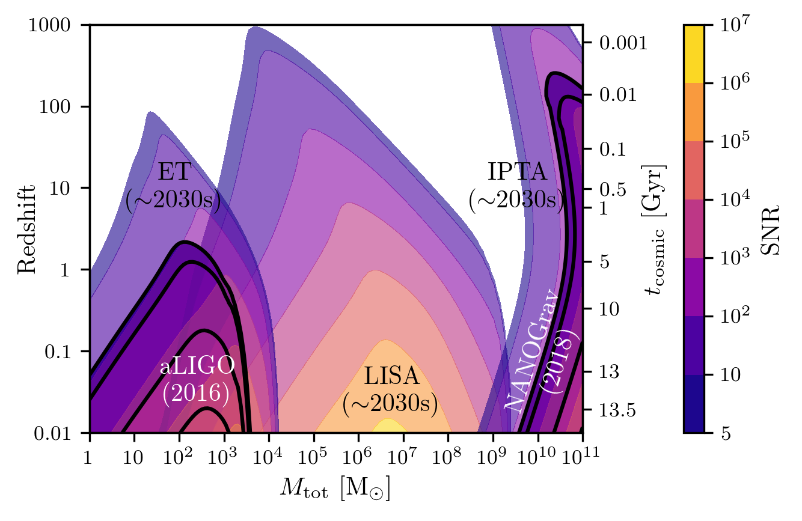

.. module:: hasasia

.. note:: This tutorial was generated from a Jupyter notebook that can be
          downloaded `here <_static/notebooks/waterfall_plot_tutorial.ipynb>`_.

.. _waterfall_plot_tutorial:

Loading ``gwent`` SNR Outputs to Generate Comparison Waterfall Plots
====================================================================

Here we present a tutorial on how to use ``gwent`` output from
``Get_SNR_Matrix`` to simultaneously plot Mass vs. Redshift SNRs for the
instrument models currently implemented (LISA, PTAs, aLIGO, and Einstein
Telescope) with the signal being an coalescing Binary Black Holes.

First, we import the necessary packages.

.. code:: python

    import numpy as np
    import matplotlib as mpl
    import matplotlib.pyplot as plt
    import matplotlib.colors as colors
    
    import astropy.units as u
    from astropy.cosmology import z_at_value
    from astropy.cosmology import WMAP9 as cosmo
    
    import gwent
    from gwent import binary
    from gwent import detector
    from gwent import snr
    from gwent import snrplot

Setting matplotlib preferences

.. code:: python

    mpl.rcParams['figure.dpi'] = 300
    mpl.rcParams['figure.figsize'] = [5,3]
    mpl.rcParams['text.usetex'] = True
    mpl.rc('font',**{'family':'serif','serif':['Times New Roman']})

We need to get the file directories to load in the SNRs.

.. code:: python

    load_directory = gwent.__path__[0] + '/LoadFiles/InstrumentFiles/'

Source Selection Function
-------------------------

Takes in a an instrument model that dictates reasonable mass ranges for
the particular detector mass regime and instantiates a source with the
variable ranges limited by the waveform calibration region.

The source parameters must be set (ie. M,q,z,chi1,chi2), but one only
needs to set the minima and maxima of the selected SNR axes variables.

.. code:: python

    def Get_Source(model):
        if model in [0,1]:
            #M = m1+m2 Total Mass
            M = 1e2
            M_min = 1e0
            M_max = 1e5
        elif model in [2,3]:
            #M = m1+m2 Total Mass
            M = 1e8
            M_min = 1e7
            M_max = 1e11
        else:
            #M = m1+m2 Total Mass
            M = 1e6
            M_min = 1e1
            M_max = 1e10
            
        #q = m2/m1 reduced mass
        q = 1.0
        q_min = 1.0
        q_max = 18.0
    
        #Chi = S_i*L/m_i**2, spins of each mass i
        chi1 = 0.0 #spin of m1
        chi2 = 0.0 #spin of m2
        chi_min = -0.85 #Limits of PhenomD for unaligned spins
        chi_max = 0.85
        
        z = 3.0 #Redshift
        z_min = 1e-2
        z_max = 1e3
        
        source = binary.BBHFrequencyDomain(M,q,z,chi1,chi2)
        source.M = [M,M_min,M_max]
        source.q = [q,q_min,q_max]
        source.chi1 = [chi1,chi_min,chi_max]
        source.chi2 = [chi2,chi_min,chi_max]
        source.z = [z,z_min,z_max]
    
        return source

Declaring Axes Variables and Sample Rates
~~~~~~~~~~~~~~~~~~~~~~~~~~~~~~~~~~~~~~~~~

.. code:: python

    #Variable on y-axis
    var_y = 'z'
    #Number of SNRMatrix rows
    sampleRate_y = 75
    #Variable on x-axis
    var_x = 'M'
    #Number of SNRMatrix columns
    sampleRate_x = 75

LISA Proposal 1
^^^^^^^^^^^^^^^

Generating SNR for detector values taken from the ESA L3 proposal,
Amaro-Seaone, et al., 2017 (https://arxiv.org/abs/1702.00786)

.. code:: python

    #Set up Instrument
    T_obs = 4*u.yr #Observing time in years
    L = 2.5e9*u.m #armlength in meters
    A_acc = 3e-15*u.m/u.s/u.s
    f_acc_break_low = .4*u.mHz.to('Hz')*u.Hz
    f_acc_break_high = 8.*u.mHz.to('Hz')*u.Hz
    f_IMS_break = 2.*u.mHz.to('Hz')*u.Hz
    A_IMS = 10e-12*u.m
    Background = False
    T_type = 'N'
    
    LISA_prop1 = detector.SpaceBased('LISA_ESA',\
                                   T_obs,L,A_acc,f_acc_break_low,f_acc_break_high,A_IMS,f_IMS_break,\
                                   Background=Background,T_type=T_type)
    source_1 = Get_Source(4)

Calculate SNR

.. code:: python

    [lisa_sample_x,lisa_sample_y,lisa_SNR] = snr.Get_SNR_Matrix(source_1,LISA_prop1,var_x,sampleRate_x,var_y,sampleRate_y)

First column is x-axis variable, second is y-axis variable z and M
sample space corresponding to SNR height

.. code:: python

    lisa_Samples = [lisa_sample_x,lisa_sample_y]

Take log of variables and SNR for plotting

.. code:: python

    lisa_logSamples = np.log10(lisa_Samples)
    lisa_logSNR = np.log10(lisa_SNR)

Einstein Telescope
^^^^^^^^^^^^^^^^^^

.. code:: python

    #Einstein Telescope
    ET_filedirectory = load_directory + '/EinsteinTelescope/'
    ET_filename = 'ET_D_data.txt'
    ET_filelocation = ET_filedirectory + ET_filename
    T_obs = 4*u.yr #Observing time in years
    ET = detector.GroundBased('ET',T_obs,load_location=ET_filelocation,I_type='A')
    source_2 = Get_Source(0)

.. code:: python

    [et_sample_x,et_sample_y,et_SNR] = snr.Get_SNR_Matrix(source_2,ET,var_x,sampleRate_x,var_y,sampleRate_y)

.. code:: python

    et_Samples = [et_sample_x,et_sample_y]
    et_logSamples = np.log10(et_Samples)
    et_logSNR = np.log10(et_SNR)

aLIGO
^^^^^

.. code:: python

    #aLIGO
    aLIGO_filedirectory = load_directory + '/aLIGO/'
    aLIGO_filename = 'aLIGODesign.txt'
    aLIGO_filelocation = aLIGO_filedirectory + aLIGO_filename
    T_obs = 4*u.yr #Observing time in years
    aLIGO = detector.GroundBased('aLIGO',T_obs,load_location=aLIGO_filelocation,I_type='A')
    source_3 = Get_Source(1)

.. code:: python

    [aLIGO_sample_x,aLIGO_sample_y,aLIGO_SNR] = snr.Get_SNR_Matrix(source_3,aLIGO,var_x,sampleRate_x,var_y,sampleRate_y)

.. code:: python

    aLIGO_Samples = [aLIGO_sample_x,aLIGO_sample_y]
    aLIGO_logSNR = np.log10(aLIGO_SNR)
    aLIGO_logSamples = np.log10(aLIGO_Samples)

NANOGrav
^^^^^^^^

SNR values for NANOGrav 11yr data

.. code:: python

    #NANOGrav calculation using 11.5yr parameters https://arxiv.org/abs/1801.01837
    load_name = 'NANOGrav_11yr_S_eff.txt'
    load_location = load_directory + '/NANOGrav/StrainFiles/' + load_name
    T_obs = 11.42*u.yr #Observing time in years
    nanograv = detector.PTA('NANOGrav 11yr',T_obs,load_location=load_location,I_type='E')
    source_4 = Get_Source(2)

.. code:: python

    [nanograv_sample_x,nanograv_sample_y,nanograv_SNR] = snr.Get_SNR_Matrix(source_4,nanograv,var_x,sampleRate_x,var_y,sampleRate_y)

.. code:: python

    nanograv_Samples = [nanograv_sample_x,nanograv_sample_y]
    nanograv_logSamples = np.log10(nanograv_Samples)
    nanograv_logSNR = np.log10(nanograv_SNR)

SKA
^^^

SNR values for a realistic pulsar noise.

.. code:: python

    T_obs = 15*u.yr #Observing time (years)
    cadence = 1/(u.wk.to('yr')*u.yr) #Avg observation cadence of 1 every week in num/year
    N_p = 200 #Number of pulsars
    SKA = detector.PTA('SKA',T_obs,N_p,cadence,use_11yr=True)
    source_5 = Get_Source(3)

.. code:: python

    [SKA_sample_x,SKA_sample_y,SKA_SNR] = snr.Get_SNR_Matrix(source_5,SKA,var_x,sampleRate_x,var_y,sampleRate_y)

.. code:: python

    SKA_Samples = [SKA_sample_x,SKA_sample_y]
    SKA_logSamples = np.log10(SKA_Samples)
    SKA_logSNR = np.log10(SKA_SNR)

Make Waterfall Plots
--------------------

Sets plotting parameters

.. code:: python

    contourcolorPresent = 'plasma'
    transparencyPresent = 1.0
    contourcolorFuture = 'plasma'
    transparencyFuture = 0.6
    axissize = 8
    labelsize = 10
    textsize = 10
    textcolor1 = 'k'
    textcolor2 = 'w'
    linesize = 2

Selects contour levels to separate sections into

.. code:: python

    contLevels = np.array([5, 10, 1e2, 1e3, 1e4, 1e5, 1e6, 1e7])
    logLevels = np.log10(contLevels)

Set labels for x and y axes

.. code:: python

    Mlabel_min = 0
    Mlabel_max = 11
    zlabel_min = -2.0
    zlabel_max = 3.0
    zlabels = np.logspace(zlabel_min,zlabel_max,zlabel_max-zlabel_min+1)
    Mlabels = np.logspace(Mlabel_min,Mlabel_max,Mlabel_max-Mlabel_min+1)

Set labels for lookback time on y-axis

.. code:: python

    lb_time_axis = True
    
    ages1 = np.array([13.5,13,10,5,1])*u.Gyr 
    ages2 = np.array([500,100,10,1])*u.Myr
    ages2 = ages2.to('Gyr')
    ages = np.hstack((ages1.value,ages2.value))
    ages = ages*u.Gyr
    ageticks = [z_at_value(cosmo.age,age) for age in ages]

Set labels for luminosity distance on y-axis

.. code:: python

    dl_axis = False
    
    dists = np.array([1e4,1e3,1e2,10,1,.1,1e-2])*u.Gpc
    distticks = [z_at_value(cosmo.luminosity_distance,dist) for dist in dists]

Add Label positions and labels for different GW detectors

.. code:: python

    labelaLIGO_text = 'aLIGO\n(2016)'
    labelaLIGO_xpos = 0.22
    labelaLIGO_ypos = 0.125
    
    labelnanograv_text = 'NANOGrav\n(2018)'
    labelnanograv_xpos = 0.93
    labelnanograv_ypos = 0.19
    
    labelet_text = 'ET\n($\sim$2030s)'
    labelet_xpos = 0.175
    labelet_ypos = 0.6
    
    labelLisa_text = 'LISA\n($\sim$2030s)'
    labelLisa_xpos = 0.615
    labelLisa_ypos = 0.1
    
    labelIpta_text = 'IPTA\n($\sim$2030s)'
    labelIpta_xpos = 0.87
    labelIpta_ypos = 0.6

Plots of Entire GW Band
^^^^^^^^^^^^^^^^^^^^^^^

.. code:: python

    fig, ax1 = plt.subplots()
    
    CS1 = ax1.contourf(nanograv_logSamples[0],nanograv_logSamples[1],nanograv_logSNR,logLevels,\
                       cmap = contourcolorPresent, alpha = transparencyPresent)
    
    ax1.contourf(aLIGO_logSamples[0],aLIGO_logSamples[1],aLIGO_logSNR,logLevels,\
                 cmap = contourcolorPresent, alpha = transparencyPresent)
    
    ax1.contour(aLIGO_logSamples[0],aLIGO_logSamples[1],aLIGO_logSNR,logLevels,colors = 'k')
    
    ax1.contourf(lisa_logSamples[0],lisa_logSamples[1],lisa_logSNR,logLevels,\
                 cmap=contourcolorFuture, alpha = transparencyFuture)
    
    ax1.contourf(et_logSamples[0],et_logSamples[1],et_logSNR,logLevels,\
                 cmap = contourcolorFuture, alpha = transparencyFuture)
    
    ax1.contourf(SKA_logSamples[0],SKA_logSamples[1],SKA_logSNR,logLevels,\
                 cmap = contourcolorFuture, alpha = transparencyFuture)
    
    #If true, display luminosity distance on right side of plot
    if dl_axis:
        #Set other side y-axis for luminosity distance scalings
        ax2 = ax1.twinx()
        ax2.contour(nanograv_logSamples[0],nanograv_logSamples[1],nanograv_logSNR,logLevels,colors = 'k')
    
        ax2.set_yticks(np.log10(distticks))
        ax2.set_xlim(et_logSamples[0][0],11)
        ax2.set_ylim(SKA_logSamples[1][0],SKA_logSamples[1][-1])
        ax2.set_yticklabels([r'$10^{%i}$' %np.log10(dist) if np.abs(int(np.log10(dist))) > 1 else '{:g}'.format(dist) for dist in dists.value],fontsize = axissize)
        ax2.set_ylabel(r'$D_{L}$ [Gpc]',fontsize=labelsize)
        ax2.yaxis.set_label_coords(1.125,.5)
        #Make colorbar
        cbar = fig.colorbar(CS1,ax=(ax1,ax2),pad=0.01)
    elif lb_time_axis:
        #Set other side y-axis for lookback time scalings
        ax2 = ax1.twinx()
        ax2.contour(nanograv_logSamples[0],nanograv_logSamples[1],nanograv_logSNR,logLevels,colors = 'k')
        #Set axes limits 
        ax2.set_yticks(np.log10(ageticks))
        ax2.set_yticklabels(['{:g}'.format(age) for age in ages.value],fontsize = axissize)
        ax2.set_ylabel(r'$t_{\rm cosmic}$ [Gyr]',fontsize=labelsize)
        ax2.yaxis.set_label_coords(1.125,.5)
        #Make colorbar
        cbar = fig.colorbar(CS1,ax=(ax1,ax2),pad=0.01)
    else:
        ax1.contour(nanograv_logSamples[0],nanograv_logSamples[1],nanograv_logSNR,logLevels,colors = 'k')
        #Make colorbar
        cbar = fig.colorbar(CS1,pad=0.01)
        
    #Set axes limits 
    ax1.set_xlim(et_logSamples[0][0],11)
    ax1.set_ylim(SKA_logSamples[1][0],SKA_logSamples[1][-1])
    
    
    #Set ticks and labels
    ax1.set_yticks(np.log10(zlabels))
    ax1.set_xticks(np.log10(Mlabels))
    ax1.set_xticklabels([r'$10^{%i}$' %y if int(y) > 1 else r'$%i$' %(10**y) for y in np.log10(Mlabels)],\
        fontsize = axissize)
    ax1.set_yticklabels([x if int(x) < 1 else int(x) for x in zlabels],\
        fontsize = axissize)
    
    ax1.set_xlabel(r'$M_{\rm tot}$ $[\mathrm{M}_{\odot}]$',fontsize = labelsize)
    ax1.set_ylabel(r'$\mathrm{Redshift}$',fontsize = labelsize)
    ax1.yaxis.set_label_coords(-.1,.5)
    
    #Label different GW detectors
    plt.text(labelaLIGO_xpos,labelaLIGO_ypos,labelaLIGO_text,fontsize = textsize, \
             horizontalalignment='center',verticalalignment='center', color = textcolor2,transform = ax1.transAxes)
    
    plt.text(labelnanograv_xpos,labelnanograv_ypos,labelnanograv_text,fontsize = textsize,\
             horizontalalignment='center',verticalalignment='center', color = textcolor2,transform = ax1.transAxes,\
            rotation=72)
    
    plt.text(labelet_xpos,labelet_ypos,labelet_text,fontsize = textsize,\
             horizontalalignment='center',verticalalignment='center', color = textcolor1,transform = ax1.transAxes)
    
    plt.text(labelLisa_xpos,labelLisa_ypos,labelLisa_text,fontsize = textsize,\
             horizontalalignment='center',verticalalignment='center', color = textcolor1,transform = ax1.transAxes)
    
    plt.text(labelIpta_xpos,labelIpta_ypos,labelIpta_text,fontsize = textsize,\
             horizontalalignment='center',verticalalignment='center', color = textcolor1,transform = ax1.transAxes)
    
    cbar.set_label(r'$\mathrm{SNR}$',fontsize = labelsize)
    cbar.ax.tick_params(labelsize = axissize)
    cbar.ax.set_yticklabels([r'$10^{%i}$' %x if int(x) > 1 else r'$%i$' %(10**x) for x in logLevels])
    plt.show()

